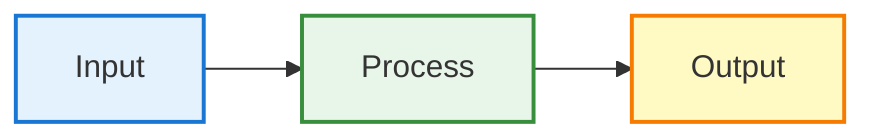

# Presentation Creation Workflow

This workflow guides you through creating professional technical presentations using Marp with integrated Mermaid diagrams.

## Prerequisites

```bash
# Install Marp CLI (optional, for export)
npm install -g @marp-team/marp-cli

# Install Mermaid CLI (for diagram generation)
npm install -g @mermaid-js/mermaid-cli
```

## Step 1: Create Presentation Structure

Create a new Marp markdown file in `docs/presentations/`:

```markdown
---
marp: true
theme: default
paginate: true
header: 'Your Title'
footer: 'Your Footer | 2026'
size: 16:9
style: |
  section {
    background-color: #ffffff;
    font-size: 18px;
    padding: 40px 60px;
  }
  h1 {
    color: #1a237e;
    font-size: 38px;
    margin-bottom: 0.3em;
  }
  h2 {
    color: #283593;
    font-size: 28px;
    margin-bottom: 0.3em;
  }
  h3 {
    font-size: 22px;
    margin-bottom: 0.3em;
    margin-top: 0.5em;
  }
  p, li, td {
    font-size: 16px;
    line-height: 1.4;
  }
  table {
    font-size: 14px;
    margin: 0.5em 0;
  }
  code {
    font-size: 14px;
  }
  ul, ol {
    margin: 0.3em 0;
    padding-left: 1.5em;
  }
  li {
    margin: 0.2em 0;
  }
  .columns {
    display: grid;
    grid-template-columns: repeat(2, minmax(0, 1fr));
    gap: 1rem;
  }
---

<!-- _class: lead -->

# Your Title
## Subtitle

Your Name | Date

---

# Content Slide

Your content here...
```

## Step 2: Create Diagram Directory

```bash
mkdir -p docs/presentations/diagrams
cd docs/presentations/diagrams
```

## Step 3: Create Mermaid Diagrams

Create `.mmd` files for each diagram:

**Example: `architecture-pipeline.mmd`**


## Step 4: Setup Puppeteer Config

Create `puppeteer-config.json` in diagrams folder:

```json
{
  "args": ["--no-sandbox", "--disable-setuid-sandbox"]
}
```

## Step 5: Create Generation Script

Create `generate-images.sh`:

```bash
#!/bin/bash

echo "🎨 Generating images from Mermaid diagrams..."

# Check if mmdc is installed
if ! command -v mmdc &> /dev/null
then
    echo "❌ Mermaid CLI not found!"
    echo "📦 Install with: npm install -g @mermaid-js/mermaid-cli"
    exit 1
fi

# Create output directory
mkdir -p images

# Generate images with transparent background
MMDC_FLAGS="-b transparent --puppeteerConfigFile puppeteer-config.json"

echo "📊 Generating diagrams..."
for file in *.mmd; do
    if [ -f "$file" ]; then
        basename="${file%.mmd}"
        echo "  → $basename"
        mmdc -i "$file" -o "images/${basename}.png" $MMDC_FLAGS -w 1200 -H 600
    fi
done

echo "✅ All diagrams generated successfully!"
echo "📁 Images saved to: images/"
ls -lh images/
```

// turbo
Make executable and run:
```bash
chmod +x generate-images.sh
./generate-images.sh
```

## Step 6: Add Diagrams to Presentation

In your Marp file:

```markdown
# Architecture Overview


---

# Two Column Layout

<div class="columns">

<div>

### Left Column
- Point 1
- Point 2

</div>

<div>


</div>

</div>
```

## Step 7: Add Tables

```markdown
# Comparison

| Feature | Option A | Option B |
|---------|----------|----------|
| **Speed** | Fast | Slow |
| **Memory** | Low | High |
```

**Important:** Ensure no extra pipes `|` in table headers!

## Step 8: Add Mathematical Formulas

```markdown
### Formula

$$
\text{Cost} = O(N^2 \cdot d)
$$

Inline: $y = mx + b$
```

## Step 9: Content Optimization

**To prevent overflow:**
- Keep padding: `40px 60px`
- Use concise text
- Limit table rows (max 8-10)
- Reduce margins between elements
- Test each slide for overflow

**Font size guidelines:**
- h1: 38px
- h2: 28px
- h3: 22px
- Body: 16-18px
- Tables: 14px

## Step 10: Preview and Export

**Preview:**
```bash
marp -p your-presentation.md
```

**Export to PDF:**
```bash
marp your-presentation.md -o presentation.pdf
```

**Export to HTML:**
```bash
marp your-presentation.md -o presentation.html
```

## Common Layouts

### Title Slide
```markdown
<!-- _class: lead -->

# Main Title
## Subtitle

Author | Date

---
```

### Single Column
```markdown
# Title

Content here...


```

### Two Columns
```markdown
# Title

<div class="columns">

<div>
Left content
</div>

<div>
Right content
</div>

</div>
```

### Colored Boxes
```markdown
style: |
  .blue-box {
    background-color: #e3f2fd;
    padding: 1rem;
    border-radius: 8px;
  }
  .green-box {
    background-color: #e8f5e9;
    padding: 1rem;
    border-radius: 8px;
  }

---

<div class="blue-box">
Content in blue box
</div>
```

## Troubleshooting

### Table not rendering
- Check for extra `|` in header row
- Ensure proper spacing around pipes

### Mermaid CLI fails
- Add puppeteer-config.json with --no-sandbox
- Check if Chromium dependencies are installed

### Content overflows footer
- Reduce font sizes
- Decrease padding
- Limit content per slide
- Use more slides instead of cramming

### Images not showing
- Use relative paths from presentation file
- Check image file exists
- Verify image format (PNG, JPG, SVG)

## Best Practices

1. **One key message per slide**
2. **Consistent color scheme** throughout
3. **Balance text and visuals**
4. **Use bullet points** over paragraphs
5. **Test on actual display** before presenting
6. **Keep animations minimal** (Marp has limited support)
7. **Use high-contrast colors** for readability
8. **Include slide numbers** (paginate: true)
9. **Add header/footer** for context
10. **Export to PDF** for compatibility

## File Structure

```
docs/presentations/
├── your-presentation.md          # Main presentation
├── diagrams/
│   ├── *.mmd                     # Mermaid sources
│   ├── images/                   # Generated PNGs
│   │   └── *.png
│   ├── generate-images.sh        # Generation script
│   ├── puppeteer-config.json     # Puppeteer config
│   └── README.md                 # Documentation
└── images/                       # External images
    └── *.png
```

## Example: Complete Slide

```markdown
---

# Architecture Comparison

<div class="columns">

<div>

| Feature | System A | System B |
|---------|----------|----------|
| **Params** | ~43M | ~40M |
| **Speed** | 30-60 FPS | 15-30 FPS |
| **Memory** | Low | High |

</div>

<div>


### Key Points
- System A: Fast, efficient
- System B: Accurate, complex

</div>

</div>

---
```

## Resources

- [Marp Documentation](https://marpit.marp.app/)
- [Mermaid Documentation](https://mermaid.js.org/)
- [Marp CLI](https://github.com/marp-team/marp-cli)
- [Mermaid Live Editor](https://mermaid.live/)

## Notes

- Always test presentation on target display
- Keep source files in version control
- Document custom styles and layouts
- Maintain consistent naming conventions
- Back up generated images
