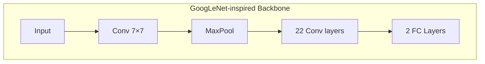
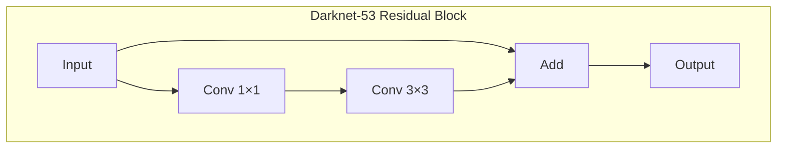
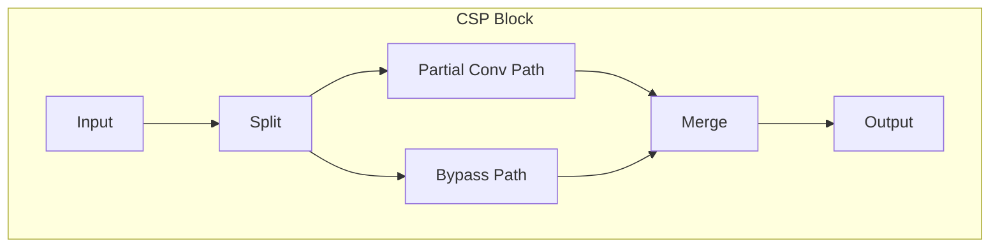
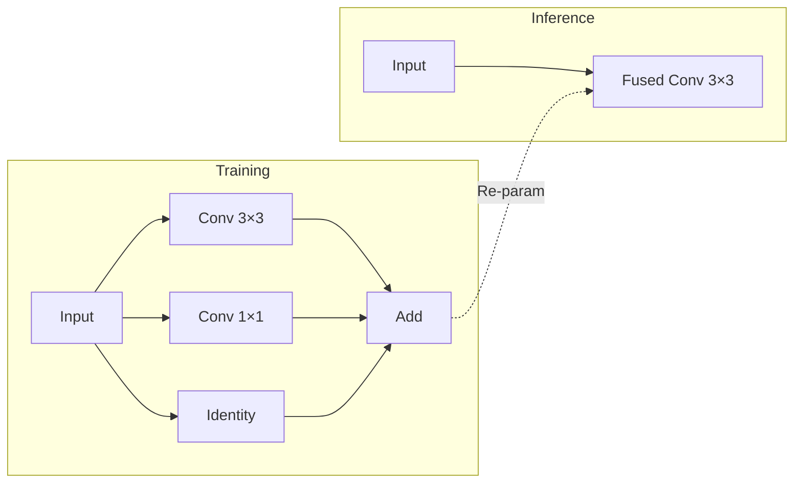
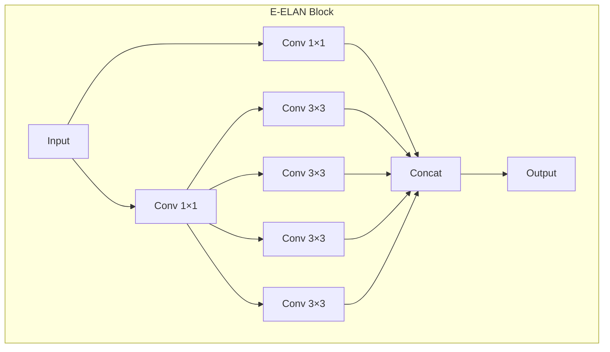
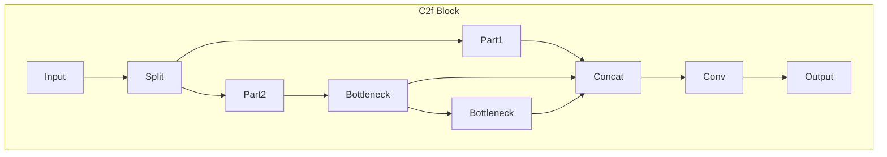
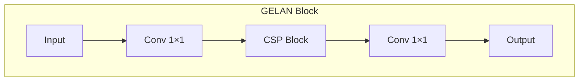
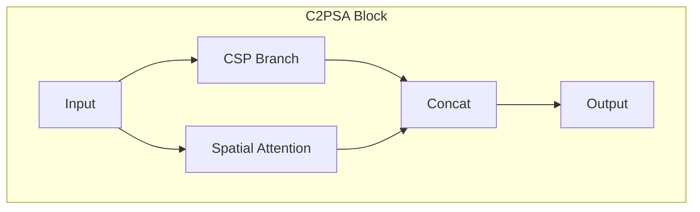
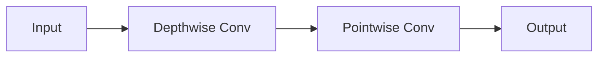

# ภาคผนวก B --- Backbone Lineage

> _Backbone ไม่ใช่แค่ feature extractor --- มันคือแกนกลางที่ gradient, speed, และ scale ต้องอยู่ร่วมกัน_

## B.1 GoogLeNet-inspired ConvNet (YOLOv1)

**ใช้ใน:** YOLOv1 (2016)

- ConvNet แบบ plain sequential --- ไม่มี residual / CSP / feature reuse
- 24 Conv + 2 Fully Connected layers
- Fixed-resolution feature map, gradient flow อ่อน

> Legacy role: พิสูจน์ว่า single-stage detection เป็นไปได้ แต่ไม่ scalable

**อ้างอิง:** Szegedy, C., et al. "Going deeper with convolutions." _CVPR_, 2015. arXiv:1409.4842

## B.2 Darknet Family (YOLOv2--v3)

### B.2.1 Darknet-19 (YOLOv2)

- 19 Conv + MaxPool, ไม่มี FC
- Batch Normalization ทุกชั้น
- สมดุล speed--accuracy สำหรับยุค 2017

### B.2.2 Darknet-53 (YOLOv3)

- 53 Conv + Residual connections (inspired by ResNet)
- Multi-scale feature extraction
- Backbone ตัวแรกที่ scale depth ได้โดยไม่ collapse

**อ้างอิง:**

1.  Redmon, J., & Farhadi, A. "YOLO9000: better, faster, stronger." _CVPR_, 2017. arXiv:1612.08242
2.  Redmon, J., & Farhadi, A. "YOLOv3: An incremental improvement." 2018. arXiv:1804.02767

## B.3 CSP (Cross Stage Partial) --- YOLOv4--v5

### แนวคิดหลัก

> Split feature flow → partial gradient reuse → lower redundancy

**ข้อดี:**

- ลด FLOPs โดยไม่สูญเสีย accuracy
- Gradient propagation ดีขึ้น
- **CSP เป็นแนวคิดเชิงโครงสร้างที่มีอิทธิพลมากที่สุด** หลังยุค Darknet

**อ้างอิง:** Wang, C.-Y., et al. "CSPNet: A new backbone that can enhance learning capability of CNN." _CVPRW_, 2020. arXiv:1911.11929

## B.4 EfficientRep --- YOLOv6

### Re-parameterization

- **Training:** multi-branch (Conv 3×3 + Conv 1×1 + Identity)
- **Inference:** fused เป็น single Conv 3×3

> Backbone สำหรับ **industrial deployment** ไม่ใช่ research elegance

**อ้างอิง:** Li, C., et al. "YOLOv6: A single-stage object detection framework for industrial applications." 2022. arXiv:2209.02976

## B.5 E-ELAN (Extended ELAN) --- YOLOv7

### ปรัชญาการออกแบบ

> Expand → Shuffle → Merge โดยไม่ทำลาย gradient paths

**จุดเด่น:**

- Gradient flow ดีเยี่ยม
- Capacity สูงโดยไม่ต้อง stack ลึก
- ELAN เป็น **gradient architecture** ไม่ใช่แค่ block

**อ้างอิง:** Wang, C.-Y., et al. "YOLOv7: Trainable bag-of-freebies sets new state-of-the-art for real-time object detectors." 2022. arXiv:2207.02696

## B.6 C2f --- YOLOv8

### แรงจูงใจ

- แทนที่ C3 block → ลด memory movement, ปรับปรุง parallelism

> C2f = CSP refined for modern accelerators

**อ้างอิง:** Ultralytics. "YOLOv8." _GitHub_, 2023. Ultralytics GitHub

## B.7 GELAN --- YOLOv9

**Generalized Efficient Layer Aggregation Network**

- Lightweight, ออกแบบให้เข้ากับ PGI (Programmable Gradient Information)
- รักษา information density ตลอด network

> Backbone ที่ co-design กับ **training dynamics (PGI)**

**อ้างอิง:** Wang, C.-Y., et al. "YOLOv9: Learning What You Want to Learn Using Programmable Gradient Information." 2024. arXiv:2402.13616

## B.8 Attention-centric Backbones --- YOLOv11/v12

### C3k2 Block (YOLOv11)

- CSP bottleneck ที่ประหยัดกว่า, kernel size เล็กลง

### C2PSA Block (YOLOv11)

- CSP + Spatial Attention → เน้น regions สำคัญ

> ทิศทางใหม่: จาก "เพิ่มชั้น" → "เน้น feature ที่สำคัญ"

**อ้างอิง:** Khanam, R., & Hussain, M. "YOLOv11: An Overview of the Key Architectural Enhancements." 2024. arXiv:2410.17725

## B.9 Ultra-Light Edge Backbone --- YOLO26

- Depthwise Separable Convolutions (MobileNet/GhostNet-like)
- Quantization-friendly, low memory footprint

> Design goal: **Deploy first, publish later**

## ตารางสรุป Backbone (Architect View)

| ยุค     | Backbone        | Key Idea            | Lasting Impact |
| :------ | :-------------- | :------------------ | :------------- |
| v1      | GoogLeNet-like  | Proof of concept    | Historical     |
| v2--v3  | Darknet         | Residual + speed    | Foundation     |
| v4--v5  | CSPDarknet      | Gradient efficiency | Dominant       |
| v6      | EfficientRep    | Re-parameterization | Industry       |
| v7      | E-ELAN          | Gradient-first      | Peak realtime  |
| v8      | C2f             | Hardware-aware CSP  | Modern default |
| v9      | GELAN           | Training-aware      | Research       |
| v11--12 | CSP + Attention | Feature emphasis    | Trend          |
| v26     | Ultra-light     | Edge-first          | Deployment     |
