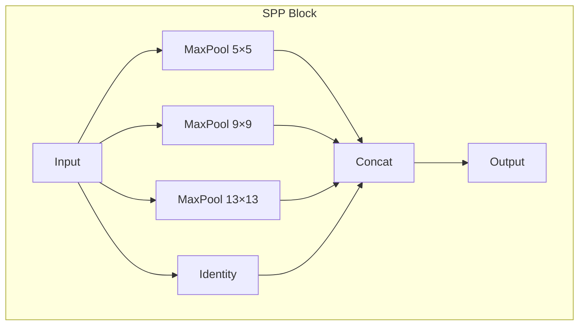
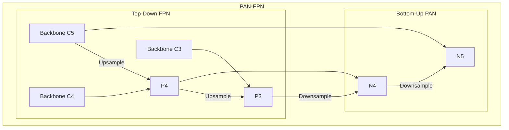

# ภาคผนวก C --- Neck Evolution

> _Neck คือทางด่วนข้อมูลที่เชื่อมต่อ feature maps ระหว่างสเกล --- รวม semantic จากชั้นลึกเข้ากับ spatial จากชั้นตื้น_

## C.1 Spatial Pyramid Pooling (SPP / SPPF)

**ใช้ใน:** YOLOv4, YOLOv5

### แนวคิด

> Aggregate features จากหลาย receptive field sizes โดยไม่เพิ่ม computation มาก

- **SPP:** parallel max-pooling ด้วย kernel sizes ต่าง ๆ (5×5, 9×9, 13×13)
- **SPPF (Fast):** sequential small-kernel pooling เพื่อลด latency

**ข้อดี:**

- ขยาย receptive field โดยไม่เพิ่ม parameters
- ปรับปรุง robustness ต่อ scale variation

**อ้างอิง:** He, K., et al. "Spatial Pyramid Pooling in Deep Convolutional Networks for Visual Recognition." _ECCV_, 2014. arXiv:1406.4729

## C.2 FPN (Feature Pyramid Network) --- Top-Down Path

**ใช้ใน:** YOLOv3

### สมการ

$$
 P_i = \mathcal{U}(P_{i+1}) \oplus F_i
$$

- $\mathcal{U}$: upsampling operator (bilinear ×2)
- $\oplus$: concatenation หรือ element-wise addition
- ส่ง semantic information จากชั้นลึกไปชั้นตื้น

**อ้างอิง:** Lin, T.-Y., et al. "Feature Pyramid Networks for Object Detection." _CVPR_, 2017. arXiv:1612.03144

## C.3 PAN-FPN (Path Aggregation Network)

**ใช้ใน:** YOLOv4, YOLOv5, YOLOv8

### แนวคิด

> เพิ่ม bottom-up path เข้ากับ FPN → bidirectional feature flow

### ความแตกต่างจาก PAN

| ด้าน       | PAN-FPN             | BiFPN                  |
| :--------- | :------------------ | :--------------------- |
| Connection | Fixed bidirectional | Weighted bidirectional |
| Fusion     | Concat/Add          | Weighted sum           |
| ใช้ใน YOLO | v4--v8              | ไม่ใช้ (latency สูง)   |

## ตารางสรุป Neck Evolution

| ยุค | Neck       | เทคนิค               | ข้อดีหลัก               |
| :-- | :--------- | :------------------- | :---------------------- |
| v1  | ไม่มี      | single feature map   | ---                     |
| v3  | FPN-like   | top-down only        | semantic propagation    |
| v4  | SPP + PAN  | top-down + bottom-up | multi-scale fusion      |
| v5  | SPPF + PAN | optimized SPP        | faster inference        |
| v8+ | PAN + C2f  | hardware-aware       | balanced speed/accuracy |
