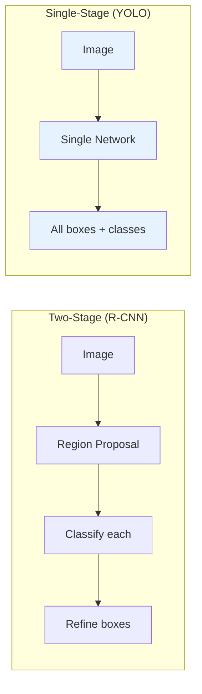
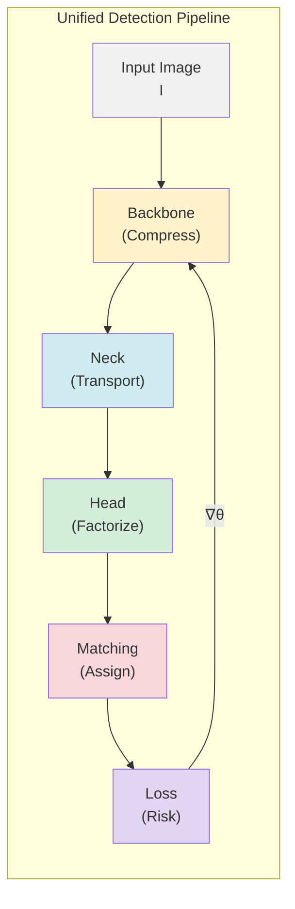
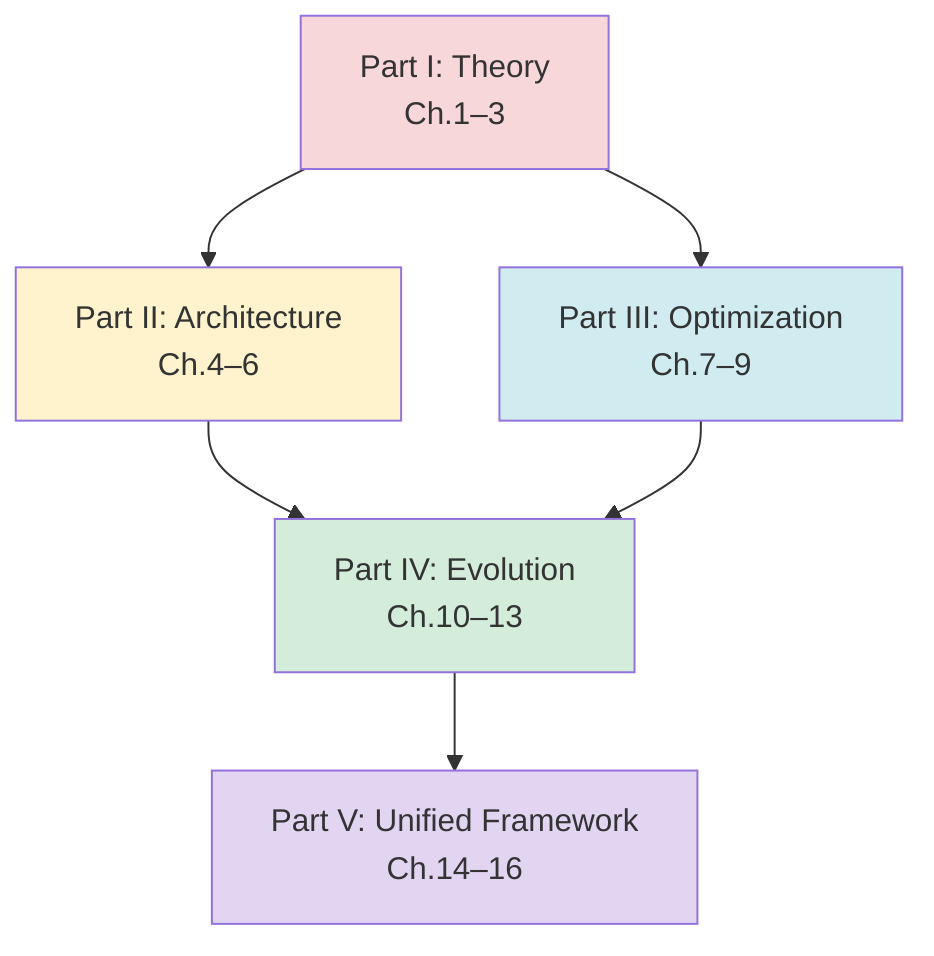

# บทที่ 1 — Detection as Structured Prediction

## 1.1 นิยามปัญหา Object Detection

การตรวจจับวัตถุ (**Object Detection**) เป็นปัญหา **structured prediction** ที่ต้องแก้สองปัญหาย่อยพร้อมกัน:

1. **Localization** — ระบุตำแหน่งของวัตถุในรูปแบบ bounding box $(x, y, w, h)$
2. **Classification** — ระบุชนิดของวัตถุจากเซตคลาส $\mathcal{C} = \{c_1, c_2, \ldots, c_C\}$

ให้ภาพอินพุต $\mathbf{I} \in \mathbb{R}^{H \times W \times 3}$ เป้าหมายคือการหาเซตของ annotations:

$$
\mathcal{A} = \{(b_i, c_i, s_i)\}_{i=1}^{N}
$$

| สัญลักษณ์                    | ความหมาย                         |
| :--------------------------- | :------------------------------- |
| $b_i = (x_i, y_i, w_i, h_i)$ | **bounding box** ของวัตถุที่ $i$ |
| $c_i \in \mathcal{C}$        | คลาสของวัตถุ                     |
| $s_i \in [0,1]$              | **confidence score**             |
| $N$                          | จำนวนวัตถุในภาพ (ไม่คงที่)       |

ความท้าทายหลักคือ $N$ ไม่คงที่ — แต่ละภาพมีจำนวนวัตถุแตกต่างกัน ทำให้ไม่สามารถจัดเป็น fixed-size regression ตรงไปตรงมาได้

---

## 1.2 Output Space Decomposition

Object detection ไม่ใช่ปัญหา classification หรือ regression ทั่วไป — แต่เป็น **structured prediction** ที่ output space มีโครงสร้างซับซ้อน

### Structured Output Space

$$
\mathcal{Y} = \mathcal{B} \times \mathcal{O} \times \mathcal{C}
$$

| Component                            | Space          | ความหมาย                            |
| :----------------------------------- | :------------- | :---------------------------------- |
| $\mathcal{B} \subseteq \mathbb{R}^4$ | Bounding box   | $(x, y, w, h)$ coordinates          |
| $\mathcal{O} \subseteq [0,1]$        | Objectness     | ความน่าจะเป็นว่ามีวัตถุ             |
| $\mathcal{C} \subseteq [0,1]^C$      | Classification | probability vector over $C$ classes |

### ความแตกต่างจาก Standard Regression

| ด้าน             | Standard Regression | Detection                        |
| :--------------- | :------------------ | :------------------------------- |
| Output dimension | คงที่               | **ผันแปร** (จำนวนวัตถุไม่คงที่)  |
| Output structure | vector              | **set of structured tuples**     |
| Evaluation       | MSE/MAE             | **mAP**, IoU-based               |
| Training target  | 1:1 mapping         | **assignment problem** (grid→GT) |

---

## 1.3 The YOLO Thesis: Detection as Single-Pass Regression

### Two Paradigms

ก่อนยุค YOLO สถาปัตยกรรม detection แบ่งเป็นสองแนวทาง:

**Two-Stage** (R-CNN family): สร้าง region proposals ก่อน → จำแนกแต่ละ proposal — ข้อจำกัด: latency สูง เพราะต้องรัน classifier ทุก proposal แยกกัน

**Single-Stage** (YOLO): รวม localization + classification เป็น **single forward pass** — ข้อดี: real-time inference

### Paradigm Shift

> **YOLO Thesis** (Redmon et al., 2016): การตรวจจับวัตถุสามารถจัดเป็น **single regression problem** ที่ map จากพิกเซลภาพไปยัง bounding box coordinates + class probabilities โดยตรง ภายใน forward pass เดียว

$$
f_\theta: \mathbb{R}^{H \times W \times 3} \rightarrow \mathbb{R}^{S \times S \times D}
$$

| ด้าน           | Two-Stage                | YOLO                   |
| :------------- | :----------------------- | :--------------------- |
| Forward passes | หลายครั้ง (per proposal) | **ครั้งเดียว**         |
| Latency        | สูง ($>100\,\text{ms}$)  | ต่ำ ($<30\,\text{ms}$) |
| End-to-end     | ซับซ้อน                  | ตรงไปตรงมา             |
| Global context | จำกัด (per-crop)         | **ทั้งภาพ**            |

---

## 1.4 Grid Discretization — แก้ปัญหา Variable-Length Output

YOLO แก้ปัญหา variable-length output โดยการ **discretize** ลง grid คงที่ — ทำให้ output มีขนาดคงที่ $S \times S \times D$ แม้จำนวนวัตถุจริงจะต่างกัน

### Prediction Lattice

$$
\Lambda = \{(i, j) \mid i \in \{0, \ldots, S-1\}, \, j \in \{0, \ldots, S-1\}\}
$$

แต่ละ lattice point $(i,j)$:

- **Anchor-based**: มี $A$ anchor slots ($A$ bounding box hypotheses)
- **Anchor-free**: มี 1 prediction point (regression จาก center)

### Multi-Scale Grid

เมื่อใช้ multi-scale prediction (YOLOv3+) จำนวน prediction ทั้งหมด:

$$
N_{total} = \sum_{l} S_l^2 \cdot A_l
$$

| Scale     | Grid $S_l$ | Anchors $A_l$               | Predictions        |
| :-------- | :--------- | :-------------------------- | :----------------- |
| P3        | 80         | 3 (anchor-based) / 1 (free) | 19,200 / 6,400     |
| P4        | 40         | 3 / 1                       | 4,800 / 1,600      |
| P5        | 20         | 3 / 1                       | 1,200 / 400        |
| **Total** | —          | —                           | **25,200 / 8,400** |

> **Definition 1.1** (Grid Responsibility)
>
> Grid cell $G_{ij}$ ที่ scale $l$ มี "responsibility" ต่อ ground truth $g_k$ เมื่อ center ของ $g_k$ ตกอยู่ใน spatial region ของ $G_{ij}$ ใน anchor-based paradigm ส่วนใน dynamic assignment ใช้เกณฑ์ที่ยืดหยุ่นกว่า (ดูบทที่ 8)

---

## 1.5 Probabilistic Formalization

### Joint Probability Model

ให้ $\mathbf{x}$ เป็นภาพอินพุตและ $\mathbf{y}$ เป็น structured output เราสามารถเขียน detection เป็น **conditional probability**:

$$
p(\mathbf{y} \| \mathbf{x}; \theta)
$$

### Factorization ข้าม Grid Cells

> **Assumption 1.1** (Conditional Independence of Grid Predictions)
>
> เมื่อกำหนด feature map $\mathbf{F}$ แล้ว predictions ที่ grid cells ต่าง ๆ เป็นอิสระต่อกัน:

$$
p(\mathbf{y} \| \mathbf{x}; \theta) = \prod_{i=1}^{S} \prod_{j=1}^{S} p(\mathbf{y}_{ij} \| F_{ij}; \theta_{head})
$$

> Assumption นี้ไม่จริงทั้งหมด (วัตถุใกล้กันมี spatial correlation) แต่ทำให้ training tractable ระบบจัดการ correlation ผ่าน **NMS** ในขั้น post-processing

### Per-Cell Task Factorization

แต่ละ grid cell $\mathbf{y}_{ij}$ สามารถ factorize ต่อ:

$$
p(\mathbf{y}_{ij} \| F_{ij}) = p(\mathbf{b}_{ij} \| F_{ij}) \cdot p(o_{ij} \| F_{ij}) \cdot p(\mathbf{c}_{ij} \| F_{ij})
$$

| Component            | Distribution                        | Loss ที่เชื่อมโยง |
| :------------------- | :---------------------------------- | :---------------- |
| $p(\mathbf{b} \| F)$ | Regression (Gaussian implicit)      | IoU / CIoU        |
| $p(o \| F)$          | Bernoulli                           | BCE               |
| $p(\mathbf{c} \| F)$ | Categorical / independent Bernoulli | CE / BCE          |

---

## 1.6 Unified Objective Function

### จาก Likelihood สู่ Loss

Total negative log-likelihood:

$$
L(\theta) = -\sum_{i} \log p(\mathbf{y}_i \| \mathbf{x}_i; \theta)
$$

ซึ่ง factorize ออกเป็น **unified detection objective**:

$$
\boxed{
\mathcal{L}(\theta) = \underbrace{\lambda_{loc} \mathcal{L}_{loc}}_{\text{localization}} + \underbrace{\lambda_{cls} \mathcal{L}_{cls}}_{\text{classification}} + \underbrace{\lambda_{obj} \mathcal{L}_{obj}}_{\text{objectness}}
}
$$

| Term                | Likelihood Connection         | Loss Function    | บทที่อธิบายละเอียด |
| :------------------ | :---------------------------- | :--------------- | :----------------- |
| $\mathcal{L}_{loc}$ | Geometric metric on box space | IoU / CIoU / DFL | บทที่ 7            |
| $\mathcal{L}_{cls}$ | Categorical / multi-label NLL | CE / BCE / FL    | บทที่ 7            |
| $\mathcal{L}_{obj}$ | Bernoulli NLL                 | BCE / VFL        | บทที่ 7            |
| $\lambda_*$         | Task-balancing priors         | Hyperparameters  | —                  |

> **Key Insight**: ฟังก์ชัน loss ทุกตัวใน YOLO **ไม่ใช่ heuristic** — แต่ละตัวเป็น negative log-likelihood ภายใต้ distributional assumption ที่ชัดเจน สิ่งที่วิวัฒน์ไปในแต่ละเวอร์ชันคือ **ลักษณะของ assumption** ที่เปลี่ยนไป

---

## 1.7 Central Thesis ของหนังสือ

### Detection = Structured Risk Minimization under Computational Constraints

ทุก architectural innovation ใน YOLO สามารถมองผ่านเลนส์เดียว:

$$
\theta^* = \arg\min_\theta \; \underbrace{\hat{R}(\theta)}_{\text{empirical risk}} \quad \text{subject to} \quad \underbrace{T(\theta) \leq T_{budget}}_{\text{latency constraint}}
$$

โดยที่:

- $\hat{R}(\theta) = \frac{1}{n} \sum_{i=1}^{n} \mathcal{L}(f_\theta(\mathbf{x}_i), \mathbf{y}_i)$ คือ empirical risk (ดูบทที่ 2)
- $T(\theta)$ คือ inference latency ของโมเดล (ดูบทที่ 3)

| Component | บทที่อธิบาย | บทบาทเชิงทฤษฎี                     |
| :-------- | :---------- | :--------------------------------- |
| Backbone  | บทที่ 4     | Information compression            |
| Neck      | บทที่ 5     | Multi-scale feature transport      |
| Head      | บทที่ 6     | Task probability factorization     |
| Matching  | บทที่ 8     | Discrete optimization (assignment) |
| Loss      | บทที่ 7     | Geometric risk minimization        |
| Gradient  | บทที่ 9     | Optimization dynamics              |

---

## 1.8 Proposition 1.1: Grid Coverage Sufficiency

> **Proposition 1.1** (Grid Coverage Sufficiency)
>
> ให้วัตถุมีขนาดเล็กสุด $w_{min} \times h_{min}$ ในภาพขนาด $W \times H$ ถ้าใช้ grid ขนาด $S \times S$ ที่ scale ละเอียดที่สุด (stride $s = W/S$) แล้ว grid cell สามารถ "รับผิดชอบ" วัตถุทุกตัวได้เมื่อ:

$$
s \leq \min(w_{min}, h_{min})
$$

> **Proof sketch:**
>
> ถ้า center ของวัตถุตกที่ตำแหน่ง $(x_c, y_c)$ ใน continuous space จะถูก map ไปที่ grid cell:

$$
G_{ij} : i = \lfloor x_c / s \rfloor, \quad j = \lfloor y_c / s \rfloor
$$

> Grid cell นี้ครอบคลุมพื้นที่ $[is, (i+1)s) \times [js, (j+1)s)$
>
> เมื่อ $s \leq w_{min}$ วัตถุจะมีขนาดอย่างน้อยเท่ากับ 1 grid cell ในแต่ละมิติ — ทำให้ network มี feature ที่เพียงพอสำหรับ prediction
>
> ในทางปฏิบัติ YOLOv3+ ใช้ 3 scales (stride 8, 16, 32) ทำให้วัตถุขนาด $\geq 8 \times 8$ pixels สามารถ detect ได้จาก $P_3$
>
> **ข้อจำกัด**: Proposition นี้เป็น necessary condition ไม่ใช่ sufficient — ในทางปฏิบัติ detection ต้องการ receptive field ที่ใหญ่กว่า grid cell เพื่อเข้าใจ context $\square$

---

## 1.9 โครงสร้างของหนังสือ

หนังสือเล่มนี้จัดเป็น 5 ภาค ตาม unified framework:

| ภาค                       | เนื้อหา                                                               | บทบาท                                       |
| :------------------------ | :-------------------------------------------------------------------- | :------------------------------------------ |
| **I — Theory**            | Detection formalization, Risk minimization, Computational constraints | **"ทำไม"** — วางแกนทฤษฎี                    |
| **II — Architecture**     | Backbone, Neck, Head                                                  | **"อะไร"** — component analysis             |
| **III — Optimization**    | Loss geometry, Label assignment, Gradient dynamics                    | **"อย่างไร"** — training mechanics          |
| **IV — Evolution**        | v1–v5, YOLOX–v8, v9–v12, YOLO26                                       | **"เมื่อไหร่"** — constraint-driven history |
| **V — Unified Framework** | System interaction, Pareto analysis, Entropy view                     | **"แล้วไง"** — synthesis                    |

ทุกข้อเสนอเชิงทฤษฎีจัดระดับเป็น 3 ชั้น:

| ระดับ  | ป้ายกำกับ                 | เงื่อนไข               |
| :----- | :------------------------ | :--------------------- |
| Tier 1 | **Proposition**           | มี proof sketch        |
| Tier 2 | **Empirical Observation** | มี citation            |
| Tier 3 | **Hypothesis**            | มี assumptions ระบุชัด |

---

## 1.10 Key Definitions

| สัญลักษณ์       | ความหมาย                                         |
| :-------------- | :----------------------------------------------- |
| $\mathbf{I}$    | ภาพอินพุต $\in \mathbb{R}^{H \times W \times 3}$ |
| $H, W$          | ความสูง, ความกว้างของภาพ                         |
| $S$             | จำนวน grid cells ต่อด้าน                         |
| $D$             | ความลึกของ prediction tensor                     |
| $C$             | จำนวนคลาส                                        |
| $\theta$        | พารามิเตอร์ของเครือข่าย                          |
| $f_\theta$      | ฟังก์ชันแม็ปจากภาพสู่ prediction                 |
| $b = (x,y,w,h)$ | bounding box coordinates                         |
| $\mathcal{L}$   | composite loss function                          |
| $\hat{R}$       | empirical risk                                   |

> **หมายเหตุ**: สัญลักษณ์ทั้งหมดเป็นไปตาม Appendix A — ใช้ตลอดทั้งเล่มอย่าง consistent

## เอกสารอ้างอิง

1. Redmon, J., Divvala, S., Girshick, R., & Farhadi, A. (2016). "You Only Look Once: Unified, Real-Time Object Detection." _CVPR 2016_. arXiv:1506.02640

2. Girshick, R., Donahue, J., Darrell, T., & Malik, J. (2014). "Rich feature hierarchies for accurate object detection and semantic segmentation." _CVPR 2014_. arXiv:1311.2524

3. Ren, S., He, K., Girshick, R., & Sun, J. (2015). "Faster R-CNN: Towards Real-Time Object Detection with Region Proposal Networks." _NeurIPS 2015_. arXiv:1506.01497

4. Liu, W., et al. (2016). "SSD: Single Shot MultiBox Detector." _ECCV 2016_. arXiv:1512.02325

5. Bishop, C. M. (2006). _Pattern Recognition and Machine Learning_. Springer. — Ch. 14 (Structured Output)

6. LeCun, Y., Chopra, S., Hadsell, R., Ranzato, M. A., & Huang, F. J. (2006). "A Tutorial on Energy-Based Learning." _Predicting Structured Data_, MIT Press.

7. Lin, T.-Y., et al. (2014). "Microsoft COCO: Common Objects in Context." _ECCV 2014_. arXiv:1405.0312
