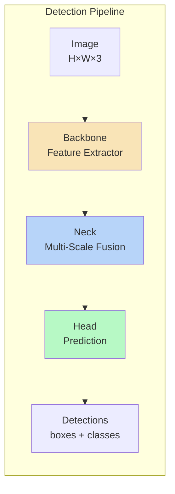
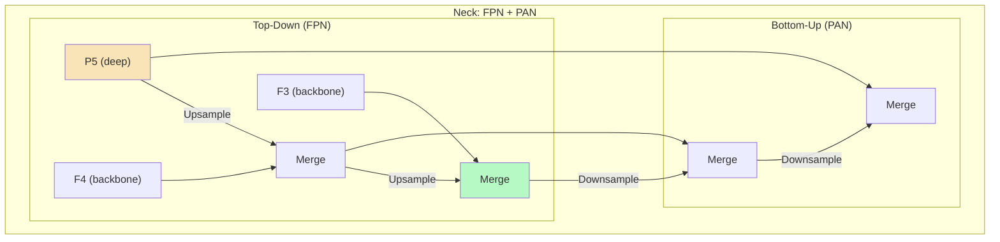
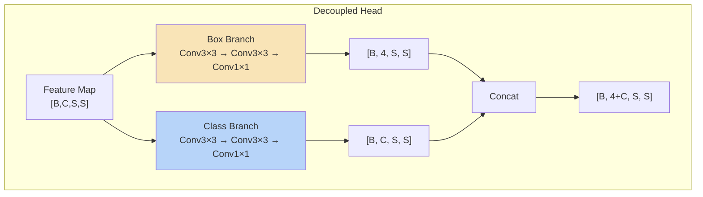

# บทที่ 2 --- สถาปัตยกรรมสามส่วน: Backbone --- Neck --- Head

## 2.1 ภาพรวมโครงสร้าง

สถาปัตยกรรม YOLO ทุกเวอร์ชัน (ตั้งแต่ v2 เป็นต้นไป) สามารถแบ่งออกเป็น 3 ส่วนหลัก:

แต่ละส่วนมีบทบาทที่ชัดเจน:

| ส่วน         | บทบาท                        | ผลลัพธ์                 |
| ------------ | ---------------------------- | ----------------------- |
| **Backbone** | ดึง **feature** จากภาพ       | Feature maps หลายระดับ  |
| **Neck**     | รวม feature ข้ามสเกล         | Fused feature pyramid   |
| **Head**     | แปลง feature เป็น prediction | Bounding boxes + scores |

> **หมายเหตุ**: YOLOv1 ไม่มี Neck --- feature map เดียวจาก backbone ถูกส่งตรงไป head ทำให้เป็นข้อจำกัดสำคัญสำหรับ **small object detection**

## 2.2 Backbone --- Feature Extractor

### หน้าที่

Backbone รับภาพอินพุตแล้วสร้าง **feature maps** ที่มี semantic meaning สูงขึ้นเรื่อย ๆ ผ่านการ **downsample** ทีละระดับ

ให้ $F_l$ เป็น feature map ที่ระดับ $l$:

$$
 F_l = \phi_l(F_{l-1})
$$

โดยที่:

| สัญลักษณ์                                        | ความหมาย                                           |
| :----------------------------------------------- | :------------------------------------------------- |
| $F_l \in \mathbb{R}^{C_l \times H_l \times W_l}$ | feature map ระดับ $l$                              |
| $\phi_l$                                         | transformation function ที่ระดับ $l$ (conv blocks) |
| $C_l$                                            | จำนวน channels (เพิ่มขึ้นตาม $l$)                  |
| $H_l, W_l$                                       | spatial resolution (ลดลงตาม $l$)                   |

### Feature Pyramid Levels

สำหรับ input $640 \times 640$, backbone สร้าง feature maps หลายระดับ:

| Level | Stride | Spatial Size   | Channels (ตัวอย่าง) | เหมาะกับ          |
| :---- | :----- | :------------- | :------------------ | :---------------- |
| $P_3$ | 8      | $80 \times 80$ | 128                 | **Small objects** |
| $P_4$ | 16     | $40 \times 40$ | 256                 | Medium objects    |
| $P_5$ | 32     | $20 \times 20$ | 512                 | Large objects     |

### วิวัฒนาการ Backbone

| ยุค    | Backbone       | จุดเด่น               | ใช้ใน      |
| :----- | :------------- | :-------------------- | :--------- |
| v1     | GoogLeNet-like | 24 Conv + 2 FC        | YOLOv1     |
| v2--v3 | Darknet        | Residual connections  | YOLOv2, v3 |
| v4--v5 | CSPDarknet     | Cross-Stage Partial   | YOLOv4, v5 |
| v7     | E-ELAN         | Gradient-first design | YOLOv7     |
| v8     | C2f            | Hardware-aware CSP    | YOLOv8     |
| v9     | GELAN          | Training-aware        | YOLOv9     |

> รายละเอียดวิวัฒนาการ backbone อยู่ใน บทที่ 14

## 2.3 Neck --- Multi-Scale Fusion

### ปัญหาที่ Neck แก้

Feature maps จาก backbone มีข้อจำกัดเชิงโครงสร้าง:

- **ระดับลึก** ($P_5$): semantic สูง แต่ spatial resolution ต่ำ → ขาดรายละเอียดตำแหน่ง
- **ระดับตื้น** ($P_3$): spatial resolution สูง แต่ semantic ต่ำ → ขาดความเข้าใจเชิงความหมาย

Neck ทำหน้าที่ **รวม (fuse)** ข้อมูลจากทั้งสองทิศทาง

### Feature Pyramid Network (FPN) --- Top-Down Path

แนวคิดจาก Lin et al. (2017):

$$
 P_i = \mathcal{U}(P_{i+1}) \oplus F_i
$$

| สัญลักษณ์     | ความหมาย                                   |
| :------------ | :----------------------------------------- |
| $\mathcal{U}$ | **upsampling** operator (เช่น bilinear ×2) |
| $\oplus$      | concatenation หรือ element-wise addition   |
| $P_i$         | fused feature ที่ระดับ $i$                 |

### Path Aggregation Network (PAN) --- Bottom-Up Path

เพิ่มเติมจาก FPN โดยเพิ่ม bottom-up path (Liu et al., 2018):

ผลลัพธ์: feature ทุกระดับได้ทั้ง **semantic (จาก top-down)** และ **spatial (จาก bottom-up)**

### วิวัฒนาการ Neck

| ยุค    | Neck       | เทคนิค               |
| :----- | :--------- | :------------------- |
| v1     | ไม่มี      | single feature map   |
| v3     | FPN-like   | top-down only        |
| v4--v5 | SPP + PAN  | top-down + bottom-up |
| v5+    | SPPF + PAN | optimized SPP        |

> รายละเอียดอยู่ใน บทที่ 15

## 2.4 Head --- Prediction Module

### หน้าที่

Head แปลง fused feature maps จาก Neck ให้เป็น **prediction tensor** --- ประกอบด้วย:

1.  **Bounding box parameters** --- ตำแหน่งและขนาด
2.  **Objectness score** --- ความน่าจะเป็นว่ามีวัตถุ
3.  **Class probabilities** --- แต่ละคลาส

### สองยุคหลักของ Head

#### Coupled Head (YOLOv2--v5)

Branch เดียว --- **classification** + **regression** ไหลผ่าน convolutional layer ตัวเดียวกัน แล้วแบ่ง channel เชิงตรรกะ:

    Conv2d(C_in → A×(5+C), kernel=1×1)

Output: $[B, A \times (5+C), S, S]$

    Channel 0–3   → bbox (tx, ty, tw, th)
    Channel 4     → objectness
    Channel 5–84  → class scores (COCO)

#### Decoupled Head (YOLOX, YOLOv8+)

สอง branches แยกกัน --- ลด **task interference**:

| ด้าน              | Coupled  | Decoupled       |
| :---------------- | :------- | :-------------- |
| โครงสร้าง         | 1 branch | 2 branches      |
| Task interference | มี       | ลดลง            |
| Parameters        | น้อย     | มากกว่าเล็กน้อย |
| ยุคที่ใช้         | v2--v5   | YOLOX, v8+      |

> รายละเอียดอยู่ใน บทที่ 16 และ Gradient Purity Index

## 2.5 Tensor Flow ระหว่างสามส่วน

ตัวอย่าง shape progression สำหรับ input $640 \times 640$ (แบบ YOLOv5s):

| idx   | Layer                         | Output Shape        | ส่วน             |
| :---- | :---------------------------- | :------------------ | :--------------- |
| 0     | Input                         | $[B, 3, 640, 640]$  | ---              |
| 1     | Conv stem (stride 2)          | $[B, 32, 320, 320]$ | backbone         |
| 2     | Conv (stride 2)               | $[B, 64, 160, 160]$ | backbone         |
| 3-4   | CSP + Conv (stride 2)         | $[B, 128, 80, 80]$  | Backbone ($P_3$) |
| 5-6   | CSP + Conv (stride 2)         | $[B, 256, 40, 40]$  | Backbone ($P_4$) |
| 7-9   | CSP + Conv (stride 2) + SPP   | $[B, 512, 20, 20]$  | Backbone ($P_5$) |
| 10-11 | Upsample + Concat $P_4$       | $[B, 512, 40, 40]$  | Neck (top-down)  |
| 12-13 | CSP + Upsample + Concat $P_3$ | $[B, 256, 80, 80]$  | Neck (top-down)  |
| 14-16 | Downsample + Concat + CSP     | $[B, 256, 40, 40]$  | Neck (bottom-up) |
| 17-18 | Downsample + Concat + CSP     | $[B, 512, 20, 20]$  | Neck (bottom-up) |
| 19    | Head (P3)                     | $[B, 255, 80, 80]$  | Head             |
| 20    | Head (P4)                     | $[B, 255, 40, 40]$  | Head             |
| 21    | Head (P5)                     | $[B, 255, 20, 20]$  | Head             |

> $255 = 3 \times (5 + 80)$ สำหรับ **COCO dataset** (3 **anchors** × 85 values)

ดูตารางเลเยอร์ฉบับเต็มใน Appendix E

## 2.6 Proposition 2.1: Depth-Resolution Tradeoff

> **Proposition 2.1** (Depth-Resolution Tradeoff)
>
> ใน **hierarchical feature extraction** ด้วย convolutional layers ที่มี stride $s$ จำนวน $L$ ระดับ spatial resolution ลดลงแบบ exponential:

$$
H_l = \frac{H_0}{s^l}, \quad W_l = \frac{W_0}{s^l}
$$

> ในขณะที่ information capacity ต่อ pixel เพิ่มขึ้นตาม channel depth $C_l$
>
> **Proof sketch:**
>
> ที่ stride $s = 2$ และ $L$ ระดับ:
>
> - Spatial elements: $\frac{H_0 W_0}{4^l}$ (ลด quartic)
> - Channel depth: $C_l = C_0 \cdot 2^l$ (เพิ่ม exponential)
> - Total tensor size: $C_l \cdot H_l \cdot W_l = C_0 \cdot H_0 \cdot W_0 \cdot \frac{2^l}{4^l} = C_0 H_0 W_0 \cdot 2^{-l}$
>
> ดังนั้น tensor size รวมลดลงแต่ **semantic density per element เพิ่มขึ้น** --- receptive field ของแต่ละ element ครอบคลุมพื้นที่ $s^{2l}$ pixels ของภาพต้นฉบับ ซึ่งหมายความว่าข้อมูลเชิงตำแหน่งถูกแลกกับข้อมูลเชิงความหมาย
>
> นี่คือเหตุผลเชิงโครงสร้างที่ **Neck จำเป็น** --- เพื่อกู้คืน spatial information ที่ backbone สูญเสียไป $\square$

## เอกสารอ้างอิง

1.  Lin, T.-Y., Dollár, P., Girshick, R., He, K., Hariharan, B., & Belongie, S. (2017). "Feature Pyramid Networks for Object Detection." _CVPR 2017_. arXiv:1612.03144

2.  Liu, S., Qi, L., Qin, H., Shi, J., & Jia, J. (2018). "Path Aggregation Network for Instance Segmentation." _CVPR 2018_. arXiv:1803.01534

3.  He, K., Zhang, X., Ren, S., & Sun, J. (2016). "Deep Residual Learning for Image Recognition." _CVPR 2016_. arXiv:1512.03385

4.  Wang, C.-Y., Liao, H.-Y. M., Wu, Y.-H., Chen, P.-Y., Hsieh, J.-W., & Yeh, I.-H. (2020). "CSPNet: A New Backbone that can Enhance Learning Capability of CNN." _CVPRW 2020_. arXiv:1911.11929

5.  Ultralytics. (2020). "YOLOv5." _GitHub_. <https://github.com/ultralytics/yolov5>
