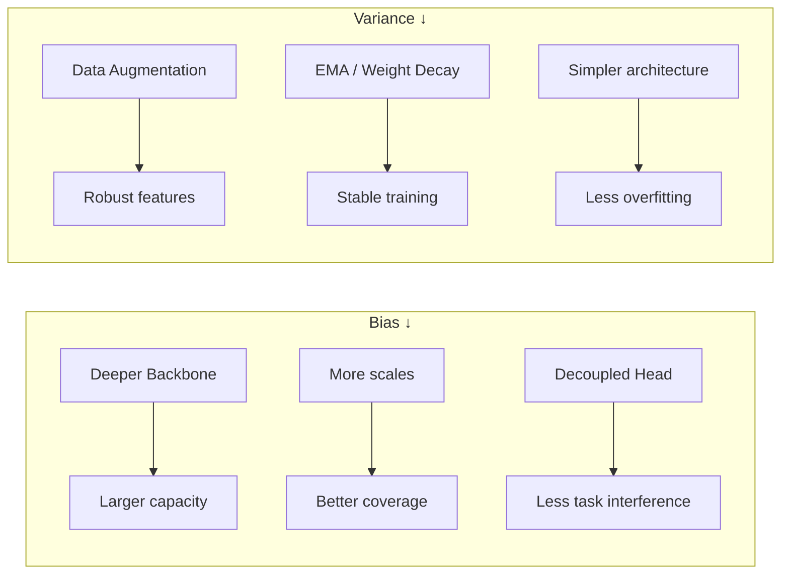

# บทที่ 4 — Statistical Learning View of Detection

## 4.1 Risk Minimization Framework

### True Risk

Detection สามารถมองเป็นปัญหา **risk minimization**:

$$
R(\theta) ;=; \mathbb{E}*{(\mathbf{x},\mathbf{y})\sim\mathcal{D}}\big[,\mathcal{L}\big(f*{\theta}(\mathbf{x}),\mathbf{y}\big),\big]
$$

|     สัญลักษณ์ | ความหมาย                    |
| ------------: | --------------------------- |
|   $R(\theta)$ | true risk (expected loss)   |
| $\mathcal{D}$ | data distribution (unknown) |
|  $f_{\theta}$ | detection network (YOLO)    |
| $\mathcal{L}$ | composite loss function     |

เป้าหมาย: หา $\theta^{*}=\arg\min_{\theta}R(\theta)$
แต่ $\mathcal{D}$ ไม่ทราบจริง เราจึงใช้ **empirical risk** แทน

---

### จาก Maximum Likelihood สู่ Loss Minimization

จาก Part 3 — probabilistic formalization:

$$
L(\theta) ;=; -\sum_{i=1}^{n}\log p(\mathbf{y}*{i}\mid \mathbf{x}*{i};\theta)
$$

Maximum Likelihood Estimation (MLE):

$$
\theta^{*}*{\text{ML}} ;=; \arg\min*{\theta} L(\theta)
$$

ดังนั้น การ minimize composite loss ใน YOLO สามารถตีความเป็น MLE ภายใต้โมเดลที่ factorize เป็น box + objectness + class (ดู Section 3.2)

---

## 4.2 Empirical Risk ใน Detection

### Empirical Risk Minimization (ERM)

เมื่อมี training set ${(\mathbf{x}_i,\mathbf{y}*i)}*{i=1}^{n}$:

$$
\hat{R}(\theta) ;=; \frac{1}{n}\sum_{i=1}^{n}\mathcal{L}\big(f_{\theta}(\mathbf{x}_i),\mathbf{y}_i\big)
$$

---

### ความซับซ้อนพิเศษของ Detection ERM

Detection แตกต่างจาก classification ตรงที่:

1. **Loss ไม่ใช่ scalar ต่อ sample** — แต่ละภาพมีหลาย grid cells ที่ contribute loss
2. **Assignment problem** — ต้องจับคู่ (match) ระหว่าง grid cells/anchors กับ ground truth ก่อนคำนวณ loss
3. **Class imbalance** — negative samples มากกว่า positive อย่างมาก (เช่น มากกว่า 100:1)

| ปัจจัย            | Classification |         Detection         |
| ----------------- | :------------: | :-----------------------: |
| Samples per image |       1        | $S^2 \times A$ (หลายพัน)  |
| Assignment        |     ไม่มี      | grid/anchor → GT matching |
| Positive ratio    |      ~50%      |            ~1%            |
| Loss components   |       1        |    3 (box + obj + cls)    |

---

### Regularization ในเชิง Detection

YOLO ใช้ implicit / explicit regularization หลายรูปแบบ:

| เทคนิค                            | ผลต่อ risk                          |
| --------------------------------- | ----------------------------------- |
| Data augmentation (Mosaic, MixUp) | ลด variance, ขยาย effective dataset |
| Weight decay                      | ลด model complexity                 |
| EMA (Exponential Moving Average)  | ลด optimization noise               |
| Early stopping                    | ป้องกัน overfitting                 |

---

## 4.3 Bias–Variance Tradeoff ใน Dense Prediction

### Framework

Under squared-loss approximation:

$$
R(\theta) ;\approx; \text{Bias}^2 + \text{Variance} + \text{Noise}
$$

| Component | ความหมายใน Detection                                           |
| --------- | -------------------------------------------------------------- |
| Bias      | ข้อจำกัดเชิงโครงสร้าง — model ไม่สามารถ represent solution ได้ |
| Variance  | ความไวต่อ training data เฉพาะชุด                               |
| Noise     | Irreducible error (annotation noise, ambiguity)                |

---

### ผลกระทบของ Architectural Choices

---

### ตัวอย่างเชิงเวอร์ชัน

| YOLO Version |                     Bias |           Variance | หมายเหตุ                      |
| ------------ | -----------------------: | -----------------: | ----------------------------- |
| v1           |       สูง (single scale) | ต่ำ (simple model) | Underfitting                  |
| v3           |       ลดลง (multi-scale) |      เพิ่มเล็กน้อย | Balance ดีขึ้น                |
| v5           |          ต่ำ (CSP + PAN) |            ปานกลาง | Augmentation ช่วยคุม variance |
| v8           | ต่ำมาก (C2f + decoupled) |            ปานกลาง | TAL ช่วยลด noise              |
| v9           |             ต่ำมาก (PGI) |      สูง (complex) | ระวัง overfit                 |

---

## 4.4 Sample Complexity Intuition

### จำนวน Training Samples ที่ต้องการ

Detection ต้องการ data มากกว่า classification เพราะ:

1. Output space ใหญ่กว่า — ต้องเรียนรู้ทั้ง location + class
2. Multi-scale — ต้องเห็นวัตถุหลายขนาด
3. Context — ต้องเข้าใจ spatial relationship

### Scaling Behavior (Empirical)

Model performance (mAP) มักแสดงพฤติกรรมประมาณ:

$$
\text{mAP} ;\propto; \alpha\cdot \log(\text{training samples}) + \beta
$$

จาก COCO experiments: performance scales logarithmically กับจำนวน training images — diminishing returns หลังราว ๆ 50k images สำหรับ COCO-scale models

---

### ผลต่อ YOLO Training

| Strategy                                | ผลต่อ sample efficiency                        |
| --------------------------------------- | ---------------------------------------------- |
| Mosaic augmentation                     | ×4 effective images per batch (approx.)        |
| Multi-scale training                    | เห็นวัตถุหลายขนาด                              |
| Transfer learning (pretrained backbone) | ลด samples needed สำหรับ domain-specific tasks |

---

## 4.5 Hypothesis 4.1 — Depth–Bias–Variance

**Hypothesis 4.1 (Depth–Bias–Variance in Detection Backbones)**

ใน hierarchical feature extraction, backbone ที่ลึกกว่า (deeper) จะลด bias (เพิ่ม representational capacity) แต่เพิ่ม variance (จำนวน parameters ที่ต้อง estimate เพิ่ม)

**Assumptions**

1. Training data size คงที่
2. ไม่มี regularization พิเศษ (no augmentation, no EMA, etc.)
3. Convergence ถึง local minimum

**Evidence (Empirical)**

- Darknet-19 (YOLOv2, 19 layers): mAP 48.1% บน VOC2007
- Darknet-53 (YOLOv3, 53 layers): mAP 55.3% บน VOC2007
- เพิ่ม depth มากโดยไม่มี residual/CSP → gradient vanishing → ไม่ converge

**Discussion**

ในทางปฏิบัติ YOLO generations แก้ปัญหา variance ด้วย:

- Residual connections (v3+)
- CSP partial feature reuse (v4–v5)
- E-ELAN gradient expansion (v7)

ผลลัพธ์: depth เพิ่มได้โดย variance ไม่ระเบิด $\square$

---

## เอกสารอ้างอิง

1. Vapnik, V. N. _Statistical Learning Theory_. Wiley. — Ch. 3 (Risk Minimization). Statistical Learning Theory
2. Hastie, T., Tibshirani, R., & Friedman, J. _The Elements of Statistical Learning_, 2nd ed., Springer. — Ch. 7 (Model Assessment). Elements of Statistical Learning
3. Redmon, J., & Farhadi, A. YOLO9000: Better, Faster, Stronger. arXiv:1612.08242
4. Redmon, J., & Farhadi, A. YOLOv3: An Incremental Improvement. arXiv:1804.02767
5. Zhu, X., Su, W., Lu, L., Li, B., Wang, X., & Dai, J. Deformable DETR: Deformable Transformers for End-to-End Object Detection. arXiv:2010.04159
6. Goodfellow, I., Bengio, Y., & Courville, A. _Deep Learning_. MIT Press. — Ch. 5, 7. Deep Learning
