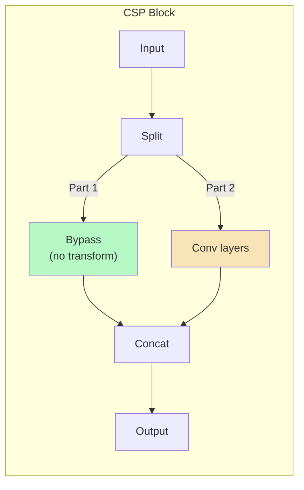

# บทที่ 5 --- Convolution ในเชิง Matrix Form และ Gradient Propagation

## 5.1 Convolution as Linear Operator

### Standard Convolution

ให้ input feature map $\mathbf{X} \in \mathbb{R}^{C_{in} \times H \times W}$ และ kernel $\mathbf{W} \in \mathbb{R}^{C_{out} \times C_{in} \times K \times K}$:

$$
 Y_{c_{out}, i, j} = \sum_{c_{in}=1}^{C_{in}} \sum_{m=0}^{K-1} \sum_{n=0}^{K-1} W_{c_{out}, c_{in}, m, n} \cdot X_{c_{in}, i+m, j+n} + b_{c_{out}}
$$

ในรูปย่อ:

$$
 \mathbf{Y} = \mathbf{W} * \mathbf{X} + \mathbf{b}
$$

| สัญลักษณ์         | ความหมาย                 |
| :---------------- | :----------------------- |
| $*$               | **convolution** operator |
| $K$               | kernel size              |
| $C_{in}, C_{out}$ | input/output channels    |
| $\mathbf{b}$      | bias vector              |

## 5.2 Toeplitz Matrix Representation

### จาก Convolution สู่ Matrix Multiplication

Convolution สามารถเขียนในรูป matrix multiplication ได้โดยการจัดเรียง input เป็น column vector (im2col):

$$
 \text{vec}(\mathbf{Y}) = \mathbf{T}_W \cdot \text{vec}(\mathbf{X}) + \mathbf{b}
$$

โดยที่ $\mathbf{T}_W$ เป็น **Toeplitz matrix** (doubly block circulant สำหรับ 2D convolution):

$$
 \mathbf{T}_W \in \mathbb{R}^{(C_{out} \cdot H_{out} \cdot W_{out}) \times (C_{in} \cdot H \cdot W)}
$$

### ทำไมต้องรู้?

การเข้าใจ Toeplitz form ทำให้:

1.  วิเคราะห์ **gradient flow** ได้เป็นทางการ
2.  เข้าใจ **parameter sharing** --- entries ซ้ำกันใน $\mathbf{T}_W$
3.  คำนวณ complexity ได้ตรง: FLOPs = จำนวน non-zero entries ใน $\mathbf{T}_W$

### ตัวอย่าง: 1D Convolution, $K=3$, $\text{stride}=1$

$$
 \mathbf{T}_W = \begin{bmatrix} w_0 & w_1 & w_2 & 0 & 0 \\ 0 & w_0 & w_1 & w_2 & 0 \\ 0 & 0 & w_0 & w_1 & w_2 \end{bmatrix}
$$

สังเกตว่า $w_0, w_1, w_2$ ซ้ำทุกแถว --- นี่คือ weight sharing

## 5.3 Backpropagation Chain Rule

### Gradient ผ่าน Layer เดียว

สำหรับ layer $l$ ที่ $F_l = \phi_l(F_{l-1})$:

$$
 \frac{\partial \mathcal{L}}{\partial F_{l-1}} = \frac{\partial \mathcal{L}}{\partial F_l} \cdot \frac{\partial F_l}{\partial F_{l-1}}
$$

### Gradient ผ่านหลาย Layers (Chain Rule)

สำหรับ network ที่มี $L$ layers:

$$
 \frac{\partial \mathcal{L}}{\partial F_0} = \frac{\partial \mathcal{L}}{\partial F_L} \cdot \prod_{l=1}^{L} \frac{\partial F_l}{\partial F_{l-1}}
$$

### Jacobian ของ Convolution Layer

สำหรับ convolution layer (ไม่มี activation):

$$
 \frac{\partial F_l}{\partial F_{l-1}} = \mathbf{T}_{W_l}
$$

Gradient เทียบกับ weight:

$$
 \frac{\partial \mathcal{L}}{\partial W_l} = \frac{\partial \mathcal{L}}{\partial F_l} \cdot \frac{\partial F_l}{\partial W_l}
$$

ในทางปฏิบัติ $\frac{\partial F_l}{\partial W_l}$ คือ cross-correlation ของ upstream gradient กับ input feature

## 5.4 Vanishing & Exploding Gradients

### Formal Condition

จาก chain rule product:

$$
 \left\| \frac{\partial \mathcal{L}}{\partial F_0} \right\| = \left\| \frac{\partial \mathcal{L}}{\partial F_L} \right\| \cdot \prod_{l=1}^{L} \left\| \frac{\partial F_l}{\partial F_{l-1}} \right\|
$$

| เงื่อนไข                | ผลลัพธ์                                             |
| :---------------------- | :-------------------------------------------------- |
| $\prod \|\cdot\| \ll 1$ | **Vanishing gradient** --- layers ลึกไม่ได้เรียนรู้ |
| $\prod \|\cdot\| \gg 1$ | **Exploding gradient** --- training ไม่เสถียร       |

### Spectral Norm Analysis

ให้ $\sigma_l = \|J_l\|_2$ (largest singular value ของ Jacobian ที่ layer $l$):

$$
 \left\| \frac{\partial \mathcal{L}}{\partial F_0} \right\|_2 \leq \left\| \frac{\partial \mathcal{L}}{\partial F_L} \right\|_2 \cdot \prod_{l=1}^{L} \sigma_l
$$

เมื่อ $\sigma_l < 1$ ทุก layer → gradient vanish exponentially กับ $L$

### ผลกระทบใน YOLO

| YOLO Version | Depth   | ปัญหา Gradient          | แก้ไขด้วย                 |
| :----------- | :------ | :---------------------- | :------------------------ |
| v1           | 24+2 FC | Vanishing (no shortcut) | Simple architecture       |
| v2           | 19      | ยังมีบ้าง               | **Batch Normalization**   |
| v3           | 53      | ลดลงมาก                 | **Residual connections**  |
| v4--v5       | 53+     | เสถียร                  | CSP + residual            |
| v7           | ลึก     | เสถียรมาก               | E-ELAN gradient expansion |
| v9           | ลึกมาก  | ควบคุมได้               | PGI explicit injection    |

## 5.5 Residual Connection as Gradient Highway

### โครงสร้าง Residual Block

$$
 F_l = F_{l-1} + \mathcal{F}(F_{l-1}; W_l)
$$

โดยที่ $\mathcal{F}$ เป็น residual function (conv layers) --- (He et al., 2016)

### Gradient ผ่าน Residual

$$
 \frac{\partial F_l}{\partial F_{l-1}} = \mathbf{I} + \frac{\partial \mathcal{F}}{\partial F_{l-1}}
$$

| Component                                       | บทบาท                                              |
| :---------------------------------------------- | :------------------------------------------------- |
| $\mathbf{I}$                                    | **Identity shortcut** --- gradient ไหลตรง ไม่ลดทอน |
| $\frac{\partial \mathcal{F}}{\partial F_{l-1}}$ | Gradient จาก learned transformation                |

ดังนั้น gradient สำหรับ multiple residual blocks:

$$
 \frac{\partial \mathcal{L}}{\partial F_0} = \frac{\partial \mathcal{L}}{\partial F_L} \cdot \prod_{l=1}^{L} \left( \mathbf{I} + \frac{\partial \mathcal{F}_l}{\partial F_{l-1}} \right)
$$

เมื่อ expand product:

$$
 = \frac{\partial \mathcal{L}}{\partial F_L} \cdot \left( \mathbf{I} + \sum_{l} \frac{\partial \mathcal{F}_l}{\partial F_{l-1}} + \text{higher-order terms} \right)
$$

สังเกตว่า **term $\mathbf{I}$ รับประกันว่า gradient ไม่เป็นศูนย์** แม้ $\frac{\partial \mathcal{F}}{\partial F_{l-1}}$ จะเล็กมาก

### CSP Extension

Cross Stage Partial (CSP) ขยายแนวคิด residual:

- **Part 1** (bypass): gradient ไหลตรง 100%
- **Part 2** (conv): gradient ผ่าน transformation

ผลคือ CSP **รับประกัน gradient flow ที่ดีกว่า residual** เพราะ bypass ไม่มี transformation ใด ๆ เลย

## 5.6 Proposition 5.1: Residual Gradient Bound

> **Proposition 5.1** (Residual Gradient Lower Bound)
>
> ใน network ที่ประกอบด้วย $L$ residual blocks แต่ละ block มีรูป $F_l = F_{l-1} + \mathcal{F}_l(F_{l-1})$ gradient norm ที่ input layer มี lower bound:

$$
 \left\| \frac{\partial \mathcal{L}}{\partial F_0} \right\| \geq \left\| \frac{\partial \mathcal{L}}{\partial F_L} \right\| \cdot \left( 1 - \sum_{l=1}^{L} \left\| \frac{\partial \mathcal{F}_l}{\partial F_{l-1}} \right\| \right)
$$

> เมื่อ $\sum_l \|\frac{\partial \mathcal{F}_l}{\partial F_{l-1}}\| < 1$ (residual functions มี small Jacobian norm)
>
> **Proof:**
>
> จาก product expansion:

$$
\prod_{l=1}^{L} (\mathbf{I} + J_l) = \mathbf{I} + \sum_l J_l + \sum_{l<m} J_l J_m + \cdots
$$

> โดยที่ $J_l = \frac{\partial \mathcal{F}_l}{\partial F_{l-1}}$
>
> ใช้ triangle inequality:

$$
\left\| \prod_{l} (\mathbf{I} + J_l) \right\| \geq \|\mathbf{I}\| - \left\| \sum_l J_l + \text{h.o.t.} \right\|
$$

>

$$
\geq 1 - \sum_l \|J_l\| - \sum_{l<m} \|J_l\| \|J_m\| - \cdots
$$

> เมื่อ $\sum_l \|J_l\| < 1$ series converges และ:

$$
\geq 1 - \frac{\sum_l \|J_l\|}{1 - \max_l \|J_l\|} > 0
$$

> ดังนั้น gradient ไม่ vanish ตราบที่ residual functions มี bounded Jacobian norm
>
> **ผลสำหรับ YOLO:**
>
> - Darknet-53 (YOLOv3) ที่ใช้ residual blocks → gradient ถูก bound away from zero
> - v1--v2 ที่ไม่มี residual → ไม่มี guarantee นี้ ซึ่งจำกัดความลึกที่ train ได้
>
> $\square$

## เอกสารอ้างอิง

1.  He, K., Zhang, X., Ren, S., & Sun, J. (2016). "Deep Residual Learning for Image Recognition." _CVPR 2016_. arXiv:1512.03385

2.  Wang, C.-Y., et al. (2020). "CSPNet: A New Backbone that can Enhance Learning Capability of CNN." _CVPRW 2020_. arXiv:1911.11929

3.  Glorot, X., & Bengio, Y. (2010). "Understanding the difficulty of training deep feedforward neural networks." _AISTATS 2010_. Glorot & Bengio (AISTATS)

4.  Gray, R. M. (2006). _Toeplitz and Circulant Matrices: A Review_. Foundation and Trends in Communications and Information Theory. Gray (Toeplitz & Circulant Matrices)

5.  Goodfellow, I., Bengio, Y., & Courville, A. (2016). _Deep Learning_. MIT Press. --- Ch. 6.5, 8.2

6.  Redmon, J., & Farhadi, A. (2018). "YOLOv3: An Incremental Improvement." arXiv:1804.02767
