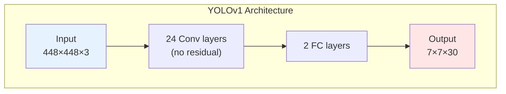
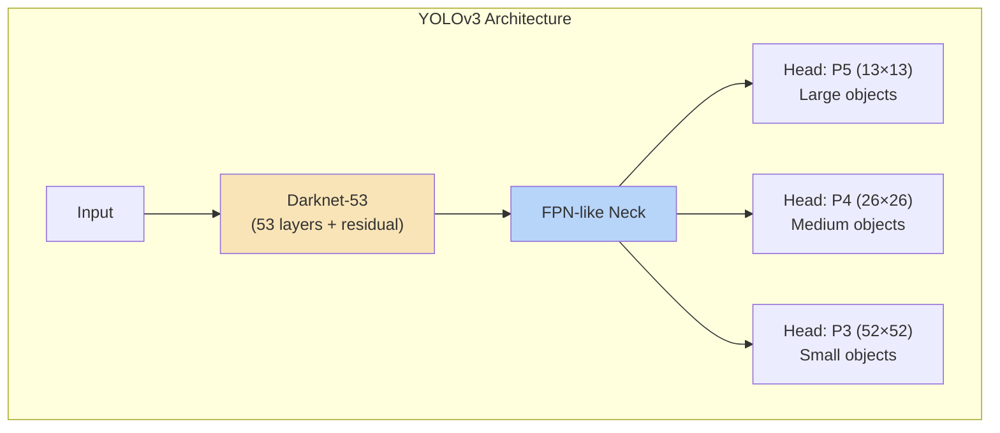

# บทที่ 7 --- YOLOv1--v3: จาก Proof of Concept สู่ Multi-Scale Detection

## 7.1 YOLOv1 --- Grid-Based Single-Shot Detection

### Architectural Profile

| ด้าน                   | รายละเอียด                        |
| :--------------------- | :-------------------------------- |
| **Year**               | 2016                              |
| **Author**             | Joseph Redmon et al.              |
| **Backbone**           | GoogLeNet-inspired 24 Conv + 2 FC |
| **Neck**               | ไม่มี                             |
| **Head**               | Coupled, single scale             |
| **Detection Paradigm** | Grid-based, no anchors            |

### Output Tensor

$$
 \mathbf{P} \in \mathbb{R}^{S \times S \times (B \times 5 + C)}
$$

สำหรับ PASCAL VOC ($S=7$, $B=2$, $C=20$):

$$
 7 \times 7 \times (2 \times 5 + 20) = 7 \times 7 \times 30
$$

| Component    | Channels | ความหมาย                             |
| :----------- | :------- | :----------------------------------- |
| $B \times 4$ | 8        | box coords $(x,y,w,h)$ ต่อ $B$ boxes |
| $B \times 1$ | 2        | confidence scores                    |
| $C$          | 20       | class conditional probabilities      |

### Theoretical Contribution

> **การตรวจจับวัตถุเป็น regression problem**
>
> YOLOv1 พิสูจน์ว่า detection สามารถจัดเป็น single regression pass ได้จริง ล้มล้างความเชื่อที่ว่าต้องใช้ region proposals

### ข้อจำกัดเชิงโครงสร้าง

1.  **Single scale** --- ใช้ feature map เดียว ($7 \times 7$) ทำให้ small objects ถูก miss
2.  **Fixed grid** --- แต่ละ cell ทำนายได้เพียง $B=2$ boxes → collision เมื่อมีวัตถุหลายตัวใน cell เดียว
3.  **FC layers** --- ไม่รักษา spatial structure, parameter หนักมาก
4.  **ไม่มี residual** --- gradient flow ที่ไม่ดี จำกัดความลึก

## 7.2 YOLOv2 --- Anchor Boxes และ Darknet-19

### Architectural Profile

| ด้าน         | รายละเอียด                          |
| :----------- | :---------------------------------- |
| **Year**     | 2017                                |
| **Author**   | Redmon & Farhadi                    |
| **Backbone** | Darknet-19 (19 Conv + BN)           |
| **Neck**     | Passthrough (early cross-scale)     |
| **Head**     | Coupled, single scale + passthrough |
| **Paradigm** | **Anchor-based**                    |

### นวัตกรรมหลัก: Anchor Boxes

แทนที่จะทำนาย box coordinates โดยตรง v2 ใช้ **anchor priors** --- bounding box templates ที่ได้จาก k-means clustering บน training set:

$$
 \text{anchors} = \{(p_{w,k}, p_{h,k})\}_{k=1}^{A}
$$

### Bounding Box Decoding

Network ทำนาย offsets จาก anchor:

**Center:**

$$
 b_x = \sigma(t_x) + c_x
$$

$$
 b_y = \sigma(t_y) + c_y
$$

**Size:**

$$
 b_w = p_w \cdot e^{t_w}
$$

$$
 b_h = p_h \cdot e^{t_h}
$$

| สัญลักษณ์    | ความหมาย                 | ดู Key                    |
| :----------- | :----------------------- | :------------------------ |
| $(t_x, t_y)$ | predicted center offset  | Section 2.1               |
| $(c_x, c_y)$ | grid cell top-left index | Section 2.2               |
| $(p_w, p_h)$ | anchor prior dimensions  | Section 2.2               |
| $\sigma$     | sigmoid function         | bounds center within cell |

### Output Tensor

$$
 \mathbf{P} \in \mathbb{R}^{S \times S \times A \times (5+C)}
$$

สำหรับ COCO ($S=13$, $A=5$, $C=80$):

$$
 13 \times 13 \times 5 \times 85 = 13 \times 13 \times 425
$$

### Theoretical Contribution

> **Prior-based search space reduction**: Anchor priors ลด regression problem จาก unconstrained space เป็น offset จาก "educated guess" --- ทำให้ convergence เร็วขึ้น

## 7.3 YOLOv3 --- Multi-Scale Prediction และ Darknet-53

### Architectural Profile

| ด้าน         | รายละเอียด                      |
| :----------- | :------------------------------ |
| **Year**     | 2018                            |
| **Author**   | Redmon & Farhadi                |
| **Backbone** | Darknet-53 (53 Conv + residual) |
| **Neck**     | FPN-like (top-down fusion)      |
| **Head**     | Coupled, **3 scales**           |
| **Paradigm** | Anchor-based, multi-scale       |

### สิ่งที่เปลี่ยน

1.  **Darknet-53**: เพิ่ม residual blocks → deeper, stable gradient
2.  **Multi-scale prediction**: 3 levels แทน 1

### Output Tensors (3 scales)

สำหรับ input $416 \times 416$ ใช้กับ COCO ($A=3$, $C=80$):

| Scale | Grid           | Output Shape       | Target Objects |
| :---- | :------------- | :----------------- | :------------- |
| P5    | $13 \times 13$ | $[B, 255, 13, 13]$ | Large          |
| P4    | $26 \times 26$ | $[B, 255, 26, 26]$ | Medium         |
| P3    | $52 \times 52$ | $[B, 255, 52, 52]$ | Small          |

$$
 255 = 3 \times (5 + 80) = 3 \times 85
$$

### Classification: Multi-Label

v3 เปลี่ยนจาก softmax เป็น **independent sigmoid** per class:

$$
 P_{class_i} = \sigma(c_i) \quad \forall i \in \{1, \ldots, C\}
$$

เหตุผล: รองรับ multi-label scenarios (e.g., "person" + "woman")

### Theoretical Contribution

> **Scale-decomposed feature hierarchy**: การใช้ 3 scales ทำให้ network มี **explicit specialization** --- แต่ละ scale "expert" ในวัตถุขนาดต่าง ๆ ลด responsibility conflict ใน grid

## 7.4 เปรียบเทียบ v1--v3

### Architectural Comparison

| ด้าน               | v1           | v2               | v3                   |
| :----------------- | :----------- | :--------------- | :------------------- |
| **Backbone**       | 24 Conv + FC | Darknet-19       | Darknet-53           |
| **Depth**          | 26 layers    | 19 layers        | 53 layers            |
| **Residual**       | ❌           | ❌               | ✅                   |
| **Neck**           | ❌           | Passthrough      | FPN-like             |
| **Scales**         | 1            | 1 (+passthrough) | 3                    |
| **Anchors**        | ❌           | 5 per cell       | 3 per cell per scale |
| **Classification** | Softmax      | Softmax          | **Sigmoid**          |

### Performance (COCO, ดูเงื่อนไขใน บทที่ 20)

| Model  | mAP@0.5       | FPS (GPU) | Source                           |
| :----- | :------------ | :-------- | :------------------------------- |
| YOLOv1 | 63.4% (VOC07) | 45        | Redmon et al. (2016), Table 1    |
| YOLOv2 | --            | 67        | Redmon & Farhadi (2017)          |
| YOLOv3 | 55.3% (COCO)  | 20        | Redmon & Farhadi (2018), Table 3 |

### Gradient & Training Perspective

| Version | Gradient Scale  | Stability | Training Ease |
| :------ | :-------------- | :-------- | :------------ |
| v1      | แรงมาก          | ❌        | ยาก           |
| v2      | แรง             | ⚠️        | ปานกลาง       |
| v3      | ใหญ่ แต่ smooth | ⚠️        | ง่ายขึ้น      |

## 7.5 Empirical Observation 7.1: Anchor Prior Convergence

> **Empirical Observation 7.1** (Anchor Priors Accelerate Convergence)
>
> การใช้ anchor priors ที่ได้จาก k-means clustering ลดจำนวน training iterations ที่ต้องใช้เพื่อ converge เทียบกับ direct coordinate regression
>
> **Evidence:**
>
> - Redmon & Farhadi (2017), Section 3: "Using anchor boxes we get a small decrease in accuracy ... however with anchor boxes our model gets to higher recall ... making it easier to learn to predict good detections"
> - YOLOv2 with anchors: recall เพิ่มจาก 81% เป็น 88% (VOC2007)
> - PerformanceYOLOv2 โดยใช้ k-means anchors ดีกว่า hand-designed anchors ≈ 5% average IoU (Redmon & Farhadi, 2017, Table 1)
>
> **Mechanism**: Anchor priors ทำหน้าที่เป็น **informed initialization** ของ box regression --- network ต้อง learn เพียง residual offset แทนที่จะ learn ทั้ง absolute position

## เอกสารอ้างอิง

1.  Redmon, J., Divvala, S., Girshick, R., & Farhadi, A. (2016). "You Only Look Once: Unified, Real-Time Object Detection." _CVPR 2016_. arXiv:1506.02640

2.  Redmon, J., & Farhadi, A. (2017). "YOLO9000: Better, Faster, Stronger." _CVPR 2017_. arXiv:1612.08242

3.  Redmon, J., & Farhadi, A. (2018). "YOLOv3: An Incremental Improvement." arXiv:1804.02767

4.  He, K., Zhang, X., Ren, S., & Sun, J. (2016). "Deep Residual Learning." _CVPR 2016_. arXiv:1512.03385

5.  Lin, T.-Y., et al. (2017). "Feature Pyramid Networks for Object Detection." _CVPR 2017_. arXiv:1612.03144
