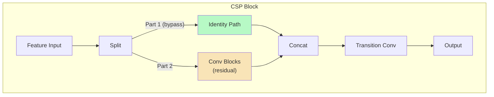

# บทที่ 8 --- YOLOv4--v5: CSP, PANet, และ Engineering Maturity

## 8.1 YOLOv4 --- Optimal Speed and Accuracy

### Architectural Profile

| ด้าน         | รายละเอียด                |
| :----------- | :------------------------ |
| **Year**     | 2020                      |
| **Authors**  | Bochkovskiy, Wang, & Liao |
| **Backbone** | CSPDarknet53              |
| **Neck**     | SPP + PANet               |
| **Head**     | Coupled (YOLOv3-style)    |
| **Paradigm** | Anchor-based, 3 scales    |

### Theoretical Contribution

> **Systematic Training Optimization Framework**: v4 จัดหมวดหมู่เทคนิค training เป็นระบบ:
>
> - **Bag of Freebies (BoF)**: เทคนิคที่เพิ่ม accuracy โดย**ไม่เพิ่ม inference cost** (เช่น augmentation, regularization, loss design)
> - **Bag of Specials (BoS)**: เทคนิคที่เพิ่ม accuracy โดย**เพิ่ม inference cost เล็กน้อย** (เช่น SPP, SAM, PAN)

### CSPDarknet53 Backbone

แนวคิดจาก CSP (Wang et al., 2020):

ผลเชิง gradient:

- Part 1 (bypass) → gradient ไหลตรง 100%
- Part 2 (dense) → gradient ผ่าน transformation
- **ลด gradient redundancy** --- ดู Proposition 8.1

### SPP (Spatial Pyramid Pooling)

Multi-scale context โดยไม่เปลี่ยน resolution:

$$
 \text{SPP}(F) = \text{Concat}(\text{MaxPool}_{k=5}(F), \text{MaxPool}_{k=9}(F), \text{MaxPool}_{k=13}(F), F)
$$

ผลลัพธ์: enlargement of receptive field โดยไม่เพิ่ม FLOPs (MaxPool ไม่มี parameters)

### Loss: CIoU

v4 เปลี่ยนจาก MSE/GIoU เป็น CIoU (Complete IoU):

$$
 \mathcal{L}_{CIoU} = 1 - \text{IoU} + \frac{\rho^2(\mathbf{b}, \mathbf{b}_{gt})}{c^2} + \alpha v
$$

| สัญลักษณ์                           | ความหมาย                                                                                             | ดู Key    |
| :---------------------------------- | :--------------------------------------------------------------------------------------------------- | :-------- |
| $\rho(\mathbf{b}, \mathbf{b}_{gt})$ | Euclidean distance between centers                                                                   | Section 7 |
| $c$                                 | diagonal of smallest enclosing box                                                                   | Section 7 |
| $v$                                 | aspect ratio consistency: $v = \frac{4}{\pi^2}(\arctan\frac{w_{gt}}{h_{gt}} - \arctan\frac{w}{h})^2$ |           |
| $\alpha$                            | tradeoff: $\alpha = \frac{v}{(1-\text{IoU})+v}$                                                      |           |

### Training Techniques (Bag of Freebies)

| เทคนิค                    | ผลต่อ bias-variance                  |
| :------------------------ | :----------------------------------- |
| **Mosaic augmentation**   | Variance ↓ (4 images per batch item) |
| CutMix                    | Variance ↓ (regularization)          |
| Self-Adversarial Training | Bias ↓ (harder examples)             |
| Label smoothing           | Variance ↓ (soft targets)            |
| DropBlock                 | Variance ↓ (spatial dropout)         |

## 8.2 YOLOv5 --- CSP + PAN ใน PyTorch Ecosystem

### Architectural Profile

| ด้าน             | รายละเอียด  |
| :--------------- | :---------- |
| **Year**         | 2020        |
| **Organization** | Ultralytics |

**Backbone** CSPDarknet (C3 blocks)

**Neck** SPPF + PAN

**Head** Coupled (anchor-based, 3 anchors/scale)

**Paradigm** Anchor-based, 3 scales

> **หมายเหตุ**: YOLOv5 ไม่มี peer-reviewed paper --- เป็น engineering-driven release ผ่าน GitHub

### สิ่งที่ v5 เพิ่มจาก v4

| Component     | v4             | v5                        |
| ------------- | -------------- | ------------------------- |
| Framework     | Darknet (C)    | **PyTorch**               |
| SPP           | SPP            | **SPPF** (faster)         |
| Auto-anchor   | Manual k-means | **Auto-anchor** (runtime) |
| Model scaling | Manual         | **5 tiers** (n/s/m/l/x)   |
| EMA           | Optional       | Default                   |
| Export        | Limited        | ONNX, TensorRT, CoreML    |

### Theoretical Contribution

> **Empirical Scaling Law**: v5 แสดงให้เห็นอย่างเป็นระบบว่า detection networks scale ได้ผ่าน width-depth multiplier (ดู scaling laws) โดยไม่ต้องเปลี่ยนสถาปัตยกรรม --- เป็น empirical validation ของ compound scaling principle

### ตารางเลเยอร์ (YOLOv5s, input 640×640)

ดูฉบับเต็มใน Appendix E --- สรุปย่อ:

| Section           | Layers | Input Shape          | Output Shape                 |
| ----------------- | ------ | -------------------- | ---------------------------- |
| Backbone stem     | 0–2    | $[B, 3, 640, 640]$   | $[B, 64, 160, 160]$          |
| Backbone P3       | 3–5    | $[B, 64, 160, 160]$  | $[B, 128, 80, 80]$           |
| Backbone P4       | 6–7    | $[B, 128, 80, 80]$   | $[B, 256, 40, 40]$           |
| Backbone P5 + SPP | 8–10   | $[B, 256, 40, 40]$   | $[B, 512, 20, 20]$           |
| Neck (top-down)   | 11–16  | Multi-scale inputs   | Multi-scale fused features   |
| Neck (bottom-up)  | 17–20  | Multi-scale features | Multi-scale fused features   |
| Head (3 scales)   | 21–23  | Fused feature maps   | $[B, 255, S, S]$ (per scale) |

### Model Variants

| Variant | Width | Depth | Params | FLOPs  | mAP@0.5 (COCO) |
| ------- | ----- | ----- | ------ | ------ | -------------- |
| v5n     | 0.25  | 0.33  | 1.9M   | 4.5G   | 45.7%          |
| v5s     | 0.50  | 0.33  | 7.2M   | 16.5G  | 56.8%          |
| v5m     | 0.75  | 0.67  | 21.2M  | 49.0G  | 63.1%          |
| v5l     | 1.00  | 1.00  | 46.5M  | 109.1G | 67.3%          |
| v5x     | 1.25  | 1.33  | 86.7M  | 205.7G | 68.9%          |

_Source: Ultralytics YOLOv5 README, Benchmark Table_

## 8.3 เปรียบเทียบ v4 vs v5

### Architectural Comparison

| ด้าน        | v4           | v5                            |
| ----------- | ------------ | ----------------------------- |
| Backbone    | CSPDarknet53 | CSPDarknet (C3)               |
| CSP variant | Original CSP | Simplified CSP (C3 block)     |
| Neck        | SPP + PAN    | SPPF + PAN                    |
| Loss        | CIoU         | CIoU                          |
| Training    | BoF + BoS    | BoF + Auto-anchor + EMA       |
| Scaling     | Manual       | Systematic 5-tier (n/s/m/l/x) |

### Performance Context

> **Empirical Observation 8.1**: v5 ไม่ได้เหนือ v4 ในทุกเงื่อนไข --- ข้อได้เปรียบหลักคือ usability, reproducibility, และ deployment ecosystem มากกว่า raw accuracy
>
> _Citation_: Comparison studies e.g., Jocher et al. (2020, GitHub Discussion #6998); Thailand et al. "A Comparison of YOLOv4 and YOLOv5 for Object Detection" (2021)

### Gradient & Training Perspective

Version Gradient Scale Stability Training Ease

---

v4 ใหญ่ แต่ smooth ✅ ดี
v5 คงที่ ✅ ดีมาก (auto-anchor, EMA)

## 8.4 Proposition 8.1: CSP Gradient Redundancy Reduction

> **Proposition 8.1** (CSP Reduces Gradient Redundancy)
>
> ให้ standard residual block มี gradient:

รูปแบบสมการที่ถูกต้อง (ลบ backslash ซ้อนและจัด LaTeX ให้สะอาด):

---

### Residual Block Gradient

$$
\nabla_{F_{\text{in}}} =
\nabla_{F_{\text{out}}}
\cdot
\left(
I + J_{\mathcal{F}}
\right)
$$

> โดยที่
>
> - $J_{\mathcal{F}}$ คือ Jacobian ของ transformation $\mathcal{F}$
> - $I$ คือ identity matrix (residual path)

---

### CSP Block (Feature Split)

ให้ split feature เป็นสองส่วน:

- $F_1$ = bypass branch
- $F_2$ = transformation branch

#### Gradient ของ Bypass Branch

$$
\nabla_{F_1} =
\nabla_{F_{\text{out}}}
\big|_{\text{bypass channels}}
$$

#### Gradient ของ Transform Branch

$$
\nabla_{F_2} =
\nabla_{F_{\text{out}}}
\big|*{\text{transform channels}}
\cdot
J*{\mathcal{F}_2}
$$

> **Proof sketch:**
>
> ใน standard residual:
>
> - Gradient ผ่าน **ทั้ง identity** และ **transform** path สำหรับ **ทุก channel**
> - ทำให้เกิด redundancy: channels เดียวกันถูก update ทั้ง 2 ทาง
>
> ใน CSP:
>
> - $F_1$ channels ถูก update เฉพาะ bypass path (clean gradient)
> - $F_2$ channels ถูก update เฉพาะ transform path
> - **ไม่มี gradient overlap** ระหว่าง 2 กลุ่ม
>
> ผลเชิงทฤษฎี:
>
> $$
> \text{Redundancy}_{\text{CSP}} = 0
> \quad
> \left(
> \text{vs. }
> \text{Redundancy}_{\text{residual}} > 0
> \right)
> $$

> ผลเชิงปฏิบัติ (Wang et al., 2020):
>
> - CSP ลด FLOPs ≈ 20% ที่ accuracy เท่าเดิม
> - Gradient diversity สูงขึ้น (วัดจาก cosine similarity ระหว่าง gradient updates)

## เอกสารอ้างอิง

1.  Bochkovskiy, A., Wang, C.-Y., & Liao, H.-Y. M. (2020). "YOLOv4: Optimal Speed and Accuracy of Object Detection." arXiv:2004.10934

2.  Wang, C.-Y., et al. (2020). "CSPNet: A New Backbone that can Enhance Learning Capability of CNN." _CVPRW 2020_. arXiv:1911.11929

3.  Ultralytics. (2020). "YOLOv5." _GitHub_. <https://github.com/ultralytics/yolov5>

4.  Zheng, Z., et al. (2020). "Distance-IoU Loss: Faster and Better Learning for Bounding Box Regression." _AAAI 2020_. arXiv:1911.08287

5.  He, K., et al. (2019). "Bag of Tricks for Image Classification with Convolutional Neural Networks." _CVPR 2019_. arXiv:1812.01187
