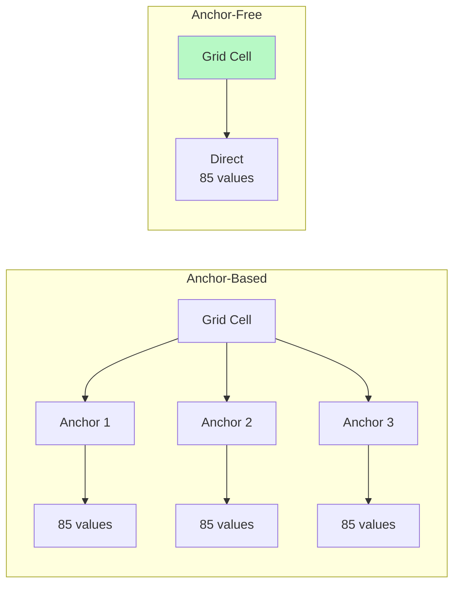
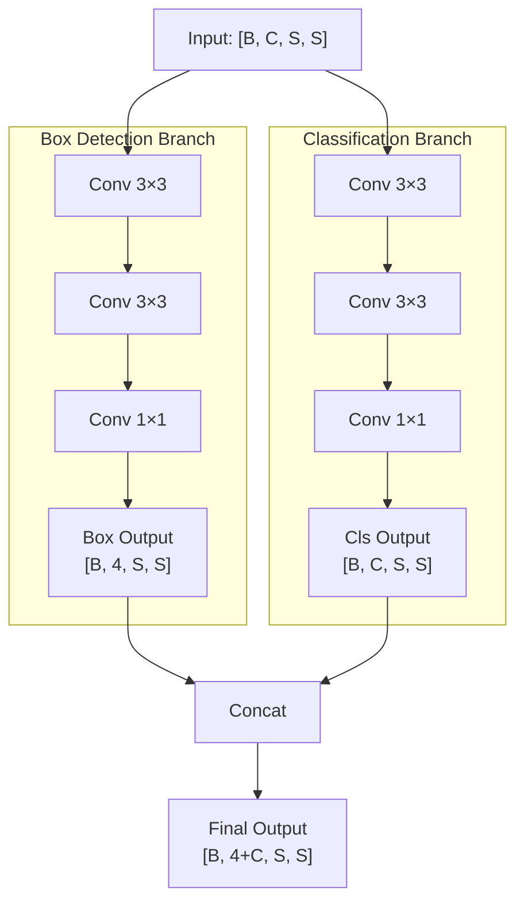

# บทที่ 9 --- Anchor-Free Paradigm: จาก Prior สู่ Point-Based Detection

## 9.1 ปัญหาของ Anchor-Based

### ปัญหาของ Anchor-Based

จาก บทที่ 7 และ บทที่ 8 ระบบ **anchor-based** มีข้อจำกัด:

| ปัญหา                  | รายละเอียด                                                      |
| :--------------------- | :-------------------------------------------------------------- |
| **Anchor design**      | ต้อง k-means clustering ต่อ dataset → hyperparameter            |
| **Slot collision**     | 1 cell มี $A$ slots → ถ้าวัตถุ $>A$ ตัวอยู่ใน cell เดียว → miss |
| **Prior mismatch**     | Anchor shape ไม่ตรงกับวัตถุจริง → regression ยากขึ้น            |
| **Static assignment**  | IoU-based matching → ไม่ยืดหยุ่น                                |
| **Output tensor ใหญ่** | $S \times S \times A \times (5+C)$ vs $S \times S \times (4+C)$ |

## 9.2 Anchor-Free: Distance Regression

### แนวคิด

แทนที่จะทำนาย offset จาก anchor prior → ทำนาย **ระยะจาก grid center ไปยังขอบกล่องโดยตรง**:

$$
 (l, t, r, b)
$$

| สัญลักษณ์ | ความหมาย                 | ดู Key         |
| :-------- | :----------------------- | :------------- |
| $l$       | ระยะจาก center ไปขอบซ้าย | distance-based |
| $t$       | ระยะไปขอบบน              |                |
| $r$       | ระยะไปขอบขวา             |                |
| $b$       | ระยะไปขอบล่าง            |                |

### Decode เป็น Box

ถ้า grid center คือ $(x_c, y_c)$:

$$
 x_{min} = x_c - l, \quad x_{max} = x_c + r
$$

$$
 y_{min} = y_c - t, \quad y_{max} = y_c + b
$$

### Output Tensor Shape

$$
 \mathbf{P} \in \mathbb{R}^{S \times S \times (4 + 1 + C)}
$$

**เปรียบเทียบ:**

| Paradigm     | Output per grid  | Grid depth | ตัวอย่าง (COCO)     |
| :----------- | :--------------- | :--------- | :------------------ |
| Anchor-based | $A \times (5+C)$ | $A$ slots  | $3 \times 85 = 255$ |
| Anchor-free  | $(4+1+C)$        | 1 point    | $85$                |

## 9.3 Decoupled Head

### จาก Coupled สู่ Decoupled

Coupled head ใช้ conv เดียวทำทุก task → เกิด **task interference**

Decoupled head (YOLOX, Ge et al., 2021) แยกเป็น 2 branches:

### ทำไมต้องแยก?

| ด้าน               | Coupled                | Decoupled             |
| :----------------- | :--------------------- | :-------------------- |
| **Parameters**     | แชร์ features          | แยก features          |
| **Gradient**       | cls gradient รบกวน box | **แยก gradient path** |
| **Accuracy**       | baseline               | +1--2% mAP            |
| **inference cost** | ต่ำ                    | สูงกว่าเล็กน้อย       |

## 9.4 Definition 9.1: Gradient Purity Index

> **Definition 9.1** (Gradient Purity Index)
>
> กำหนดให้ $\nabla_{cls}$ เป็น gradient ที่ไหลกลับจาก classification loss และ $\nabla_{reg}$ เป็น gradient จาก box regression loss แล้ว **Gradient Purity Index (GPI)** คือ:

$$
G = \frac{\|\nabla_{cls}\|}{\|\nabla_{reg}\|}
$$

> **ใช้วิเคราะห์:**
>
> | สถานการณ์     | $G$          | ความหมาย                             |
> | :------------ | :----------- | :----------------------------------- |
> | $G \approx 1$ | Balanced     | ทั้ง 2 tasks ได้รับ gradient เท่ากัน |
> | $G \gg 1$     | Cls-dominant | Classification loss ครอบงำ training  |
> | $G \ll 1$     | Reg-dominant | Box regression ครอบงำ                |
>
> **ในเชิง Head design:**
>
> - **Coupled head**: $G$ ผันแปรสูงเพราะ shared features → task interference
> - **Decoupled head**: $G$ เสถียรเพราะ gradient ถูก isolate

## 9.5 Proposition 9.1: Decoupled Gradient Interference Reduction

> **Proposition 9.1** (Decoupled Head Reduces Gradient Interference)
>
> ให้ $\mathcal{L}_{total} = \mathcal{L}_{cls} + \mathcal{L}_{reg}$ สำหรับ shared feature $F$
>
> ใน **coupled head**:

$$
\frac{\partial \mathcal{L}_{total}}{\partial F} = \frac{\partial \mathcal{L}_{cls}}{\partial F} + \frac{\partial \mathcal{L}_{reg}}{\partial F}
$$

> Interference เกิดเมื่อ:

$$
\cos\left(\frac{\partial \mathcal{L}_{cls}}{\partial F}, \frac{\partial \mathcal{L}_{reg}}{\partial F}\right) < 0
$$

> นั่นคือ gradient ของ 2 tasks ชี้ **ทิศทางตรงข้าม** → update ขัดกัน
>
> ใน **decoupled head** ($F_{cls}, F_{reg}$ แยกกัน):

$$
\frac{\partial \mathcal{L}_{cls}}{\partial F_{cls}} \perp \frac{\partial \mathcal{L}_{reg}}{\partial F_{reg}}
$$

> เนื่องจาก $F_{cls}$ และ $F_{reg}$ เป็น features คนละชุด gradient จึงไม่ interact กัน (orthogonal in parameter space)
>
> **Proof sketch:**
>
> 1.  ให้ $\theta_{cls}$ เป็น parameters ของ cls branch, $\theta_{reg}$ ของ reg branch
> 2.  $\frac{\partial \mathcal{L}_{cls}}{\partial \theta_{reg}} = 0$ (ไม่มี dependency)
> 3.  $\frac{\partial \mathcal{L}_{reg}}{\partial \theta_{cls}} = 0$ (symmetric)
> 4.  ดังนั้น **gradient interference = 0** ที่ head level
>
> **ข้อจำกัด**: Interference ยังคงเกิดที่ shared backbone features ที่อยู่ก่อน head --- decoupled head ลด interference เฉพาะ "last-mile" prediction

## 9.6 Empirical Observation 9.2: Anchor-Free Prior Mismatch Elimination

> **Empirical Observation 9.2** (Anchor-Free Eliminates Prior Mismatch)
>
> การเปลี่ยนจาก anchor-based เป็น anchor-free ขจัด prior mismatch problem แต่เพิ่ม assignment complexity
>
> **Evidence:**
>
> - Ge et al. (2021) YOLOX, Section 2.3: "The anchor-free detection paradigm requires more advanced label assignment strategies to compensate for the loss of anchor priors"
> - YOLOX (anchor-free + SimOTA) > YOLOv3 (anchor-based + static) ≈ +3% mAP บน COCO val
> - YOLOX Table 2: anchor-free baseline + decoupled head + SimOTA = 50.0% mAP@0.5:0.95 (YOLOX-L)

## เอกสารอ้างอิง

1.  Ge, Z., Liu, S., Wang, F., Li, Z., & Sun, J. (2021). "YOLOX: Exceeding YOLO Series in 2021." arXiv:2107.08430

2.  Tian, Z., Shen, C., Chen, H., & He, T. (2019). "FCOS: Fully Convolutional One-Stage Object Detection." _ICCV 2019_. arXiv:1904.01355

3.  Redmon, J., & Farhadi, A. (2018). "YOLOv3: An Incremental Improvement." arXiv:1804.02767
