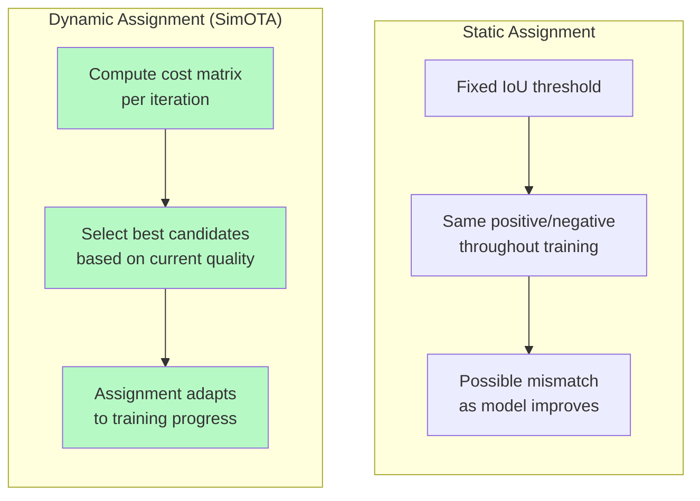
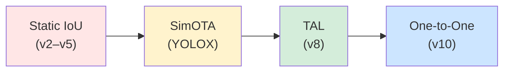

# บทที่ 10 --- Label Assignment Evolution: Static → Dynamic → End-to-End

## 10.1 Static Assignment (IoU Matching)

### แนวคิด

ใช้ใน YOLOv2--v5 (ยุค anchor-based):

1.  คำนวณ IoU ระหว่าง anchor priors กับทุก **ground truth**
2.  Assign anchor ที่มี IoU สูงสุดเป็น **positive sample**
3.  Anchors ที่ IoU \< threshold → **negative sample**

### สูตร

$$
 \text{assign}(a_k, g_j) = \begin{cases} \text{positive} & \text{if } IoU(a_k, g_j) = \max_k IoU(a_k, g_j) \\ \text{negative} & \text{if } IoU(a_k, g_j) < \tau_{neg} \\ \text{ignore} & \text{otherwise} \end{cases}
$$

### ปัญหา

| ปัญหา         | อธิบาย                                          |
| :------------ | :---------------------------------------------- |
| **Rigid**     | กฎตายตัว --- ไม่ปรับตาม training progress       |
| **Collision** | 2 GT อยู่ใน cell เดียว → anchor slot ไม่พอ      |
| **Mismatch**  | Anchor shape ไม่ตรง → label noise เชิง implicit |

## 10.2 SimOTA --- Dynamic Assignment

### แนวคิด

ใช้ใน YOLOX (Ge et al., 2021) --- assignment **ปรับตาม prediction quality**:

### ขั้นตอน

1.  **กำหนด candidate region** รอบ **ground truth** center
2.  **คำนวณ cost matrix** ระหว่าง candidates กับ GTs
3.  **เลือก Top-k** candidates ที่มี cost ต่ำสุดเป็น positive

### Alignment Score

$$
 t = s^\alpha \cdot u^\beta
$$

| สัญลักษณ์       | ความหมาย                             | ดู Key                      |
| :-------------- | :----------------------------------- | :-------------------------- |
| $t$             | alignment score                      |                             |
| $s$             | **classification score**             | quality of class prediction |
| $u$             | **IoU** between predicted box and GT | quality of localization     |
| $\alpha, \beta$ | hyperparameters                      | weighting between tasks     |

### ทำไมดีกว่า Static?

**Static Assignment**

- ใช้ _Fixed IoU threshold_ ตั้งแต่ต้นจนจบ
- Positive/negative ไม่เปลี่ยนตามคุณภาพโมเดล
- เมื่อโมเดลดีขึ้น เกณฑ์เดิมอาจไม่เหมาะ → เกิด _mismatch_

ผลคือ gradient บางส่วนไม่สะท้อนคุณภาพจริงของ prediction

---

**Dynamic Assignment (SimOTA)**

- คำนวณ cost matrix ใหม่ทุก iteration
- เลือก candidate ตาม “คุณภาพปัจจุบัน”
- Assignment ปรับตามความก้าวหน้าของ training

ผลคือ positive samples สอดคล้องกับ performance ของโมเดล ณ เวลานั้น →
gradient คมกว่า, convergence เสถียรกว่า, และลดความผิดเพี้ยนจาก threshold แข็ง

## 10.3 Task-Aligned Learning (TAL)

### แนวคิด

ใช้ใน YOLOv8 (Ultralytics, 2023) --- ปรับปรุงจาก SimOTA:

### Alignment Metric

$$
 t = s^\alpha \cdot u^\beta
$$

(โครงสร้างเดียวกับ SimOTA แต่ implementation แตกต่าง)

### ความแตกต่างจาก SimOTA

| ด้าน                | SimOTA                | TAL                              |
| :------------------ | :-------------------- | :------------------------------- |
| Candidate selection | Top-k per GT          | Metric-based threshold           |
| Loss weighting      | Uniform               | **Task-aligned** (weight by $t$) |
| Stability           | ดี                    | **ดีกว่า** (ลด oscillation)      |
| Implementation      | OT solver (expensive) | Simple sorting                   |

### Task-Aligned Loss

TAL ใช้ alignment metric $t$ เป็น weight ใน loss:

$$
\\ \mathcal{L}\_{cls} = -\sum_i t_i \cdot \text{BCE}(p_i, y_i)
$$

ผลคือ candidates ที่ align ดีกว่า → ได้ gradient มากกว่า → focus training

## 10.4 One-to-One Assignment (NMS-Free)

### แนวคิด

ใช้ใน YOLOv10 (Wang et al., 2024) --- แต่ละ GT ถูก assign ให้ **เพียง 1 prediction**:

$$
 \text{assign}: \mathcal{G} \rightarrow \mathcal{P}, \quad \|\text{assign}(g_j)\| = 1 \quad \forall g_j
$$

### Consistent Dual Assignment

v10 ใช้ **2 heads** ระหว่าง training:

1.  **One-to-many head** (เหมือน TAL) → สร้าง rich gradient
2.  **One-to-one head** → learn NMS-free prediction
3.  เฉพาะ one-to-one head ถูกใช้ตอน inference → ไม่ต้อง **NMS**

### ข้อจำกัด

ไม่ต้อง NMS ตอน inference **Label ambiguity sensitive**
Latency ลดลง Accuracy อาจ drop ใน noisy datasets
Simpler deployment Training ซับซ้อนกว่า (dual heads)

## 10.5 Assignment Timeline

ยุค Strategy ใช้ใน Flexibility

2017 Static IoU matching v2, v3, v4, v5 ❌ Rigid
2021 SimOTA (dynamic) YOLOX ✅ Adaptive
2023 TAL (task-aligned) v8, v11 ✅✅ Efficient
2024 One-to-one v10 --- NMS-free

## 10.6 Empirical Observation 10.1: Dynamic vs Static

> **Empirical Observation 10.1** (Dynamic Assignment Reduces Label Conflict)
>
> Dynamic assignment (SimOTA/TAL) ลด false positive rate เทียบกับ static IoU matching
>
> **Evidence:**
>
> - Ge et al. (2021) YOLOX Table 2: SimOTA vs static = +2.3% mAP (YOLOX-L, COCO val)
> - Feng et al. (2021) TOOD: Task-Aligned One-stage Object Detection --- alignment metric ลด label noise จาก assignment
> - Ultralytics v8 docs: TAL described as "more stable training than SimOTA with comparable accuracy"
>
> **Mechanism**: Dynamic assignment เลือก positive samples จาก predictions ที่ **model เชื่อมั่น** (high $s \cdot u$) ทำให้ gradient signal สะอาดกว่า

## เอกสารอ้างอิง

1.  Ge, Z., Liu, S., Wang, F., Li, Z., & Sun, J. (2021). "YOLOX: Exceeding YOLO Series in 2021." arXiv:2107.08430

2.  Feng, C., Zhong, Y., Gao, Y., Scott, M. R., & Huang, W. (2021). "TOOD: Task-aligned One-stage Object Detection." _ICCV 2021_. arXiv:2108.07755

3.  Wang, A., et al. (2024). "YOLOv10: Real-Time End-to-End Object Detection." arXiv:2405.14458

4.  Ultralytics. (2023). "YOLOv8." _GitHub_. <https://github.com/ultralytics/ultralytics>
