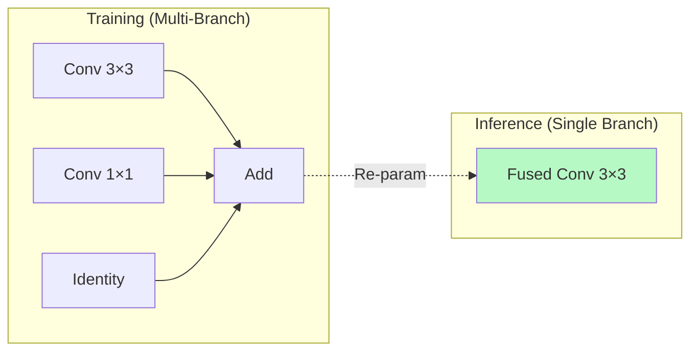
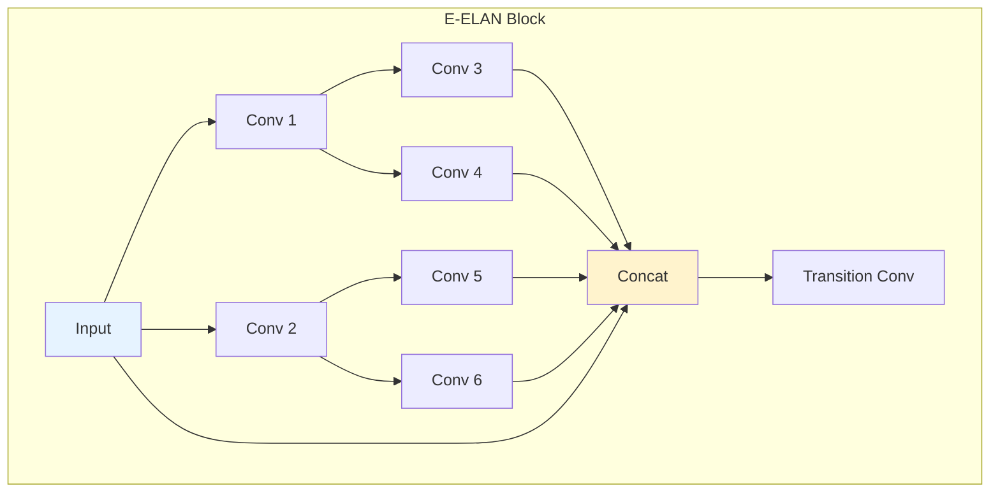

# บทที่ 11 --- YOLOX, v6, v7, v8: สถาปัตยกรรมตัวแทนยุค Anchor-Free

## 11.1 YOLOX --- Anchor-Free Pioneer

### Architectural Profile

| ด้าน           | รายละเอียด                            |
| :------------- | :------------------------------------ |
| **Year**       | 2021                                  |
| **Authors**    | Ge et al. (Megvii)                    |
| **Backbone**   | Modified CSPDarknet (Darknet53 + CSP) |
| **Neck**       | PAN                                   |
| **Head**       | **Decoupled**                         |
| **Paradigm**   | **Anchor-free**                       |
| **Assignment** | **SimOTA**                            |

### สิ่งที่ YOLOX เสนอ (สรุป)

| Innovation                           | ผลกระทบ                                       |
| :----------------------------------- | :-------------------------------------------- |
| Anchor-free + decoupled head         | ขจัด prior mismatch, ลด gradient interference |
| SimOTA                               | Dynamic label assignment                      |
| Strong augmentation (Mosaic + MixUp) | Variance ลดลง                                 |

### Performance

| Model   | Params | FLOPs  | mAP@0.5:0.95 | Source                    |
| :------ | :----- | :----- | :----------- | :------------------------ |
| YOLOX-S | 9.0M   | 26.8G  | 40.5%        | Ge et al. (2021), Table 6 |
| YOLOX-M | 25.3M  | 73.8G  | 46.9%        |                           |
| YOLOX-L | 54.2M  | 155.6G | 50.0%        |                           |

## 11.2 YOLOv6 --- EfficientRep Re-Parameterization

### Architectural Profile

| ด้าน           | รายละเอียด                  |
| :------------- | :-------------------------- |
| **Year**       | 2022                        |
| **Authors**    | Li et al. (Meituan)         |
| **Backbone**   | EfficientRep (RepVGG-style) |
| **Neck**       | RepPAN                      |
| **Head**       | Decoupled                   |
| **Assignment** | SimOTA → TAL (v3.0)         |

### Re-Parameterization

แนวคิดหลัก: **training กับ inference ใช้สถาปัตยกรรมต่างกัน**

Training:

$$
 y = W_{3\times3} * x + W_{1\times1} * x + x
$$

Inference (fused):

$$
 y = W'_{3\times3} * x
$$

โดยที่ $W'_{3\times3} = W_{3\times3} + \text{pad}(W_{1\times1}) + I$

ผล: Training ได้ expressiveness จากหลาย branches; inference ได้ speed จาก single branch

## 11.3 YOLOv7 --- E-ELAN Gradient Expansion

### Architectural Profile

| ด้าน           | รายละเอียด                                                   |
| :------------- | :----------------------------------------------------------- |
| **Year**       | 2022                                                         |
| **Authors**    | Wang, Bochkovskiy, & Liao                                    |
| **Backbone**   | E-ELAN                                                       |
| **Neck**       | Extended PAN                                                 |
| **Head**       | Coupled + Auxiliary Heads                                    |
| **Strategies** | Compound model scaling; Planned re-parameterized convolution |

### E-ELAN: Extended Efficient Layer Aggregation Network

E-ELAN ออกแบบโดย **คิดจาก gradient ก่อน**:

### Auxiliary Head Training

v7 ใช้ **auxiliary heads** ที่ intermediate layers เพื่อ inject gradient ลึกขึ้นใน network:

$$
 \mathcal{L}_{total} = \mathcal{L}_{main} + \sum_{k} \lambda_k \mathcal{L}_{aux,k}
$$

หลัง training → ตัด auxiliary heads ออก → inference cost ไม่เพิ่ม

## 11.4 YOLOv8 --- C2f + TAL Hardware-Aware Design

### Architectural Profile

| ด้าน             | รายละเอียด                 |
| :--------------- | :------------------------- |
| **Year**         | 2023                       |
| **Organization** | Ultralytics                |
| **Backbone**     | CSP with **C2f** blocks    |
| **Neck**         | PAN                        |
| **Head**         | **Decoupled**, anchor-free |
| **Assignment**   | **TAL**                    |

### C2f Block

C2f ปรับปรุงจาก CSP C3 block:

> C2f = Cross Stage Partial + Fine-grained features

| ด้าน           | C3 (v5)    | C2f (v8)                           |
| :------------- | :--------- | :--------------------------------- |
| Feature flow   | 2 paths    | 2 paths + bottleneck outputs       |
| Granularity    | Coarse     | **Fine-grained**                   |
| Memory pattern | Sequential | **Concat all** (hardware-friendly) |

### DFL (Distribution Focal Loss)

v8 ใช้ DFL แทน direct coordinate regression:

$$
 \hat{y} = \sum_{i=0}^{n} P(i) \cdot i
$$

โดยที่ $P(i)$ เป็น probability distribution เหนือ discrete bins --- ทำให้ regression แม่นยำกว่าการ predict scalar เดียว

### Loss Components

$$
 \mathcal{L}_{v8} = \lambda_{box} \mathcal{L}_{CIoU} + \lambda_{cls} \mathcal{L}_{BCE} + \lambda_{dfl} \mathcal{L}_{DFL}
$$

> หมายเหตุ: v8 **ไม่มี objectness branch** --- merge เข้า classification

## 11.5 Unified Comparison

### Architecture Table

| ด้าน       | YOLOX      | v6           | v7          | v8        |
| :--------- | :--------- | :----------- | :---------- | :-------- |
| Backbone   | CSPDarknet | EfficientRep | E-ELAN      | CSP-C2f   |
| Neck       | PAN        | RepPAN       | E-PAN       | PAN       |
| Head       | Decoupled  | Decoupled    | Coupled+aux | Decoupled |
| Assignment | SimOTA     | SimOTA/TAL   | Mosaic+aux  | TAL       |
| Anchor     | Free       | Free         | Based       | **Free**  |
| NMS        | ✅         | ✅           | ✅          | ✅        |

### Performance (COCO val, 640×640, comparable scale)

| Model    | Params | mAP@0.5:0.95 | FPS (T4) | Source             |
| :------- | :----- | :----------- | :------- | :----------------- |
| YOLOX-S  | 9.0M   | 40.5%        | 102      | Ge et al. (2021)   |
| YOLOv6-S | 18.5M  | 45.0%        | 113      | Li et al. (2022)   |
| YOLOv7   | 36.9M  | 51.2%        | 84       | Wang et al. (2022) |
| YOLOv8s  | 11.2M  | 44.9%        | 128      | Ultralytics (2023) |

> ดูเปรียบเทียบ normalized ใน บทที่ 20

### Gradient Perspective

| Version | Gradient Stability | Design Principle                     |
| :------ | :----------------- | :----------------------------------- |
| YOLOX   | ✅                 | CSP-based Anchor-free migration      |
| v6      | ✅                 | Rep-based Hardware efficiency        |
| v7      | ✅✅               | **E-ELAN** **Gradient-first design** |
| v8      | ✅                 | C2f Hardware-aware CSP               |

## 11.6 Hypothesis 11.1: E-ELAN Loss Landscape

> **Hypothesis 11.1** (E-ELAN Achieves Flatter Loss Landscape than CSP)
>
> E-ELAN ที่ใช้ใน YOLOv7 ทำให้ loss landscape แบนกว่า CSP-based backbones ส่งผลให้ generalization ดีขึ้น
>
> **Assumptions:**
>
> 1.  "Flat loss landscape" หมายถึง low curvature (small eigenvalues of **Hessian**) ใกล้ minimum
> 2.  Flat minima สัมพันธ์กับ generalization (Hochreiter & Schmidhuber, 1997; Foret et al., 2021)
> 3.  เปรียบเทียบบนสภาวะ training เดียวกัน (เช่น COCO, 300 epochs)
>
> **Reasoning:**
>
> - E-ELAN สร้าง **gradient paths มากกว่า** CSP ($2^n$ paths สำหรับ $n$ branches)
> - Gradient diversity สูงกว่า → exploration กว้างกว่า → converge ไปที่ flatter region
> - Wang et al. (2022) แสดงว่า E-ELAN มี "gradient path expansion" → richer gradient information
>
> **ข้อจำกัด:**
>
> - ไม่มี direct Hessian analysis ใน original paper
> - ต้องมีการวัด sharpness metric (เช่น SAM-style ε perturbation) เพื่อยืนยัน
> - Hypothesis ตั้งบน indirect evidence จาก generalization performance $\square$

## เอกสารอ้างอิง

1.  Ge, Z., et al. (2021). "YOLOX: Exceeding YOLO Series in 2021." arXiv:2107.08430

2.  Li, C., et al. (2022). "YOLOv6: A Single-Stage Object Detection Framework." arXiv:2209.02976

3.  Wang, C.-Y., Bochkovskiy, A., & Liao, H.-Y. M. (2022). "YOLOv7: Trainable bag-of-freebies sets new state-of-the-art for real-time object detectors." arXiv:2207.02696

4.  Ultralytics. (2023). "YOLOv8." _GitHub_. <https://github.com/ultralytics/ultralytics>

5.  Ding, X., et al. (2021). "RepVGG: Making VGG-style ConvNets Great Again." _CVPR 2021_. arXiv:2101.03697

6.  Hochreiter, S., & Schmidhuber, J. (1997). "Flat Minima." _Neural Computation_.

7.  Foret, P., et al. (2021). "Sharpness-Aware Minimization for Efficiently Improving Generalization." _ICLR 2021_. arXiv:2010.01412
