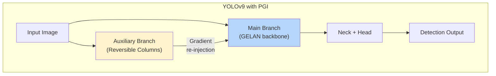

# บทที่ 12 --- YOLOv9--v12: PGI, NMS-Free, และ Attention Mechanisms

## 12.1 YOLOv9 --- GELAN + PGI

### Architectural Profile

### Architectural Profile

| ด้าน               | รายละเอียด                                  |
| :----------------- | :------------------------------------------ |
| **Year**           | 2024                                        |
| **Authors**        | Wang, Yeh, & Liao                           |
| **Backbone**       | **GELAN** (Generalized ELAN)                |
| **Neck**           | PAN-based                                   |
| **Head**           | Decoupled, anchor-free                      |
| **Key Innovation** | **PGI** (Programmable Gradient Information) |

### PGI: Programmable Gradient Information

ปัญหา: ใน deep networks ข้อมูลจาก input image ถูก "สูญเสีย" ผ่าน repeated downsampling --- Information Bottleneck principle

PGI แก้โดย: **inject gradient จาก auxiliary branch กลับเข้า main network อย่างชัดเจน**

### GELAN Backbone

GELAN ขยาย E-ELAN ให้ยืดหยุ่นกว่า:

| ด้าน            | E-ELAN (v7)     | GELAN (v9)                   |
| :-------------- | :-------------- | :--------------------------- |
| Block types     | Fixed conv      | **Any** (CSP, ELAN, RepConv) |
| Inner structure | Hard-coded      | **Programmable**             |
| Gradient paths  | Multiple, fixed | **Multiple, configurable**   |

### Performance

| Model    | Params | FLOPs  | mAP@0.5:0.95 | Source                      |
| :------- | :----- | :----- | :----------- | :-------------------------- |
| YOLOv9-S | 7.2M   | 26.7G  | 46.8%        | Wang et al. (2024), Table 6 |
| YOLOv9-M | 20.1M  | 76.8G  | 51.4%        |                             |
| YOLOv9-C | 25.5M  | 102.8G | 53.0%        |                             |

## 12.2 YOLOv10 --- NMS-Free Detection

### Architectural Profile

| ด้าน               | รายละเอียด                           |
| :----------------- | :----------------------------------- |
| **Year**           | 2024                                 |
| **Authors**        | Wang et al. (Tsinghua)               |
| **Key Innovation** | Consistent Dual Assignment, NMS-free |

### Consistent Dual Assignment

(ดูรายละเอียดใน Ch.10 Section 10.4)

Training ใช้ 2 heads:

- **One-to-many** head: rich gradient signal (เหมือน TAL)
- **One-to-one** head: NMS-free prediction

Inference ใช้เฉพาะ one-to-one head → ไม่ต้อง **NMS**

### ผลต่อ Latency

| Component           | With NMS   | Without NMS (v10) |
| :------------------ | :--------- | :---------------- |
| Model inference     | 6.5ms      | 6.5ms             |
| NMS post-processing | 1.2--3.0ms | **0ms**           |
| **Total**           | 7.7--9.5ms | **6.5ms**         |

## 12.3 YOLOv11--v12 --- Advanced Building Blocks

### YOLOv11

| ด้าน             | รายละเอียด                         |
| :--------------- | :--------------------------------- |
| **Year**         | 2024                               |
| **Organization** | Ultralytics                        |
| **Block**        | **C3k2** (smaller kernel CSP)      |
| **Attention**    | **C2PSA** (Partial Self-Attention) |

### YOLOv12

| ด้าน               | รายละเอียด         |
| :----------------- | :----------------- |
| **Year**           | 2025               |
| **Key Innovation** | **Area Attention** |

**Area Attention** แบ่ง feature map เป็น non-overlapping regions แล้ว apply self-attention ภายในแต่ละ region:

$$
 \text{AreaAttn}(F) = \frac{1}{\|\mathcal{R}\|} \sum_{R \in \mathcal{R}} \text{SelfAttn}(F_R)
$$

ผลคือ:

- ขนาด attention matrix: $O(N/R)^2$ แทน $O(N^2)$ --- ลดลงมาก
- ยังได้ contextual information ภายใน local regions

## 12.4 Hypothesis 12.1: PGI Information Bound

> **Hypothesis 12.1** (PGI Bounds Information Loss in Deep Hierarchies)
>
> Programmable Gradient Information (PGI) ช่วยรักษา mutual information ระหว่าง input $\mathbf{X}$ กับ deep features $\mathbf{F}_L$ โดย:

$$
I(\mathbf{X}; \mathbf{F}_L^{PGI}) \geq I(\mathbf{X}; \mathbf{F}_L^{std})
$$

> โดยที่ $I(\cdot;\cdot)$ คือ mutual information
>
> **Assumptions:**
>
> 1.  Information processing inequality: $I(\mathbf{X}; \mathbf{F}_{l+1}) \leq I(\mathbf{X}; \mathbf{F}_l)$ สำหรับ deterministic mapping
> 2.  PGI auxiliary branch provides additional gradient channel ที่ bypass intermediate bottlenecks
> 3.  Reversible columns ใน auxiliary branch reduce information loss
>
> **Reasoning:**
>
> - Data Processing Inequality บอกว่า information สามารถ **ลดเท่านั้น** ผ่าน deterministic processing
> - PGI ใช้ **auxiliary reversible columns** --- ซึ่ง reversible transformations มี $I(\mathbf{X}; \mathbf{F}_l) = I(\mathbf{X}; \mathbf{F}_{l+1})$ (no information lost)
> - Gradient จาก reversible branch ถูก inject กลับเข้า main branch → guide main network ไปสู่ features ที่ retain information มากขึ้น
>
> **Evidence (indirect):**
>
> - Wang et al. (2024), Section 3.2: "PGI ... generates reliable gradients through auxiliary reversible branch"
> - YOLOv9-C outperforms YOLOv8-C by +2.3% mAP with similar FLOPs (Table 6)
>
> **ข้อจำกัด:**
>
> - ยังไม่มี direct mutual information measurement ใน deep detection networks
> - Bound is qualitative, not quantitative $\square$

## เอกสารอ้างอิง

1.  Wang, C.-Y., Yeh, I.-H., & Liao, H.-Y. M. (2024). "YOLOv9: Learning What You Want to Learn Using Programmable Gradient Information." arXiv:2402.13616

2.  Wang, A., et al. (2024). "YOLOv10: Real-Time End-to-End Object Detection." arXiv:2405.14458

3.  Ultralytics. (2024). "YOLO11." _Documentation_. <https://docs.ultralytics.com/models/yolo11/>

4.  Tian, Y., et al. (2025). "YOLOv12: Attention-Centric Real-Time Object Detectors." arXiv:2502.12524
