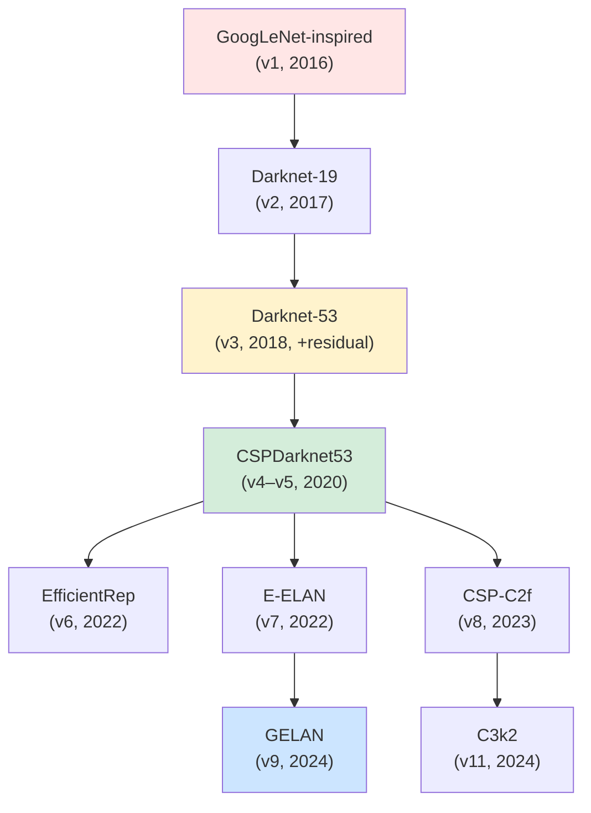

# บทที่ 14 --- วิวัฒนาการ Backbone: จาก GoogLeNet สู่ GELAN

## 14.1 Backbone Family Tree

> ดูรายละเอียดแต่ละ backbone ใน Appendix B และ A_appendix_backbones.md

## 14.2 FLOPs / Parameters / Gradient Comparison

### Backbone-Only Comparison (ประมาณ, input 640×640)

| Backbone     | Params | FLOPs  | Gradient paths               | Residual          |
| :----------- | :----- | :----- | :--------------------------- | :---------------- |
| v1 backbone  | ~45M   | ~8G    | 1 (sequential)               | ❌                |
| Darknet-19   | ~20M   | ~5.6G  | 1                            | ❌                |
| Darknet-53   | ~40M   | ~9.2G  | $\sim 2^{26}$ (shortcut)     | ✅                |
| CSPDarknet53 | ~27M   | ~7.0G  | $\sim 2^{26} + \text{split}$ | ✅ + CSP          |
| C2f-Darknet  | ~11M   | ~8.7G  | dense concat                 | ✅ + C2f          |
| E-ELAN       | ~15M   | ~12G   | $\sim 4^n$ (expansion)       | ✅ + ELAN         |
| GELAN        | ~25M   | ~26.7G | configurable                 | ✅ + programmable |

### Design Evolution Trends

| ยุค        | Design principle                   | ดูบท  |
| :--------- | :--------------------------------- | :---- |
| 2016--2017 | Deeper = better                    | Ch.7  |
| 2018       | Residual → stable depth            | Ch.7  |
| 2020       | Feature reuse (CSP)                | Ch.8  |
| 2022       | **Gradient-first** design          | Ch.11 |
| 2024       | **Information-first** design (PGI) | Ch.12 |

## 14.3 Proposition 14.1: CSP Compute Reduction

> **Proposition 14.1** (CSP Partial Reuse Reduces Compute)
>
> ให้ standard residual block ใช้ $C$ channels ทั้ง input และ output, กับ $N$ convolution layers. ถ้า CSP split ratio = 0.5:

$$
\text{FLOPs}_{CSP} \approx \frac{1}{4} \text{FLOPs}_{standard} + \text{FLOPs}_{transition}
$$

> **Proof sketch:**
>
> Standard block: ทุก conv layer ทำงานบน $C$ channels เต็ม

$$
\text{FLOPs}_{std} = N \cdot 2 C^2 K^2 H W
$$

> CSP split: Part 2 ทำงานบน

$$
(C/2) \text{ channels} \implies \text{FLOPs}_{CSP\_part2} = N \cdot 2 (C/2)^2 K^2 H W = N \cdot \frac{C^2}{2} K^2 H W
$$

> Ratio:

$$
\frac{\text{FLOPs}_{CSP\_part2}}{\text{FLOPs}_{std}} = \frac{1}{4} \cdot N
$$

> Plus transition conv (1×1, $C \rightarrow C$):

$$
\text{FLOPs}_{trans} = 2C^2 HW
$$

> สำหรับ $N=3$, $K=3$: ลดได้ ≈ **50%** net (accounting transition)
>
> _Evidence_: Wang et al. (2020), CSPNet: ≈20% overall network FLOPs reduction ที่ mAP เท่าเดิม (Table 3, COCO val) $\square$

## เอกสารอ้างอิง

1.  Wang, C.-Y., et al. (2020). "CSPNet." _CVPRW 2020_. arXiv:1911.11929
2.  Wang, C.-Y., et al. (2022). "YOLOv7." arXiv:2207.02696
3.  Wang, C.-Y., et al. (2024). "YOLOv9." arXiv:2402.13616
