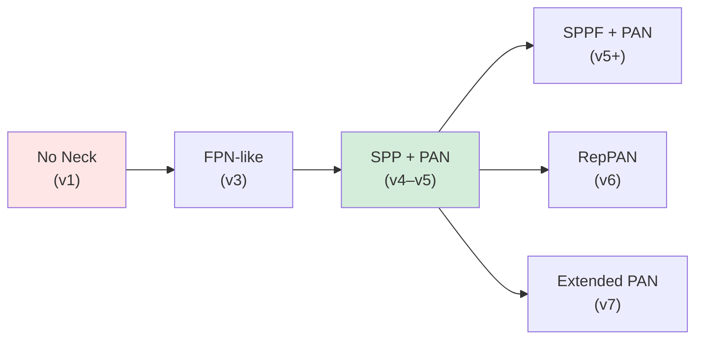

# บทที่ 15 --- Neck Evolution: FPN → PAN → BiFPN

## 15.1 ภาพรวมวิวัฒนาการ Neck

## 15.2 FPN --- Top-Down Only

Feature Pyramid Network (Lin et al., 2017):

$$
 P_i = \text{Conv}\left(\mathcal{U}(P_{i+1}) \oplus F_i\right)
$$

**จุดแข็ง**: ส่ง semantic information จาก deep → shallow **จุดอ่อน**: ไม่มี bottom-up path → localization ที่ deep levels ไม่ดี

ใช้ใน: YOLOv3

## 15.3 PAN --- Bidirectional

Path Aggregation Network (Liu et al., 2018):

**Top-down**: $P_i^{td} = \mathcal{U}(P_{i+1}^{td}) \oplus F_i$ \
**Bottom-up**: $P_i^{bu} = \text{DownSample}(P_{i-1}^{bu}) \oplus P_i^{td}$

ผลลัพธ์: features ทุกระดับได้ทั้ง **semantic** (top-down) และ **location** (bottom-up) information

ใช้ใน: YOLOv4--v5, v8

ดู Mermaid diagram ใน Ch.2 Section 2.3

## 15.4 BiFPN --- Weighted Fusion

BiFPN (Tan et al., 2020) เพิ่ม **learnable weights** ที่ fusion nodes:

$$
 P_i^{out} = \sum_j \frac{w_j}{\sum_k w_k + \epsilon} \cdot P_j^{in}
$$

ผล: network เรียนรู้ว่าจะให้น้ำหนัก features จาก scale ใดมากกว่า

> **Empirical Observation 15.1**: BiFPN ที่ใช้ใน EfficientDet ให้ +0.5--1.0% mAP เทียบกับ PAN ที่ weight เท่ากัน (Tan et al., 2020, Table 4) แต่ YOLO series ส่วนใหญ่ยังคงใช้ PAN ที่ไม่มี learnable weights เนื่องจาก overhead ไม่คุ้มเมื่อ focus ที่ real-time
>
> _Citation_: Tan, M., Pang, R., & Le, Q. V. (2020). EfficientDet, Table 4

## 15.5 SPP / SPPF

**SPP** (Spatial Pyramid Pooling, He et al., 2015):

- MaxPool ที่ kernel $5, 9, 13$ → concat → multi-scale context
- ไม่เพิ่ม parameters (MaxPool ไม่มี weights)

**SPPF** (v5):

- Sequential MaxPool ที่ kernel $5$ สามครั้ง → equivalent receptive field
- **เร็วกว่า** SPP เพราะ sequential pooling reuse intermediate results

## เอกสารอ้างอิง

1.  Lin, T.-Y., et al. (2017). "Feature Pyramid Networks." _CVPR 2017_. arXiv:1612.03144
2.  Liu, S., et al. (2018). "Path Aggregation Network." _CVPR 2018_. PANet (Path Aggregation Network)
3.  Tan, M., Pang, R., & Le, Q. V. (2020). "EfficientDet." _CVPR 2020_. arXiv:1911.09070
4.  He, K., et al. (2015). "Spatial Pyramid Pooling in Deep Convolutional Networks." _IEEE TPAMI_. SPP (Spatial Pyramid Pooling)
