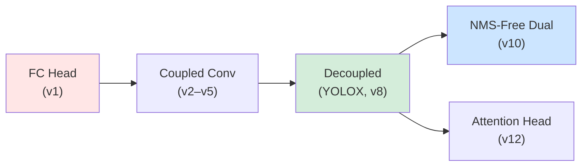

# บทที่ 16 --- Head Evolution: Coupled → Decoupled → NMS-Free

## 16.1 วิวัฒนาการ Head

## 16.2 Tensor Shape Comparison

| Head Type             | Output per scale                     | Total channels | ยุค        |
| :-------------------- | :----------------------------------- | :------------- | :--------- |
| FC (v1)               | $S \times S \times (B \times 5 + C)$ | 30 (VOC)       | 2016       |
| Coupled anchor        | $S \times S \times A(5+C)$           | 255 (COCO)     | 2017--2020 |
| Decoupled anchor-free | $S \times S \times (4+C)$            | 84 (COCO)      | 2021+      |
| NMS-free              | $S \times S \times (4+C)$ + matching | 84             | 2024       |

## 16.3 Gradient Purity Index Analysis

ใช้ GPI (Definition 9.1) วิเคราะห์ head types:

| Head Type     | GPI Stability             | GPI Interpretation          |
| :------------ | :------------------------ | :-------------------------- |
| FC (v1)       | ❌ ผันแปรสูง              | FC ไม่แยก spatial structure |
| Coupled       | ⚠️ ผันแปร                 | Cls/reg gradient compete    |
| **Decoupled** | ✅ **เสถียร**             | Gradient ถูก isolate        |
| NMS-Free      | ✅ เสถียร (ตาม decoupled) | + one-to-one constraint     |

## 16.4 Proposition 16.1: Branch Separation Gradient Purity

> **Proposition 16.1** (Decoupled Head Improves Gradient Signal Purity)
>
> ให้ GPI $G = \frac{\|\nabla_{cls}\|}{\|\nabla_{reg}\|}$
>
> ใน

$$
\text{decoupled head}: \text{Var}(G) < \text{Var}(G_{coupled})
$$

> กล่าวคือ GPI ผันแปรน้อยกว่า (เสถียรกว่า) ใน decoupled head
>
> **Proof sketch:**
>
> 1.  ใน coupled head:

$$
\nabla_{cls} \text{ และ } \nabla_{reg} \text{ ไหลผ่าน shared conv } \rightarrow \text{ interaction term: } G_{coupled} = \frac{\|\nabla_{cls} + \epsilon_{interact}\|}{\|\nabla_{reg} + \epsilon'_{interact}\|}
$$

> โดยที่ $\epsilon_{interact}$ เป็น cross-task gradient noise 2. ใน decoupled head: ไม่มี shared conv ที่

$$
\text{head} \rightarrow \epsilon_{interact} = 0: G_{decoupled} = \frac{\|\nabla_{cls}\|}{\|\nabla_{reg}\|}
$$

> 3.  เนื่องจาก $\epsilon_{interact}$ เป็น random variable → $\text{Var}(G_{coupled}) > \text{Var}(G_{decoupled})$
>
> _Evidence_: Ge et al. (2021), YOLOX Table 2: switching from coupled to decoupled head → +1.1% mAP (YOLOX-L, COCO val) $\square$

## เอกสารอ้างอิง

1.  Ge, Z., et al. (2021). "YOLOX." arXiv:2107.08430
2.  Wang, A., et al. (2024). "YOLOv10." arXiv:2405.14458
