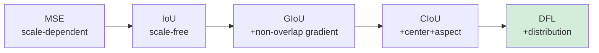

# บทที่ 17 --- Loss Function Design: จาก MSE สู่ CIoU + DFL

## 17.1 Loss Architecture

ทุกเวอร์ชัน YOLO ใช้ composite loss:

$$
 \mathcal{L} = \lambda\_{box}\mathcal{L}\_{box} + \lambda\_{obj}\mathcal{L}\_{obj} + \lambda\_{cls}\mathcal{L}\_{cls}
$$

ดู connection กับ MLE

### Box Regression Loss Evolution

| ยุค    | Loss     | สูตร                                                                                        | ปัญหาที่แก้           |
| :----- | :------- | :------------------------------------------------------------------------------------------ | :-------------------- |
| v1--v2 | MSE      | $(x-\hat{x})^2 + (y-\hat{y})^2 + (\sqrt{w}-\sqrt{\hat{w}})^2 + (\sqrt{h}-\sqrt{\hat{h}})^2$ | Direct regression     |
| v3--v4 | IoU      | $1 - \text{IoU}$                                                                            | Scale-invariant       |
| v4     | GIoU     | $1 - \text{IoU} + \frac{ \| C \setminus (A \cup B) \| }{ \| C \| }$                         | gradient เมื่อ IoU=0  |
| v4--v5 | **CIoU** | $1 - \text{IoU} + \frac{\rho^2}{c^2} + \alpha v$                                            | Center + aspect ratio |
| v8+    | **DFL**  | $-\sum_i P(i) \log P(i)$ (distribution)                                                     | Discrete distribution |

### IoU → GIoU → CIoU Progression

### CIoU Detail

$$
 \mathcal{L}_{CIoU} = 1 - \text{IoU} + \frac{\rho^2(\mathbf{b}, \mathbf{b}_{gt})}{c^2} + \alpha v
$$

$$
 v = \frac{4}{\pi^2}\left(\arctan\frac{w_{gt}}{h_{gt}} - \arctan\frac{w}{h}\right)^2, \quad \alpha = \frac{v}{(1-\text{IoU})+v}
$$

## 17.3 Classification and Objectness Loss

| Component      | Distribution | Loss     | Connection to MLE |
| :------------- | :----------- | :------- | :---------------- | --- |
| Objectness     | Bernoulli    | BCE      | $-\log p(o        | F)$ |
| Classification | Categorical  | CE / BCE | $-\log p(c        | F)$ |

### BCE:

$$
 \mathcal{L}_{BCE} = -y \log \hat{y} + (1-y)\log(1-\hat{y})
$$

### Focal Loss (อ้างอิง, ไม่ใช่ default YOLO):

$$
 \mathcal{L}_{FL} = -\alpha_t (1-p_t)^\gamma \log(p_t)
$$

ใช้ลด class imbalance --- Lin et al. (2017), RetinaNet

## 17.4 MLE Connection

จาก Ch.3 Section 3.4:

$$
 \theta^* = \arg\min_\theta -\sum_i \log p(\mathbf{y}_i | \mathbf{x}_i; \theta)
$$

| Loss term                 | Probabilistic model                     | MLE derivation                 |
| :------------------------ | :-------------------------------------- | :----------------------------- |
| $\mathcal{L}_{obj}$ (BCE) | $p(o) = \sigma(z)^o(1-\sigma(z))^{1-o}$ | NLL ของ Bernoulli              |
| $\mathcal{L}_{cls}$ (CE)  | $p(c=k) = \text{softmax}_k(z)$          | NLL ของ Categorical            |
| $\mathcal{L}_{box}$ (IoU) | ไม่มี explicit probabilistic model      | **Geometric metric** (non-MLE) |

> **หมายเหตุ**: Box loss (IoU family) ไม่ได้มาจาก MLE framework โดยตรง --- เป็น geometric metric ที่ถูกเลือกเพราะ scale-invariance ไม่ใช่เพราะ probabilistic justification

## 17.5 Proposition 17.1: CIoU Convergence Under Non-Overlap

> **Proposition 17.1** (CIoU Provides Gradient Under Zero IoU)
>
> เมื่อ predicted box $b$ และ ground truth $b_{gt}$ ไม่ overlap ($IoU = 0$):
>
> - **IoU Loss**: $\nabla \mathcal{L}_{IoU} = 0$ (ไม่มี gradient → ไม่ learn)
> - **CIoU Loss**: $\nabla \mathcal{L}_{CIoU} = 0$ (ยังมี gradient จาก center distance term)
>
> **Proof:**
>
> เมื่อ $IoU = 0$:

$$
\mathcal{L}_{CIoU} = 1 - 0 + \frac{\rho^2(\mathbf{b}, \mathbf{b}_{gt})}{c^2} + \alpha v = 1 + \frac{\rho^2}{c^2} + \alpha v
$$

> Gradient w.r.t. predicted center:

$$
\frac{\partial \mathcal{L}\_{CIoU}}{\partial b_x} = \frac{2(b_x - b\_{gt,x})}{c^2} \neq 0 \quad (\text{ตราบที่ centers ไม่ตรงกัน})
$$

> ดังนั้น CIoU ให้ gradient signal ที่ **ดึง predicted box เข้าหา GT** แม้ไม่ overlap --- ช่วย training converge เร็วขึ้นในช่วงแรก
>
> _Evidence_: Zheng et al. (2020), Table 3: CIoU converges ≈ 30% faster than GIoU loss บน COCO (measured by epoch-to-mAP) $\square$

## เอกสารอ้างอิง

1.  Zheng, Z., et al. (2020). "Distance-IoU Loss." _AAAI 2020_. arXiv:1911.08287
2.  Lin, T.-Y., et al. (2017). "Focal Loss for Dense Object Detection." _ICCV 2017_. arXiv:1708.02002
3.  Rezatofighi, H., et al. (2019). "Generalized Intersection over Union." _CVPR 2019_. arXiv:1902.09630
