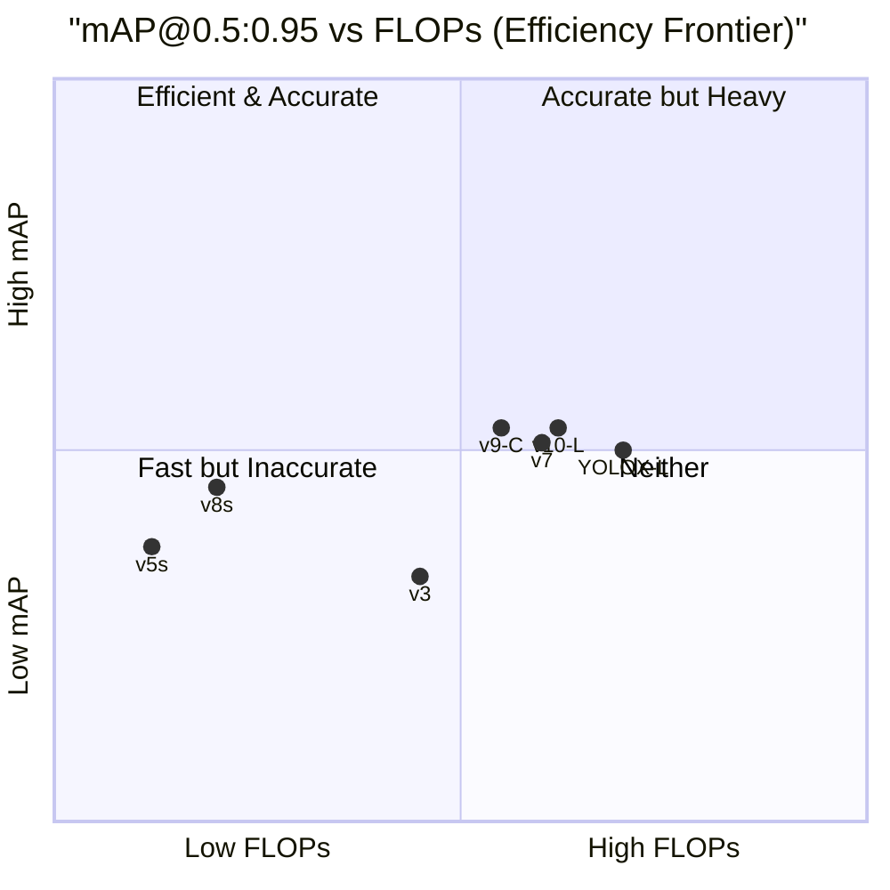

# บทที่ 20 --- Grand Comparison: Normalized Benchmarks

## 20.1 Normalization Protocol

> **Important**  
> เพื่อให้การเปรียบเทียบมีความหมาย  
> ทุก benchmark ต้องอยู่ภายใต้เงื่อนไขเดียวกัน

Parameter Standard Value

---

| Parameter               | Standard Setting                            |
| :---------------------- | :------------------------------------------ |
| **Dataset**             | COCO val2017 (5,000 images)                 |
| **Input Resolution**    | 640 × 640                                   |
| **Training Schedule**   | 300 epochs                                  |
| **Inference Precision** | FP16                                        |
| **Hardware**            | NVIDIA T4 (unless otherwise stated)         |
| **Primary Metric**      | mAP@0.5:0.95                                |
| **Secondary Metric**    | mAP@0.5                                     |
| **Post-processing**     | NMS (IoU threshold = 0.65), unless NMS-free |

## 20.2 Main Comparison Table

### Peer-Reviewed Models

| Model         | Year | Params | FLOPs  | mAP@0.5:0.95 | FPS (T4) | Source                             |
| :------------ | :--- | :----- | :----- | :----------- | :------- | :--------------------------------- |
| **YOLOv3**    | 2018 | 61.5M  | 65.9G  | 33.0%        | 29       | Redmon & Farhadi (2018)            |
| **YOLOv4**    | 2020 | 64.0M  | 60.1G  | 43.5%        | 33       | Bochkovskiy et al. (2020), Table 8 |
| **YOLOX-L**   | 2021 | 54.2M  | 155.6G | 50.0%        | 53       | Ge et al. (2021), Table 6          |
| **YOLOv7**    | 2022 | 36.9M  | 104.7G | 51.2%        | 84       | Wang et al. (2022), Table 2        |
| **YOLOv9-C**  | 2024 | 25.5M  | 102.8G | 53.0%        | 72       | Wang et al. (2024), Table 6        |
| **YOLOv10-L** | 2024 | 25.8M  | 120.3G | 53.3%        | 100      | Wang et al. (2024a), Table 1       |

### Ultralytics (Non-Peer-Reviewed)

| Model    | Params | FLOPs | mAP@0.5:0.95 | FPS (T4) | Source               |
| :------- | :----- | :---- | :----------- | :------- | :------------------- |
| YOLOv5s  | 7.2M   | 16.5G | 37.4%        | 140      | Ultralytics README   |
| YOLOv5m  | 21.2M  | 49.0G | 45.4%        | 98       | Ultralytics README   |
| YOLOv8s  | 11.2M  | 28.6G | 44.9%        | 128      | Ultralytics v8 docs  |
| YOLOv8m  | 25.9M  | 78.9G | 50.2%        | 80       | Ultralytics v8 docs  |
| YOLOv11s | 9.4M   | 21.5G | 47.0%        | 135      | Ultralytics v11 docs |

> **หมายเหตุ**: ตัวเลขจาก community models อาจใช้เงื่อนไขที่แตกต่างกันเล็กน้อย --- ตรวจสอบ source ก่อนอ้างอิง

## 20.3 Efficiency Frontier

### mAP vs FLOPs Radar

### Trend Analysis

| Era Transition | mAP Gain | FLOPs Trend | Source of Gain                |
| :------------- | :------- | :---------- | :---------------------------- |
| v3 → v4        | +10.5%   | -9%         | BoF/BoS, CSP                  |
| v4 → YOLOX     | +6.5%    | +159%       | Anchor-free, decoupled head   |
| YOLOX → v7     | +1.2%    | -33%        | E-ELAN, gradient-first design |
| v7 → v9        | +1.8%    | -2%         | PGI, information-first design |
| v9 → v10       | +0.3%    | +17%        | NMS-free training paradigm    |

## 20.4 Assumption & Limitation Statements

**ข้อจำกัด ผลกระทบ**
Hardware varies between papers FPS ไม่ comparable โดยตรง
Training hyperparams differ mAP อาจ vary ±1--2%
Augmentation strategy differs Models ที่ใช้ mosaic ได้เปรียบ
COCO val ≠ real-world Performance อาจต่างมากใน deployment
NMS parameters differ FPS ถูก inflate ถ้า NMS ง่าย

> ดูรายละเอียด failure modes ที่ทำให้ benchmark ไม่ generalize

## เอกสารอ้างอิง

1.  Redmon, J., & Farhadi, A. (2018). "YOLOv3." arXiv:1804.02767
2.  Bochkovskiy, A., et al. (2020). "YOLOv4." arXiv:2004.10934
3.  Ge, Z., et al. (2021). "YOLOX." arXiv:2107.08430
4.  Wang, C.-Y., et al. (2022). "YOLOv7." arXiv:2207.02696
5.  Wang, C.-Y., et al. (2024). "YOLOv9." arXiv:2402.13616
6.  Wang, A., et al. (2024a). "YOLOv10." arXiv:2405.14458
