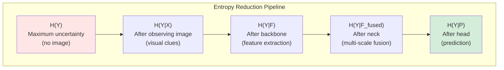

# บทที่ 21 --- Detection as Entropy Reduction: ทฤษฎีรวมของ Real-Time Detection

## 21.1 Conditional Entropy of Detection

### Formalization

ให้ $X$ เป็น random variable แทนภาพอินพุต, $Y$ เป็น structured output (set of boxes + classes)

**Conditional entropy**:

$$
 H(Y \| X) = -\sum_y p(y\|x) \log p(y\|x)
$$

ค่านี้วัด **uncertainty** ในการทำนาย $Y$ เมื่อเห็น $X$

### Detection as Uncertainty Reduction

ก่อน detection (prior):

$$
 H(Y) = -\sum_y p(y) \log p(y)
$$

หลัง observe ภาพ + process ด้วย detector $f\_\theta$:

$$
 H(Y \| X; \theta) \leq H(Y \| X) \leq H(Y)
$$

**Detection ลดความไม่แน่นอน**: จาก "ไม่มีข้อมูล" → "เห็นภาพ" → "เห็นภาพ + processed"

## 21.2 Detection ลด Uncertainty

### Formal Statement

$$
 H(Y \| X, \theta^*) \leq H(Y \| X, \theta_0)
$$

โดยที่:

สัญลักษณ์ ความหมาย

---

$\theta_0$ parameters ก่อน training (random init)
$\theta^*$ parameters หลัง training (optimized)

### Connection กับ Training

Training = **minimize conditional entropy**:

จาก MLE:

$$
 \theta^* = \arg\min\_\theta -\sum_i \log p(y_i \| x_i; \theta) = \arg\min\_\theta \hat{H}(Y\|X;\theta)
$$

โดยที่ $\hat{H}$ คือ empirical estimate ของ conditional entropy

> **NLL = empirical conditional entropy** --- ดังนั้น **minimize loss = minimize entropy**

### แต่ละส่วนลด Entropy อย่างไร

| Component              | Entropy Reduction Mechanism                                      |
| ---------------------- | ---------------------------------------------------------------- |
| **Backbone**           | สกัด relevant features → ลด **spatial redundancy**               |
| **Neck**               | Fuse multi-scale features → ลด **scale ambiguity**               |
| **Head**               | Predict box + class explicitly → ลด **representation ambiguity** |
| **Assignment**         | Match prediction ↔ GT → ลด **label ambiguity**                   |
| **NMS / Post-process** | Remove duplicates → ลด **output redundancy**                     |

## 21.3 Unifying Themes

### Theme 1: Gradient Efficiency

_ทุก architectural innovation ใน YOLO พยายามทำให้ gradient ไหลได้ดีขึ้น_

| Innovation        | Gradient Effect                             | Entropy Implication                              |
| ----------------- | ------------------------------------------- | ------------------------------------------------ |
| **Residual (v3)** | Gradient bounded via skip connection        | Optimization converges → lower ( H )             |
| **CSP (v4)**      | Redundancy reduced, partial gradient flow   | More efficient descent → faster ( H \downarrow ) |
| **E-ELAN (v7)**   | Gradient paths expanded (layer aggregation) | Broader exploration → deeper ( H ) minimization  |
| **PGI (v9)**      | Gradient injected from prediction guidance  | Information preserved → tighter ( H ) bound      |

### Theme 2: Assignment Flexibility

| Innovation             | Assignment Effect                                    | Entropy Implication                                           |
| ---------------------- | ---------------------------------------------------- | ------------------------------------------------------------- |
| **Static IoU (v2–v5)** | Fixed matching rule (threshold-based)                | Coarse ( H ) reduction (rigid supervision)                    |
| **SimOTA (YOLOX)**     | Dynamic cost-based matching per iteration            | Adaptive ( H \downarrow ) aligned with model quality          |
| **TAL (v8)**           | Task-aligned matching (cls + box jointly considered) | More efficient ( H \downarrow ), reduced assignment noise     |
| **One-to-one (v10)**   | Unique prediction–GT matching                        | Direct ( H ) minimization at output level (no NMS redundancy) |

### Theme 3: Structural Simplification

| Innovation                | Simplification                                         | Entropy Implication                                                       |
| ------------------------- | ------------------------------------------------------ | ------------------------------------------------------------------------- |
| **Anchors → Anchor-free** | ลด hyperparameters และกำจัด prior box ที่กำหนดล่วงหน้า | ลด prior-mismatch entropy ทำให้ ( H ) จาก spatial prior ไม่จำเป็น         |
| **NMS → NMS-free**        | ตัดขั้นตอน post-processing ออก                         | Output entropy ถูกเรียนรู้โดยตรงในโมเดล ไม่ต้องพึ่ง heuristic suppression |
| **Decoupled Head**        | แยก box / class branch ลด task interference            | ลด task-specific entropy แต่ละ task converge ได้ชัดเจนขึ้น                |

## 21.4 Open Research Questions

| Question                                                             | Related Chapters                          | Status             |
| -------------------------------------------------------------------- | ----------------------------------------- | ------------------ | ---- |
| Formal bound on ( H(Y                                                | X;\theta^\*) ) สำหรับ given architecture? | Ch.4, Ch.5         | Open |
| Can PGI be generalized เป็น universal gradient framework?            | Ch.12                                     | Exploratory        |
| Optimal tradeoff ระหว่าง assignment complexity กับ gradient quality? | Ch.10                                     | Partially answered |
| Foundation model integration กับ YOLO?                               | —                                         | Emerging           |
| Formal proof ว่า flat minima generalize ใน detection?                | Ch.18                                     | Open               |
| Information-theoretic lower bound ของ detection performance?         | Ch.3                                      | Fundamental        |

## 21.5 Toward Foundation Models

### ปัจจุบัน vs อนาคต

| ด้าน             | Current YOLO (2024)                   | Foundation Era (Future)                                       |
| ---------------- | ------------------------------------- | ------------------------------------------------------------- |
| **Training**     | Task-specific (detection only)        | Multi-task pretrained (detection, segmentation, pose, etc.)   |
| **Data**         | Explicit labeled datasets (เช่น COCO) | Large-scale self-supervised pretraining + labeled fine-tuning |
| **Architecture** | Fixed Backbone–Neck–Head pipeline     | Modular blocks (plug-in backbone / head / task adapter)       |
| **Deployment**   | One model per task                    | Single foundation model → multiple downstream tasks           |

### ผลเชิงทฤษฎี

Foundation models อาจทำให้:

- $H(Y\|X;\theta)$ ต่ำกว่า task-specific models (better priors จาก massive pretraining)
- Bias ลดลงพร้อมกับ variance (paradox of scale)
- Transfer ไป unseen domains ได้ดีขึ้น (ลด domain shift)

> บทนี้ปิดท้ายด้วยวิสัยทัศน์ที่ว่า: YOLO ไม่ใช่แค่ model series แต่เป็น **living proof of principle** --- ว่า single-pass detection as regression เป็น paradigm ที่ยังคงวิวัฒน์ได้อีกมาก

## เอกสารอ้างอิง

1.  Cover, T. M., & Thomas, J. A. (2006). _Elements of Information Theory_. 2nd ed. Wiley. --- Ch. 2 (Entropy.)

2.  Kirillov, A., et al. (2023). "Segment Anything." _ICCV 2023_. arXiv:2304.02643

3.  Radford, A., et al. (2021). "Learning Transferable Visual Models From Natural Language Supervision." _ICML 2021_. arXiv:2103.00020

4.  Shannon, C. E. (1948). "A Mathematical Theory of Communication." _Bell System Technical Journal_. Communication Theory

> **จบเนื้อหาหลัก** --- ดูภาคผนวก A--H สำหรับ symbol reference, diagrams, derivations, และ layer tables
