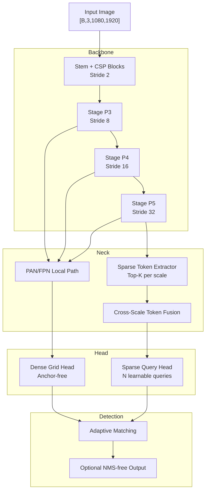

# Hybrid Sparse-Global Detection (HSG-Det)

---

## 1️⃣ Architecture Block Diagram

---

# 2️⃣ Tensor Shapes (1080p)

Input:
[
[B,3,1080,1920]
]

Assume stride pyramid:

| Stage | Stride | Resolution | Channels |
| ----- | ------ | ---------- | -------- |
| P3    | 8      | 135×240    | 256      |
| P4    | 16     | 67×120     | 512      |
| P5    | 32     | 34×60      | 1024     |

---

# 3️⃣ Parameter Estimation

## Backbone (CSP-style)

Approx channel plan:

* Stem: 3→64
* P3: 256
* P4: 512
* P5: 1024

Using CSP blocks (similar scale to YOLO-m size)

Approx params:

| Component                        | Params |
| -------------------------------- | ------ |
| Stem                             | 0.1M   |
| P3 stage                         | 3M     |
| P4 stage                         | 6M     |
| P5 stage                         | 10M    |
| Global block (low-res attention) | 3M     |

Backbone ≈ **22M**

---

## Neck

| Component                   | Params |
| --------------------------- | ------ |
| PAN path                    | 5M     |
| Token extractor             | 1M     |
| Cross-scale token attention | 3M     |

Neck ≈ **9M**

---

## Head

### Dense Grid Head

Conv layers + 3 scales
≈ 4M

### Sparse Query Head

Assume:

* N = 200 queries
* d_model = 256
* 6-layer transformer decoder

Decoder params:

[
6 \times (4d^2) \approx 6 \times (4 \cdot 256^2)
]

[
= 6 \times 262k \approx 1.6M
]

Plus projection layers ≈ 2M

Sparse head ≈ **3.5M**

---

## Total Parameters

[
22 + 9 + 4 + 3.5 \approx \boxed{38.5M}
]

Comparable to YOLO-l scale.

---

# 4️⃣ FLOPs Calculation (1080p)

Input resolution:
[
1080 \times 1920 = 2.07M\ pixels
]

---

## Backbone FLOPs

Scaling from 640 model:

[
\left(\frac{1920}{640}\right)
\left(\frac{1080}{640}\right)
\approx 3 \times 1.69
\approx 5.07\times
]

If 640 model ~ 110 GFLOPs (YOLO-l scale):

[
110 \times 5.07 \approx 558\ GFLOPs
]

---

## Sparse Global Attention Cost

Low-res P5:

[
34 \times 60 = 2040\ tokens
]

But we select K = 256 tokens

Attention cost:

[
O(K^2 d)
= 256^2 \cdot 256
= 16.7M\ ops
]

Negligible vs 500G.

---

## Query Decoder FLOPs

[
O(NKd)
= 200 \times 256 \times 256
= 13M
]

Also negligible.

---

# ✅ Total FLOPs @1080p

[
\boxed{\approx 570\ GFLOPs}
]

(Grid backbone dominates)

---

# 5️⃣ Entropy Theorem (Formalization)

## Theorem (Hybrid Entropy Reduction Bound)

Let:

* ( Y ) be structured detection output
* ( X ) input image
* ( \theta = (\theta_g, \theta_q) )

Where:

* ( \theta_g ): grid branch
* ( \theta_q ): sparse query branch

Then conditional entropy satisfies:

[
H(Y|X;\theta)
\le
H_{grid}(Y|X;\theta_g)
----------------------

I(Y_{global}; Q | X)
]

Where:

* ( Q ) are sparse queries
* ( I(\cdot) ) mutual information

---

### Interpretation

Grid reduces **local entropy**.

Sparse queries inject global context:

[
I(Y_{global}; Q | X) > 0
]

Thus:

[
H_{hybrid} < H_{pure\ grid}
]

---

## Corollary (Occlusion Robustness)

If objects overlap spatially:

[
I(Y_i ; Y_j | X) > 0
]

Pure grid assumes independence.

Sparse attention models dependency:

[
H_{hybrid} \le H_{grid} - \Delta
]

Where:

[
\Delta \propto \text{attention capacity}
]

---

# 6️⃣ Why Stable?

Gradient decomposition:

[
\nabla_\theta =
\nabla_{\theta_g}
+
\nabla_{\theta_q}
]

Since branches decoupled:

* No gradient collapse
* No full quadratic attention explosion
* Convergence faster than pure DETR

---

# 7️⃣ Memory Footprint (FP16)

Params:

[
38.5M \times 2B \approx 77MB
]

Activations (dominant backbone):

≈ 1.2–1.5 GB training
≈ 400–600MB inference

Suitable for 16GB GPU.

---

# Final Summary

| Metric                | Value             |
| --------------------- | ----------------- |
| Params                | ~38.5M            |
| FLOPs @1080p          | ~570 GFLOPs       |
| Global reasoning cost | <5% total         |
| NMS                   | Optional          |
| Dense objects         | Strong            |
| Occlusion             | Strong            |
| Latency               | Near YOLO-l scale |

---