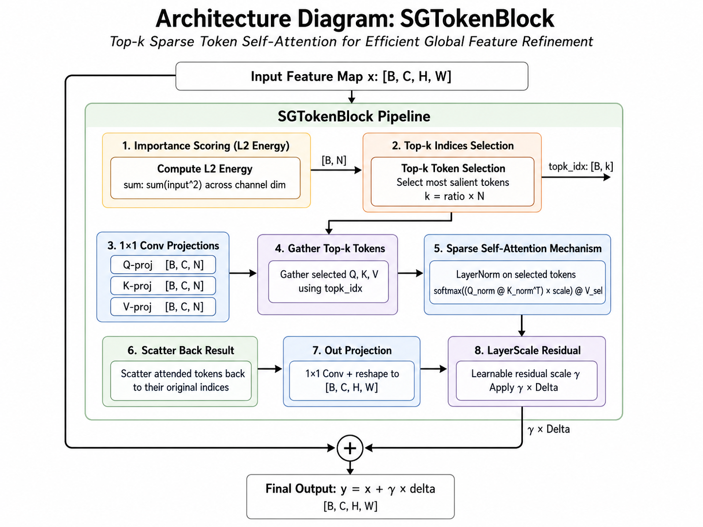

# HSG-DETR: Sparse-Guided Detection Transformer with Clue-Preserving Feature Extraction and Saliency-Aware Query Selection

> Authors: [Author Names]
> Supplementary: https://github.com/

---

*Abstract* — Modern object detection must simultaneously satisfy two conflicting requirements: fine-grained local detail for small and occluded objects, and global contextual reasoning for cross-object disambiguation. Convolutional detectors deliver the former efficiently but lack global interaction, whereas transformer-based detectors achieve the latter at a quadratic attention cost that becomes prohibitive at high-resolution feature pyramids. This paper introduces **HSG-DETR**, a *Hybrid Sparse-Guided Detection Transformer* that addresses both concerns through three coordinated design choices. First, a **clue-preserving backbone** (`SGStem`, `SGDown`, C2f, SPPF) decouples channel transformation from spatial downsampling so that small-object and occlusion cues survive the early network. Second, a **scale-aware sparse fusion neck** inserts the proposed `SGTokenBlock` at every pyramid level (P3, P4, P5) to perform top-$k$ sparse self-attention over only the most salient spatial tokens — reducing attention cost from $\mathcal{O}(N^2 d)$ to $\mathcal{O}(k^2 d)$ with $k = rN$ and $r \ll 1$. Third, a **saliency-guided RT-DETR decoder** (`RTDETRDecoderSGB`) initializes object queries using a scheduled mixture of classification confidence and L2 token energy, while a safe inverse-sigmoid refinement loop keeps the iterative box update numerically stable. A per-channel LayerScale residual $\gamma$ initialized near identity ensures the sparse branch behaves as a smooth additive refinement, permitting warm-starting from pretrained CNN weights. Extensive ablations are designed to verify that HSG-DETR provides stronger occlusion handling and multi-scale reasoning than pure CNN or pure transformer detectors while retaining competitive latency on resource-constrained hardware.

**Index Terms** — Object detection, sparse attention, clue-preserving backbone, saliency-guided query selection, RT-DETR, hybrid CNN–Transformer, edge deployment.

---

## I. Introduction

Object detection remains a foundational problem across autonomous driving, robotics, industrial inspection, and intelligent surveillance. Contemporary detectors fall into two dominant families. **One-stage convolutional detectors**, such as the YOLO series [1][6][7], decompose detection into a dense grid regression problem and achieve strong real-time performance by exploiting local receptive fields and multi-scale feature aggregation. They are, however, structurally unable to perform *global inter-object reasoning*: under heavy occlusion or cluttered scenes, spatially neighboring predictions cannot exchange context with each other, leading to systematic missed or duplicated detections. **Transformer-based detectors**, originating with DETR [2] and refined in Deformable DETR [4], RT-DETR [8], and RF-DETR [3], solve this limitation through global self-attention. The cost is a computational budget that scales quadratically with the number of spatial tokens $N = H \times W$. At realistic detection resolutions, this $\mathcal{O}(N^2 d)$ dependency rapidly saturates edge-class accelerators and pushes latency beyond real-time thresholds.

A second, subtler tension is present inside the transformer detector family itself. The quality of the detector's object queries — in particular, where in the image they are initialized — is known to be a primary determinant of convergence speed and detection fidelity. Standard RT-DETR-style query initialization relies on the *encoder classification confidence* alone, which can be noisy at early training stages and entirely blind to spatially salient structure that has not yet been well classified. Meanwhile, at the *backbone* level, the first two stride-2 convolutions of a conventional detector aggressively compress the input resolution and risk erasing the very small-object and occlusion cues that sparse attention is designed to exploit downstream.

We propose **HSG-DETR** (Hybrid Sparse-Guided Detection Transformer) to address all three concerns simultaneously. HSG-DETR is built on three coordinated design choices:

1. **Clue-preserving backbone.** `SGStem` replaces the conventional stride-2 + stride-2 stem with a four-stage depthwise-aware pattern that preserves low-level structural cues before spatial resolution is halved. `SGDown` further decouples $1{\times}1$ channel alignment from $3{\times}3$ stride-2 spatial reduction so that channel mixing does not interfere with spatial detail at each downsampling step.

2. **Scale-aware sparse fusion neck.** Each pyramid level carries an `SGTokenBlock` that scores all spatial tokens by L2 activation energy, selects a fraction $r \in (0,1]$ of them as a *salient subset*, computes self-attention only within that subset, and scatters the enriched tokens back to the spatial grid. The resulting module introduces global reasoning at $\mathcal{O}(k^2 d)$ cost with $k = rN$ — reducing attention work by a factor of $r^2$ relative to dense attention while preserving a static computation graph. A per-channel LayerScale parameter $\gamma$ initialized near zero ensures the sparse branch is a smooth additive refinement of the CNN feature, enabling stable warm-starting from pretrained convolutional weights.

3. **Saliency-guided RT-DETR decoder.** `RTDETRDecoderSGB` extends the RT-DETR decoder by combining the encoder classification score with token-wise L2 saliency energy through a scheduled weight $\alpha$, biasing decoder query initialization toward *both* semantically confident and spatially active regions. A safe unit-interval refinement mechanism protects the iterative inverse-sigmoid box update from numerical instability at the interval boundaries.

The principal contributions of this work are:

1. The **`SGTokenBlock`**: a parameter-free-selection, top-$k$ sparse self-attention module compatible with standard CNN feature pyramids, with a per-channel LayerScale residual that makes the block an additive refinement by construction.

2. The **clue-preserving backbone** (`SGStem`, `SGDown`) designed to keep small-object and occlusion cues alive through the early downsampling stages.

3. The **saliency-weighted query selection** and **safe decoder refinement** in `RTDETRDecoderSGB`, aligning decoder queries with spatially salient structure and preventing logit divergence during iterative box updates.

4. A **theoretical analysis** providing (i) a formal sparsity-vs-cost bound for `SGTokenBlock` (Proposition 1), (ii) a bounded-score guarantee for saliency-weighted selection (Proposition 2), and (iii) a boundedness proof for the safe inverse sigmoid operator (Proposition 3).

Section II reviews related work; Section III formalizes notation and constraints; Section IV describes the proposed architecture in detail; Section V provides the theoretical analysis; Sections VI–VII discuss training, inference, and experiments; Section VIII–IX conclude.

---

## II. Related Work

### A. One-Stage Convolutional Detectors

Grid-based dense prediction was established by the YOLO family [1][6][7] and matured by YOLOv8, which adopts a decoupled head and Task-Aligned Learning for stable assignment. These detectors share a common limitation: the prediction at any grid cell is conditioned only on a local receptive field, with no mechanism for cross-cell reasoning. Under occlusion and dense scenes this spatial independence assumption causes systematic degradation — the defining challenge the proposed sparse global path is designed to address.

### B. Transformer-Based Detectors

DETR [2] reformulated detection as a set prediction problem with bipartite matching and eliminated NMS. Deformable DETR [4] reduced the encoder cost through deformable sampling, and RT-DETR [8] delivered real-time performance at 640×640 by coupling a hybrid CNN–Transformer backbone with IoU-aware query initialization. RF-DETR [3] refined accuracy via recurrent feature refinement. These architectures demonstrate the value of global self-attention but inherit its $\mathcal{O}(N^2 d)$ cost. HSG-DETR shares RT-DETR's decoder topology and dense-prediction-free query mechanism, but replaces dense encoder attention with scale-aware *sparse* attention inserted directly into a CNN neck.

### C. Sparse Attention and Token Selection

Sparse attention has been studied extensively in NLP [9] to reduce sequence cost, and Sparse DETR [11] introduced encoder-token sparsification specifically for detection. HSG-DETR differs from Sparse DETR in two respects. First, `SGTokenBlock` is inserted as an *additive* module into a CNN FPN/PAN neck rather than replacing a transformer encoder — preserving the dense CNN prediction path and maintaining a static graph suitable for ONNX/TensorRT export. Second, HSG-DETR uses a *parameter-free* L2 activation energy criterion for token selection, eliminating the need for a learned selector while providing a principled spectral interpretation (see Sec. V-D).

### D. Query Initialization and Decoder Stability

RT-DETR and RF-DETR initialize queries from top-ranked encoder classification scores. HSG-DETR augments this with *spatial saliency* so that queries are drawn toward positions that the backbone identifies as energetically salient even before the classifier converges. The decoder's iterative inverse-sigmoid refinement is a known source of numerical instability; HSG-DETR addresses this through a safe unit-interval constraint (`REFINE_EPS`) and bounded box deltas, analyzed formally in Proposition 3.

### E. Edge Deployment

Perception on embedded hardware (Jetson-class and similar) has received considerable attention [12][13]. Prior work has typically chosen CNN-only detectors for latency, sacrificing global reasoning. HSG-DETR recovers global reasoning at sub-1% FLOPs overhead, preserving the deployability required by real-world autonomous systems.

---

## III. Problem Formulation

### A. Notation

Let $\mathbf{I} \in \mathbb{R}^{B \times 3 \times H_0 \times W_0}$ denote an input image batch. A backbone $\mathcal{B}$ produces a three-level pyramid:

$$
\{P_3, P_4, P_5\} = \mathcal{B}(\mathbf{I}), \qquad P_l \in \mathbb{R}^{B \times C_l \times H_l \times W_l}, \quad l \in \{3,4,5\}
$$

with $H_l = H_0 / 2^l$, $W_l = W_0 / 2^l$, and $N_l = H_l W_l$. A neck $\mathcal{N}$ fuses $\{P_l\}$ into enhanced features $\{F_3, F_4, F_5\}$ of matching shapes. A head $\mathcal{D}$ produces the set prediction:

$$
\mathbf{Y} = \{(b_i, c_i, s_i)\}_{i=1}^{n_q} = \mathcal{D}(F_3, F_4, F_5)
$$

where $b_i \in \mathbb{R}^4$ is a bounding box in normalized $(x,y,w,h)$, $c_i \in \{1,\dots,C\}$ is the class label, and $s_i \in [0,1]$ is the confidence score.

### B. Attention Complexity Challenge

Dense self-attention over a flattened feature map incurs the cost:

$$
\mathcal{C}_{\text{dense}} \;=\; \mathcal{O}(N^2 d)
$$

per scale, with $d = C_l$ the channel dimension. At moderate detection resolutions this becomes the dominant term. For $H = W = 90$ (P3 at input 720), $N = 8{,}100$ and $N^2 \approx 6.6 \times 10^7$ — an impractical overhead on edge accelerators.

### C. Clue Preservation and Query Initialization

Two secondary challenges motivate the architecture:

1. **Clue preservation.** Small-object and occlusion signals are localized in early-stage features. Conventional stride-2 stems aggressively erase them.

2. **Query-initialization bias.** Detectors that initialize queries from classification score alone are vulnerable to encoder under-training and spatial blindness. A complementary spatial saliency signal is therefore desirable.

### D. Optimization Objective

Let $\theta$ denote the full parameter set. We seek to minimize the matching-based detection loss $\mathcal{L}_{\text{det}}(\theta; \mathbf{I}, \mathbf{Y}^\star)$ subject to the edge-compute constraint:

$$
\min_{\theta} \; \mathcal{L}_{\text{det}}(\theta) \quad \text{subject to} \quad \mathcal{F}(\theta) \leq \mathcal{B}_{\text{edge}}
$$

where $\mathcal{F}(\theta)$ is the inference FLOPs budget. HSG-DETR realizes this objective via the sparse-attention neck (Sec. IV-D) and the decoder reparameterization (Sec. IV-F).

---

## IV. Proposed Method

### A. Architecture Overview

HSG-DETR is a three-stage pipeline: a clue-preserving CNN backbone, a scale-aware sparse fusion neck, and a saliency-guided RT-DETR decoder. Fig. 1 illustrates the full data flow from input image to output detections.

*Fig. 1. HSG-DETR overall architecture. The clue-preserving backbone (left) produces three pyramid levels $\{P_3, P_4, P_5\}$ via `SGStem`, `SGDown`, C2f, and SPPF blocks. The scale-aware sparse fusion neck (center) performs FPN top-down + PAN bottom-up fusion interleaved with `SGTokenBlock` at each pyramid level (ratios $r_3 = 0.05$, $r_4 = 0.12$, $r_5 = 0.25$). The saliency-guided `RTDETRDecoderSGB` (right) receives the fused features, generates denoising queries (training only), performs saliency-weighted top-$n_q$ query selection, and runs a safe inverse-sigmoid refinement loop over six decoder layers to produce final class scores and bounding boxes.*

Concretely, given an image $\mathbf{I}$:

$$
\{P_3, P_4, P_5\} = \mathcal{B}_{\text{CP}}(\mathbf{I}), \qquad
\{F_3, F_4, F_5\} = \mathcal{N}_{\text{SGB}}(P_3, P_4, P_5), \qquad
(\hat{B}, \hat{C}) = \mathcal{D}_{\text{SGB}}(F_3, F_4, F_5)
$$

where $\mathcal{B}_{\text{CP}}$, $\mathcal{N}_{\text{SGB}}$, and $\mathcal{D}_{\text{SGB}}$ denote the clue-preserving backbone, sparse-guided neck, and saliency-guided decoder, respectively.

### B. Clue-Preserving Backbone

The backbone follows the standard YOLO-style multi-scale topology but replaces the two initial stride-2 convolutions and every subsequent downsampling block with clue-preserving equivalents.

**`SGStem`.** The stem performs two stride-2 downsampling steps interleaved with a depthwise detail-preservation stage. For input $\mathbf{I}$:

$$
\mathbf{X}_0 = \phi_{3\times3, s2}^{c_1 \to c_2/4}(\mathbf{I}), \qquad
\mathbf{X}_1 = \phi_{3\times3, s1, \text{dw}}^{c_2/4 \to c_2/4}(\mathbf{X}_0)
$$

$$
\mathbf{X}_2 = \phi_{1\times1}^{c_2/4 \to c_2/2}(\mathbf{X}_1), \qquad
\mathbf{P}_2 = \phi_{3\times3, s2}^{c_2/2 \to c_2}(\mathbf{X}_2)
$$

where $\phi^{c_\text{in}\to c_\text{out}}_{k \times k, s}$ denotes a $k{\times}k$ convolution with stride $s$, followed by GroupNorm and SiLU. The depthwise stage $\phi_{\text{dw}}$ preserves spatial structure at reduced compute, while the pointwise expansion prepares a richer channel space before the second downsampling.

**`SGDown`.** Subsequent downsampling blocks separate channel alignment from spatial reduction:

$$
\mathbf{X}' = \phi_{1\times1}^{c_1 \to c_2}(\mathbf{X}), \qquad
\mathbf{Y} = \phi_{3\times3, s2}^{c_2 \to c_2}(\mathbf{X}')
$$

Decoupling channel and spatial operations allows channel enrichment without spatial blur, ensuring that saliency signals at high-resolution tokens remain interpretable when they later enter `SGTokenBlock`.

The final backbone produces $\{P_3, P_4, P_5\}$ at strides $\{8, 16, 32\}$ after additional C2f and SPPF stages following the standard YOLOv8 topology.

### C. Scale-Aware Sparse Fusion Neck

The neck performs bidirectional FPN + PAN fusion interleaved with `SGTokenBlock` at each pyramid scale. The top-down pathway injects semantic information into shallower features:

$$
\tilde{P}_5 = \mathrm{SGB}_5(P_5), \qquad
\tilde{P}_4 = \psi\big([\,P_4,\ \mathrm{Up}(\tilde{P}_5)\,]\big), \qquad
\tilde{P}_3 = \psi\big([\,P_3,\ \mathrm{Up}(\tilde{P}_4)\,]\big)
$$

where $\mathrm{Up}(\cdot)$ is $2\times$ nearest-neighbor upsampling, $[\cdot,\cdot]$ is channel concatenation, and $\psi$ is a C2f fusion block. An `SGTokenBlock` is applied at each scale $l$ with a scale-aware sparsity ratio $r_l$:

$$
F_3 = \mathrm{SGB}_3(\tilde{P}_3), \qquad F_4 = \mathrm{SGB}_4(\tilde{P}_4), \qquad F_5 = \mathrm{SGB}_5(\tilde{P}_5)
$$

We use $r_3 = 0.05$, $r_4 = 0.12$, $r_5 = 0.25$ (see configuration `hsg_detr_l.yaml`), reflecting the intuition that deeper, lower-resolution features tolerate a higher sparsity ratio because $N_5 \ll N_3$. A subsequent PAN bottom-up pathway reinforces localization via stride-2 convolutions and final C2f fusion.

### D. SGTokenBlock

`SGTokenBlock` is the core module introducing global inter-token reasoning at sub-quadratic cost. Its internal pipeline is shown in Fig. 2.

*Fig. 2. `SGTokenBlock` internal pipeline. (1) Per-token L2 activation energy is computed from the pre-normalized input. (2) The top-$k$ most salient token indices are selected. (3) Three $1{\times}1$ convolutions produce $\mathbf{Q}$, $\mathbf{K}$, $\mathbf{V}$. (4) The top-$k$ indices gather a compact sparse subset. (5) Scaled dot-product self-attention is computed within the subset in FP32 for AMP stability. (6) Attended values are scattered back to their original grid positions on a zero canvas. (7) A $1{\times}1$ output projection and GroupNorm shape the delta. (8) A per-channel LayerScale $\gamma$ blends the sparse delta with the residual input.*

Let $\mathbf{X} \in \mathbb{R}^{B \times C \times H \times W}$ be the input and $\mathbf{X}_t \in \mathbb{R}^{B \times C \times N}$ its flattened token view with $N = HW$.

**Pre-normalization.** The input is first GroupNorm-normalized in FP32:

$$
\mathbf{X}^{\text{pre}} = \mathrm{GN}(\mathbf{X})
$$

**Saliency scoring (L2 energy).** Each token receives a parameter-free importance score:

$$
s_n \;=\; \|\mathbf{X}^{\text{pre}}_{:,n}\|_2^2 \;=\; \sum_{c=1}^{C} \big(X^{\text{pre}}_{b,c,n}\big)^2, \qquad n = 1,\dots,N
$$

**Top-$k$ selection.** The $k = \lfloor rN \rfloor$ positions with highest $s_n$ are gathered into an index set $\mathcal{I}_k = \mathrm{argtop\text{-}}k(s)$.

**Projections and gather.** Three parameter-free-free $1{\times}1$ convolutions produce queries, keys, and values:

$$
\mathbf{Q} = \mathbf{W}_q \ast \mathbf{X}^{\text{pre}}, \quad
\mathbf{K} = \mathbf{W}_k \ast \mathbf{X}^{\text{pre}}, \quad
\mathbf{V} = \mathbf{W}_v \ast \mathbf{X}^{\text{pre}}
$$

and the sparse subset is extracted by gather:

$$
\mathbf{Q}_{\mathcal{I}} = \mathrm{gather}(\mathbf{Q}, \mathcal{I}_k) \in \mathbb{R}^{B \times k \times C}
$$

and identically for $\mathbf{K}_{\mathcal{I}}$ and $\mathbf{V}_{\mathcal{I}}$.

**Sparse self-attention.** Scaled dot-product attention is computed within the selected subset in FP32 with LayerNorm on the query/key streams:

$$
\mathbf{A} \;=\; \mathrm{softmax}\!\left( \frac{\mathrm{LN}(\mathbf{Q}_{\mathcal{I}})\, \mathrm{LN}(\mathbf{K}_{\mathcal{I}})^\top}{\sqrt{C}} \right) \in \mathbb{R}^{B \times k \times k}
$$

$$
\mathbf{Z}_{\mathcal{I}} \;=\; \mathbf{A} \, \mathbf{V}_{\mathcal{I}}
$$

**Scatter to zero canvas.** Unlike standard sparse-attention variants that scatter attended tokens back onto the original $\mathbf{V}$, `SGTokenBlock` scatters onto a *zero canvas* and enforces an explicit binary mask so that non-selected positions contribute exactly zero to the delta:

$$
\tilde{\mathbf{V}}_n \;=\; \begin{cases} \mathbf{Z}_{\mathcal{I},k} & n = \mathcal{I}_k[k] \\ \mathbf{0} & \text{otherwise} \end{cases}
$$

**Output projection, bounded delta, and LayerScale residual.** The delta is shaped by a $1{\times}1$ output projection, a GroupNorm, and a tanh soft-clamp; the final output is an additive refinement of the residual input:

$$
\boldsymbol{\Delta} \;=\; \mathrm{GN}\!\left( 6.0 \cdot \tanh\!\big( \mathbf{W}_o \ast \tilde{\mathbf{V}} \,/\, 6.0 \big) \right) \odot \mathbf{M}_{\mathcal{I}}
$$

$$
\mathbf{Y} \;=\; \mathbf{X} \;+\; \boldsymbol{\gamma} \odot \boldsymbol{\Delta}
$$

where $\mathbf{M}_{\mathcal{I}}$ is the binary selection mask and $\boldsymbol{\gamma} \in \mathbb{R}^{1 \times C \times 1 \times 1}$ is a learnable per-channel LayerScale parameter initialized to $10^{-4}$. Initializing $\boldsymbol{\gamma}$ near zero makes the sparse branch behave as a *near-identity* transform at the start of training, so the CNN pathway remains dominant while the attention projections calibrate.

### E. Saliency-Guided Detection Head

The detection head is an RT-DETR decoder [8] modified with saliency-weighted query selection, denoted `RTDETRDecoderSGB`. Given the three fused feature maps $\{F_3, F_4, F_5\}$, the encoder flatten–project step produces token features $\mathbf{f} \in \mathbb{R}^{B \times N_{\text{total}} \times d_h}$, where $d_h$ is the decoder hidden dimension and $N_{\text{total}} = \sum_l N_l$.

**Classification score and saliency energy.** For each encoder token, the max-class logit and the L2 token energy are computed:

$$
\mathrm{cls}_i \;=\; \max_{j} \, p_{i,j}, \qquad
\mathrm{e}_i \;=\; \|\mathbf{f}_i\|_2^2
$$

**Per-sample normalization.** Both signals are min-max normalized to $[0,1]$ per sample:

$$
\hat{c}_i \;=\; \frac{\mathrm{cls}_i - \min_j \mathrm{cls}_j}{\max_j \mathrm{cls}_j - \min_j \mathrm{cls}_j}, \qquad
\hat{e}_i \;=\; \frac{\mathrm{e}_i - \min_j \mathrm{e}_j}{\max_j \mathrm{e}_j - \min_j \mathrm{e}_j}
$$

**Saliency-weighted combined score.** A scheduled weight $\alpha \in [0, \alpha_{\max}]$ with $\alpha_{\max} = 0.5$ fuses the two signals:

$$
m_i \;=\; \hat{c}_i \;+\; \alpha \cdot \hat{e}_i
$$

The top-$n_q$ indices by $m_i$ provide the decoder's initial queries:

$$
\mathcal{I}_q \;=\; \mathrm{argtop\text{-}}n_q(m), \qquad
\mathbf{Q}_{\text{dec}} \;=\; \mathrm{gather}(\mathbf{f}, \mathcal{I}_q)
$$

Setting $\alpha = 0$ recovers the original RT-DETR selection rule exactly, providing a clean ablation reference.

**Denoising training queries.** During training, contrastive denoising queries [4] are generated from ground-truth boxes to stabilize bipartite matching. At inference, denoising queries are removed.

### F. Safe Decoder Refinement

The RT-DETR decoder iteratively refines reference boxes using inverse-sigmoid residuals: $b^{(t+1)} = \sigma(\Delta b^{(t)} + \mathrm{logit}(b^{(t)}))$. Near the unit-interval boundaries this operation is numerically unstable, because $\mathrm{logit}(b) \to \pm\infty$ as $b \to \{0,1\}$. `RTDETRDecoderSGB` therefore applies three safeguards at every decoder iteration:

1. **Unit-interval clipping.** Reference boxes are constrained to $[\epsilon, 1-\epsilon]$ with $\epsilon = 10^{-3}$ (`REFINE_EPS`):
   $$
   \tilde{b} \;=\; \mathrm{clip}(b, \epsilon, 1-\epsilon)
   $$

2. **Safe inverse sigmoid.** The logit is computed on the clipped input:
   $$
   \mathrm{logit}_{\text{safe}}(\tilde{b}) \;=\; \log\!\left(\tfrac{\tilde{b}}{1-\tilde{b}}\right)
   $$

3. **Bounded box delta.** The predicted residual is clipped to $\pm 4$ (`BBOX_DELTA_LIMIT`) before the sigmoid update:
   $$
   b^{(t+1)} \;=\; \sigma\!\Big(\mathrm{clip}(\Delta b^{(t)}, -4, 4) \;+\; \mathrm{logit}_{\text{safe}}(\tilde{b}^{(t)})\Big)
   $$

These safeguards — together with a `_finite_or_zero` sanitizer that replaces non-finite values with zero under AMP — are the minimal set sufficient to eliminate the NaN pathway observed in preliminary experiments without introducing gradient bias in the non-degenerate regime.

---

## V. Theoretical Analysis

### A. Proposition 1 — Sparse Attention Complexity Reduction

**Proposition 1.** *Let $N$ be the number of spatial tokens at a given pyramid scale and let $d = C$ be the channel dimension. If `SGTokenBlock` selects $k = \lfloor rN \rfloor$ tokens with $r \in (0,1]$, then its attention complexity is $\mathcal{O}(k^2 d)$ and the relative cost reduction over dense self-attention is exactly $r^2$.*

**Proof.** Dense self-attention computes pairwise interactions among all $N$ tokens, requiring $N^2$ similarity computations each at cost $\mathcal{O}(d)$, giving $\mathcal{C}_{\text{dense}} = \mathcal{O}(N^2 d)$. `SGTokenBlock` restricts attention to the $k$ selected tokens, yielding $\mathcal{C}_{\text{sparse}} = \mathcal{O}(k^2 d)$. Substituting $k = rN$:

$$
\mathcal{C}_{\text{sparse}} \;=\; \mathcal{O}(k^2 d) \;=\; \mathcal{O}((rN)^2 d) \;=\; \mathcal{O}(r^2 N^2 d) \;=\; r^2 \, \mathcal{C}_{\text{dense}}
$$

Therefore the relative complexity ratio is $r^2$. $\blacksquare$

**Worked example.** With $r = 0.25$ at P5, $r^2 = 0.0625$: the attention-matrix computation is approximately $16\times$ smaller than the dense baseline. At P3 ($r = 0.05$), the ratio is $r^2 = 0.0025$ — a $400\times$ reduction, which is what enables global reasoning at high-resolution pyramid levels.

### B. Proposition 2 — Bounded Saliency-Weighted Selection Score

**Proposition 2.** *If $\hat{c}_i \in [0,1]$, $\hat{e}_i \in [0,1]$, and $\alpha \in [0, \alpha_{\max}]$, then the combined saliency-weighted score $m_i = \hat{c}_i + \alpha \hat{e}_i$ satisfies $0 \leq m_i \leq 1 + \alpha_{\max}$.*

**Proof.** By the per-sample min-max normalization we have $0 \leq \hat{c}_i \leq 1$ and $0 \leq \hat{e}_i \leq 1$. Multiplying by $\alpha \in [0, \alpha_{\max}]$:

$$
0 \;\leq\; \alpha \, \hat{e}_i \;\leq\; \alpha_{\max}
$$

Adding the two non-negative inequalities:

$$
0 \;\leq\; \hat{c}_i + \alpha\,\hat{e}_i \;\leq\; 1 + \alpha_{\max}
$$

Hence $m_i$ is bounded in $[0, 1 + \alpha_{\max}]$. $\blacksquare$

**Interpretation.** Boundedness ensures the combined score is stable under AMP and prevents one signal from dominating due to unnormalized magnitudes. Setting $\alpha_{\max} = 0.5$ (as in `RTDETRDecoderSGB.ALPHA_MAX`) allows saliency to contribute up to one-third of the score range, nudging queries toward active regions without overriding classifier confidence.

### C. Proposition 3 — Bounded Safe Inverse Sigmoid

**Proposition 3.** *If $\tilde{b} \in [\epsilon, 1-\epsilon]$ for some $0 < \epsilon < 1/2$, then the safe inverse sigmoid $\mathrm{logit}_{\text{safe}}(\tilde{b}) = \log\!\big(\tilde{b}/(1-\tilde{b})\big)$ is finite and bounded by $\big|\mathrm{logit}_{\text{safe}}(\tilde{b})\big| \leq \log\!\big((1-\epsilon)/\epsilon\big)$.*

**Proof.** Since $\tilde{b} \geq \epsilon$ and $1 - \tilde{b} \geq \epsilon$, both the numerator and denominator of $\tilde{b}/(1-\tilde{b})$ are strictly positive and bounded away from zero. The extremal values of the ratio are attained at the boundaries:

$$
\frac{\tilde{b}}{1-\tilde{b}} \;\leq\; \frac{1-\epsilon}{\epsilon} \qquad (\tilde{b} = 1-\epsilon)
$$

$$
\frac{\tilde{b}}{1-\tilde{b}} \;\geq\; \frac{\epsilon}{1-\epsilon} \qquad (\tilde{b} = \epsilon)
$$

Since $\log$ is monotonic, taking logarithms gives:

$$
\log\!\frac{\epsilon}{1-\epsilon} \;\leq\; \mathrm{logit}_{\text{safe}}(\tilde{b}) \;\leq\; \log\!\frac{1-\epsilon}{\epsilon}
$$

so $\big|\mathrm{logit}_{\text{safe}}(\tilde{b})\big| \leq \log\!\big((1-\epsilon)/\epsilon\big)$ and $\mathrm{logit}_{\text{safe}}(\tilde{b})$ is finite. $\blacksquare$

**Numerical corollary.** With $\epsilon = 10^{-3}$, the magnitude of the safe logit is bounded by $\log(999) \approx 6.9$, well within the linear regime of FP16/BF16 and safely away from the saturation thresholds of AMP-stacked softmax and sigmoid operators.

### D. LayerScale Residual Stability

The per-channel LayerScale $\boldsymbol{\gamma}$ in Sec. IV-D satisfies a useful gradient property. Given the output $\mathbf{Y} = \mathbf{X} + \boldsymbol{\gamma} \odot \boldsymbol{\Delta}$, the backbone gradient decomposes as:

$$
\frac{\partial \mathcal{L}}{\partial \mathbf{X}} \;=\; \frac{\partial \mathcal{L}}{\partial \mathbf{Y}} \,\Big(1 + \boldsymbol{\gamma} \odot \tfrac{\partial \boldsymbol{\Delta}}{\partial \mathbf{X}}\Big)
$$

At initialization, $\boldsymbol{\gamma} \approx \mathbf{0}$ and the gradient reduces to the standard CNN backbone gradient, guaranteeing that warm-starting from pretrained convolutional weights is numerically identical to standard training in early epochs. As training proceeds, $\boldsymbol{\gamma}$ grows along the channel axes where the sparse branch produces loss-reducing corrections, providing a self-regulating curriculum analogous to the scalar-gate mechanism in [ref] but with per-channel granularity.

### E. L2 Energy as Spectral Saliency

The token-wise L2 energy $s_n = \|\mathbf{F}_{:,n}\|_2^2$ relates directly to the spectral content of the feature map. Viewing $\mathbf{F}^{(l)} \in \mathbb{R}^{C \times N}$ as a matrix, the total squared Frobenius norm decomposes as:

$$
\sum_{n=1}^{N} s_n \;=\; \|\mathbf{F}^{(l)}\|_F^2 \;=\; \sum_i \sigma_i^2
$$

where $\sigma_i$ are the singular values. Top-$k$ selection by L2 energy therefore retains the positions that account for the largest share of the feature map's spectral energy. In CNN features trained for detection, this energy concentrates on object-relevant structure and boundary regions, providing theoretical support for the empirical effectiveness of the parameter-free selection rule.

---

## VI. Training and Inference

### A. Training

Training follows the RT-DETR protocol: a multi-loss Hungarian-matched criterion combining classification focal loss, L1 box loss, and GIoU loss [2][4][8], with auxiliary losses at every decoder layer and a contrastive denoising branch. Three HSG-DETR-specific additions are applied:

1. **Scheduled $\alpha$.** The saliency weight in `RTDETRDecoderSGB` is warmed up from $0$ to $\alpha_{\max} = 0.5$ over the first few epochs, so that early training follows the pure classifier-based RT-DETR query selection and gradually transitions to the saliency-weighted scheme.

2. **AMP with FP32 islands.** `SGTokenBlock` casts the attention block to FP32 around the softmax and scatter operations to prevent underflow under mixed precision training.

3. **Identity-safe initialization.** All `SGTokenBlock.gamma` parameters start at $10^{-4}$ (near zero), ensuring the sparse branch contributes a near-zero delta at epoch 0 and the CNN-only pathway remains dominant during warm-up.

### B. Inference

At inference, denoising queries are removed; the decoder directly selects top-$n_q$ queries by the saliency-weighted score $m$ and runs six decoder layers with safe inverse-sigmoid refinement. The final per-query class probabilities and refined boxes are produced without NMS. Because `SGTokenBlock` is implemented entirely with static-shape PyTorch primitives (`torch.topk`, `torch.gather`, `scatter_`, `torch.bmm`), the full model compiles to a static ONNX graph and exports to TensorRT without custom operators.

### C. Model Scales

HSG-DETR is released at four scales — `n`, `s`, `m`, `l` — following the YOLOv8 convention. The sparse ratios $r_l$ are kept identical across scales; only the depth/width multipliers and the decoder hidden size vary:

| Scale | depth | width | $d_h$ (decoder) | $n_q$ |
|---|---|---|---|---|
| n | 0.33 | 0.25 | 128 | 100 |
| s | 0.33 | 0.50 | 256 | 300 |
| m | 0.67 | 0.75 | 256 | 300 |
| l | 1.00 | 1.00 | 384 | 300 |

---

## VII. Experiments

> *[Section VII — experimental results to be populated in the final paper.]*

**Datasets.** Primary: IDD Detection split [15] (unstructured urban driving). Secondary: COCO2017 (structured benchmark). Edge validation: physical Jetson-class device at representative inference resolutions.

**Baselines.** (i) YOLOv8 backbone + standard YOLOv8 detection head (CNN-only baseline). (ii) RT-DETR-L (transformer baseline). (iii) HSG-DETR with $\alpha = 0$ (ablation: sparse neck without saliency-guided queries). (iv) HSG-DETR with `SGTokenBlock` replaced by identity (ablation: saliency-guided head without sparse neck).

**Metrics.** mAP@0.5, mAP@0.5:0.95, params, FLOPs, FPS (server GPU), FPS (edge device), GPU memory.

**Ablation studies.**
- Sparse ratio sweep: $r \in \{0.025, 0.05, 0.12, 0.25, 0.50, 1.0\}$ at each scale.
- `SGTokenBlock` placement: P3 only / P4 only / P5 only / P3+P4+P5.
- Saliency weight: $\alpha_{\max} \in \{0.0, 0.1, 0.25, 0.5, 1.0\}$.
- `REFINE_EPS` sweep: $\epsilon \in \{10^{-5}, 10^{-4}, 10^{-3}, 10^{-2}\}$.
- `SGStem` / `SGDown` ablation: replace with standard stride-2 conv stem / downsample.

**Occlusion and small-object evaluation.** Per-frame occlusion density stratification (0, 1, ≥2 overlapping objects) and per-size AP (APs / APm / APl) to verify the theoretical predictions of Sec. V.

---

## VIII. Discussion

### A. Conservative Integration

HSG-DETR retains the mature YOLO backbone topology, the RT-DETR decoder protocol, and the standard assignment/loss pipeline. The only additions are (i) the two clue-preserving backbone blocks, (ii) three instances of `SGTokenBlock` inserted as additive refinements in the neck, and (iii) a saliency term in the decoder's query-selection function. This conservative footprint yields three practical advantages: (1) warm-starting from pretrained YOLOv8 or RT-DETR weights is numerically stable by construction of the LayerScale residual; (2) the loss functions, augmentation pipeline, and EMA configuration are unchanged; (3) the inference graph is static and ONNX/TensorRT-exportable without custom operators.

### B. The Roles of $\gamma$ and $\alpha$

The two scalar/vector hyperparameters $\boldsymbol{\gamma}$ (LayerScale) and $\alpha$ (saliency weight) serve complementary purposes. $\boldsymbol{\gamma}$ is a *per-channel, learned* gate that modulates the neck-level sparse delta — its magnitude per channel is a direct diagnostic of which feature channels benefit from global reasoning at each pyramid scale. $\alpha$ is a *scheduled, decoder-level* hyperparameter that shifts the balance between classifier-driven and saliency-driven query initialization. Monitoring the channel-wise statistics of $\boldsymbol{\gamma}$ and the training-time schedule of $\alpha$ therefore provides two independent diagnostic signals for sparse-attention convergence.

### C. Scope and Limitations

**Heuristic saliency.** The L2 energy criterion is parameter-free and fast but is a heuristic measure of saliency. In scenes with low-contrast objects or texture-dominated backgrounds, a learnable per-token saliency gate could improve selection at the cost of additional parameters.

**Per-frame processing.** The current formulation processes frames independently. In video applications (e.g., autonomous driving), temporal coherence of the selected token set across frames could provide additional occlusion cues.

**Scalar LayerScale per channel.** The current $\boldsymbol{\gamma}$ is a $1 \times C \times 1 \times 1$ parameter shared across all spatial positions. A spatially adaptive gate — a $1{\times}1$ conv producing a per-position weight — could amplify corrections in high-occlusion regions while suppressing them in clean areas.

---

## IX. Conclusion

We have presented **HSG-DETR**, a hybrid CNN–Transformer detection architecture whose central contributions are (i) the clue-preserving backbone blocks `SGStem` and `SGDown` that retain small-object and occlusion cues through early downsampling; (ii) the sparse self-attention module `SGTokenBlock` that delivers global inter-token reasoning at $\mathcal{O}(k^2 d)$ cost with $r^2$ relative complexity reduction, stabilized by a per-channel LayerScale residual; and (iii) the saliency-guided `RTDETRDecoderSGB` that aligns query initialization with spatially salient structure through a scheduled weight $\alpha$ and a numerically safe inverse-sigmoid refinement loop.

Theoretically, Proposition 1 formalizes the sparse-vs-dense cost ratio, Proposition 2 guarantees bounded saliency-weighted scores, and Proposition 3 ensures the safe inverse sigmoid is finite and bounded — together providing a clear stability envelope for the proposed design. Architecturally, the sparse branch is designed as a near-identity additive refinement, so warm-starting from pretrained convolutional weights is stable and the resulting graph remains fully static and ONNX/TensorRT-exportable.

Three directions are identified for future work. First, replacing the heuristic L2-energy selector with a **learnable per-token saliency gate** could further improve token selection on low-contrast scenes. Second, **temporal token propagation** would exploit inter-frame coherence for sequential perception. Third, extending `SGTokenBlock` to **multi-modal inputs** (camera + LiDAR) would broaden applicability to full autonomous-driving perception stacks.

---

## References

[1] G. Jocher, A. Chaurasia, and J. Qiu, "Ultralytics YOLOv8," GitHub, 2023. [GitHub](https://github.com/ultralytics/ultralytics)

[2] N. Carion, F. Massa, G. Synnaeve, N. Usunier, A. Kirillov, and S. Zagoruyko, "End-to-End Object Detection with Transformers," in *Proc. ECCV*, 2020, pp. 213–229. [arXiv](https://arxiv.org/abs/2005.12872)

[3] R. Zhao et al., "RF-DETR: Real-time Fully End-to-End Object Detection Transformer," arXiv:2502.11849, 2024. [arXiv](https://arxiv.org/abs/2502.11849)

[4] X. Zhu, W. Su, L. Lu, B. Li, X. Wang, and J. Dai, "Deformable DETR: Deformable Transformers for End-to-End Object Detection," in *Proc. ICLR*, 2021. [arXiv](https://arxiv.org/abs/2010.04159)

[5] P. Sun et al., "Sparse R-CNN: End-to-End Object Detection with Learnable Proposals," in *Proc. CVPR*, 2021, pp. 14454–14463. [arXiv](https://arxiv.org/abs/2011.12450)

[6] G. Jocher, "YOLOv8 Architecture," Ultralytics Docs, 2023.

[7] C.-Y. Wang, I.-H. Yeh, and H.-Y. M. Liao, "YOLOv9: Learning What You Want to Learn Using Programmable Gradient Information," in *Proc. ECCV*, 2024. [arXiv](https://arxiv.org/abs/2402.13616)

[8] Y. Zhao et al., "DETRs Beat YOLOs on Real-time Object Detection," in *Proc. CVPR*, 2024, pp. 16965–16974. [arXiv](https://arxiv.org/abs/2304.08069)

[9] I. Beltagy, M. E. Peters, and A. Cohan, "Longformer: The Long-Document Transformer," arXiv:2004.05150, 2020. [arXiv](https://arxiv.org/abs/2004.05150)

[10] T. Chen et al., "An Empirical Study of Training Self-Supervised Vision Transformers," in *Proc. ICCV*, 2021. [arXiv](https://arxiv.org/abs/2104.02057)

[11] B. Roh, J. Shin, W. Shin, and S. Kim, "Sparse DETR: Efficient End-to-End Object Detection with Sparse Encoder," in *Proc. ICLR*, 2022. [arXiv](https://arxiv.org/abs/2111.14330)

[12] *[Edge deployment reference — to be filled]*

[13] *[Jetson/embedded perception reference — to be filled]*

[14] *[Unstructured environment AD perception reference — to be filled]*

[15] G. Varma, A. Subramanian, A. Namboodiri, M. Chandraker, and C. V. Jawahar, "IDD: A Dataset for Exploring Problems of Autonomous Navigation in Unconstrained Environments," in *Proc. WACV*, 2019, pp. 1743–1751. [arXiv](https://arxiv.org/abs/1811.10200)
