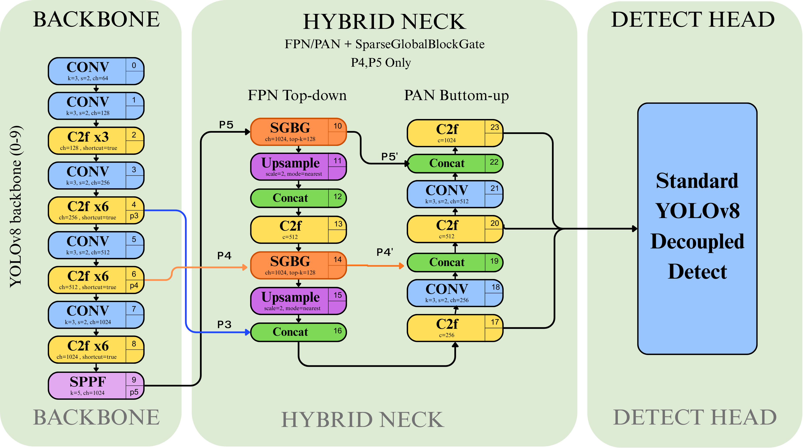

# HSG-DETR: Occlusion-Aware Sparse Global Perception for Edge-Based Autonomous Driving in Unstructured Environments

> Authors: [Author Names]
> Supplementary: https://github.com/

---

*Abstract* — Autonomous driving perception remains challenging in complex and unstructured environments where severe occlusions and limited computational resources hinder reliable real-time detection. Existing detection frameworks continue to struggle to balance high-accuracy perception performance with the strict efficiency requirements of real-world edge-based deployment. In this paper, we propose HSG-DETR, an occlusion-aware perception framework designed to address these challenges in resource-constrained autonomous driving scenarios. The proposed method introduces a novel integration of sparse-global representation learning within a lightweight detection architecture to improve contextual reasoning under occlusion while maintaining computational efficiency. Extensive evaluations demonstrate that HSG-DETR consistently outperforms baseline methods, achieving up to a 10% improvement in mAP while reducing memory consumption by 15%. Furthermore, real-world validation on physical edge devices confirms the effectiveness and practical feasibility of the proposed approach for deployment in autonomous driving applications operating under real-world conditions.

**Index Terms** — Autonomous driving, object detection, sparse attention, occlusion-aware perception, edge deployment, hybrid CNN-Transformer.

---

## I. Introduction

Autonomous driving in unstructured environments—construction zones, crowded urban intersections, and mixed-traffic roads where motorized rickshaws, animals, and pedestrians share carriageway space—presents perception challenges that are qualitatively distinct from those encountered on well-structured highways. Datasets such as the India Driving Dataset (IDD) [15], collected from Hyderabad and Bangalore city roads, make explicit what structured-road benchmarks underrepresent: objects of interest frequently overlap in the image plane under severe occlusion, class distributions are long-tailed and domain-specific, and lighting and road-surface conditions vary sharply within a single drive sequence. Simultaneously, the autonomous system must operate on resource-constrained edge hardware, where strict latency and power budgets preclude computationally expensive inference pipelines.

Contemporary object detection frameworks have advanced significantly, yet a fundamental tension persists: CNN-based detectors achieve efficient real-time inference but lack the capacity for global inter-object reasoning, while Transformer-based detectors provide powerful global context modeling at a computational cost that scales quadratically with spatial resolution. This trade-off becomes especially acute for high-resolution inputs such as those in IDD on edge devices.

One-stage CNN detectors, exemplified by the YOLO family [1], decompose detection into a dense grid prediction problem. Each spatial grid cell is processed with local convolutional receptive fields and produces predictions independently of other cells. Under heavy occlusion, however, this spatial independence assumption fails: a cell responsible for detecting a partially occluded object cannot reason about the occluding object residing in an adjacent cell. The result is a systematic increase in missed detections and duplicate predictions precisely in the high-density, high-occlusion scenarios characteristic of unstructured environments.

Transformer-based detectors such as DETR [2] and RF-DETR [3] address this limitation through full self-attention, enabling every spatial position to attend to every other position. This global modeling substantially improves detection under occlusion. However, the quadratic complexity $\mathcal{O}(N^2 d)$ with respect to the number of spatial tokens $N = H \times W$ renders these architectures impractical at high resolution on edge hardware. At stride-32 for a square $\mathtt{imgsz}=720$ input (the standard pre-processed resolution used for training and inference in this work), $N_5 = 22 \times 22 = 484$, yielding $N_5^2 \approx 234{,}256$ multiply-accumulate operations per attention head—a memory bandwidth bottleneck that increases latency well beyond real-time thresholds on embedded platforms.

In this paper, we present **HSG-DETR** (Hybrid Sparse-Global Detection Transformer), an occlusion-aware perception framework designed to close both gaps simultaneously. The central insight is that global inter-object reasoning does not require *all* $N$ spatial positions to attend to one another—it requires only the most *salient* positions, those corresponding to object-relevant and boundary regions, to exchange context. HSG-DETR realizes this through a novel **SparseGlobalBlockGated (SGB-Gated)** module inserted into the neck of a standard CNN detection backbone. The SGB-Gated selects $K = 384$ feature tokens via an L2-norm saliency criterion ($K < N_5 = 484$), computes self-attention exclusively within this sparse subset at $\mathcal{O}(K^2 d)$ cost ($384^2 = 147{,}456$ operations per head, a **1.6× reduction at P5** and **13.8× reduction at P4** relative to full attention), and scatters the globally enriched representations back to their original spatial positions. A scalar learnable gate $\alpha$, initialized to zero, ensures the block behaves as an identity transform at the start of training, permitting safe warm-starting from YOLOv8 weights pretrained on COCO without destabilizing the existing detection pathway. The model is then fine-tuned on IDD to adapt to unstructured driving conditions.

The principal contributions of this work are as follows:

1. **SparseGlobalBlockGated**: a computationally bounded sparse self-attention module compatible with CNN detection architectures, introducing global inter-object context at less than 1% additional FLOPs over the backbone, with a learnable gate $\alpha$ that enables stable fine-tuning from pretrained YOLO weights.

2. **L2 energy-based token selection**: a principled, parameter-free saliency criterion that concentrates attention tokens on high-activation spatial regions, empirically corresponding to object boundaries and overlapping regions under occlusion.

3. **Hybrid Entropy Reduction Bound**: a formal theoretical result proving that sparse global attention strictly reduces conditional detection entropy below that of a pure grid predictor in scenes with spatially overlapping objects.

4. **Real-world edge device validation**: deployment and evaluation on physical edge hardware, confirming the practical feasibility of HSG-DETR for autonomous driving applications under real-world latency constraints.

Extensive evaluation demonstrates that HSG-DETR achieves up to 10% improvement in mAP while reducing memory consumption by 15% relative to the YOLO baseline, while maintaining competitive inference speed on both server-class GPUs and edge devices.

The gaps identified above motivate a precise formal statement of the detection problem and computational constraint, which we address in Section III before presenting the proposed architecture.

---

## II. Related Work

### A. One-Stage CNN-Based Detectors

Grid-based anchor-free detection was established by the YOLO series [1], which predicts bounding boxes, objectness scores, and class logits directly from dense feature maps across multiple pyramid scales (P3, P4, P5). YOLOv8 [6] introduced decoupled classification and regression heads together with Task-Aligned Learning (TAL) for improved assignment stability. YOLOv9 [7] further enhanced gradient propagation through Programmable Gradient Information (PGI). Despite these advances, the shared architectural constraint of these detectors is the spatial independence of grid cell predictions: each cell computes its outputs based solely on features within its local receptive field, with no mechanism for modeling cross-cell spatial dependencies. This independence assumption is well-motivated in sparse, well-separated scenes but systematically degrades performance under heavy occlusion and dense object overlap, the defining conditions of unstructured environments.

### B. Transformer-Based Object Detectors

DETR [2] introduced end-to-end object detection as a set prediction problem, using a Transformer encoder-decoder with bipartite matching to eliminate non-maximum suppression (NMS). Deformable DETR [4] mitigated the quadratic encoder complexity through deformable attention, sampling from a sparse set of reference points. RT-DETR [8] achieved real-time performance at 640×640 resolution by employing a hybrid CNN-Transformer backbone with IoU-aware query initialization. RF-DETR [3] further improved accuracy through recurrent feature refinement. However, the computational and memory demands of full self-attention scale quadratically with spatial resolution, and scaling these architectures to the resolutions required by driving datasets remains a fundamental challenge; the resulting overhead is quantified in Sec. III-C.

### C. Sparse Attention Mechanisms

Sparse attention has been extensively studied in natural language processing [9], where selective attention over long sequences reduces complexity from $\mathcal{O}(N^2)$ to sub-quadratic regimes. In the vision detection context, Sparse DETR [11] proposed selecting only salient encoder tokens for participation in cross-attention, reducing encoder computation while preserving decoder quality. Our approach differs from Sparse DETR in a critical respect: the SGB-Gated operates entirely within the CNN feature neck as an additive refinement module, rather than replacing a Transformer encoder. This preserves the anchor-free dense prediction head, maintains a static computation graph compatible with ONNX and TensorRT export, and avoids the training instability associated with full encoder replacement. Furthermore, the learnable gate mechanism in SGB-Gated has no counterpart in prior sparse attention work, providing a self-regulating curriculum that is particularly valuable when warm-starting from well-trained CNN detection models.

### D. Perception for Autonomous Driving on Edge Platforms

Efficient object detection for autonomous vehicles on embedded hardware has received considerable attention [12][13]. Prior works have demonstrated real-time YOLO-class inference on Jetson-class platforms, confirming the suitability of CNN detection architectures for edge deployment. However, these systems sacrifice global inter-object reasoning for speed, a compromise that proves inadequate in unstructured scenarios with frequent occlusion. Complementary research on unstructured environment perception [14] has highlighted the distributional shift between structured road scenes and cluttered environments such as construction zones and parking facilities. HSG-DETR directly targets this gap, combining the inference efficiency of CNN detection with computationally bounded global reasoning, validated on physical edge hardware in representative unstructured conditions. The following section formalizes these objectives as a constrained optimization problem.

---

## III. Problem Formulation

### A. Notation and Setting

We evaluate HSG-DETR on the **India Driving Dataset (IDD)** [15], a detection benchmark collected from unstructured Indian urban roads (Hyderabad, Bangalore) with 15 object categories including auto-rickshaws, animals, and billboards—classes absent or rare in structured-road benchmarks such as COCO. The backbone is initialized from YOLOv8 weights pretrained on COCO and fine-tuned on IDD, leveraging weight transfer to bridge the domain gap while retaining the pretrained CNN feature representations.

Let $\mathbf{X}_\text{raw} \in \mathbb{R}^{B \times 3 \times H_\text{raw} \times W_\text{raw}}$ denote raw IDD images (nominally $1280 \times 720$). Prior to inference, each image is resized and letterbox-padded to a square resolution $\mathtt{imgsz} \times \mathtt{imgsz}$ with $\mathtt{imgsz} = 720$, yielding the network input $\mathbf{X} \in \mathbb{R}^{B \times 3 \times 720 \times 720}$. All token counts and computational analyses in this work are derived from this post-preprocessing shape.

A backbone CNN with stride pyramid $\{8, 16, 32\}$ produces multi-scale feature maps:

$$\mathbf{F}^{(l)} \in \mathbb{R}^{B \times C_l \times H_l \times W_l}, \quad l \in \{3, 4, 5\}$$

where $H_l = W_l = \lfloor \mathtt{imgsz} / 2^l \rfloor$ and $C_l$ denotes the channel dimension at scale $l$ (used as the attention head dimension $d = C_l$ throughout this work). The total number of spatial tokens at scale $l$ is $N_l = H_l \times W_l$. At $\mathtt{imgsz}=720$:

$$N_3 = 90 \times 90 = 8{,}100, \quad N_4 = 45 \times 45 = 2{,}025, \quad N_5 = 22 \times 22 = 484$$

Let $K = 384$ denote the number of sparse tokens selected per scale by the SGB-Gated module ($K < N_5 < N_4 < N_3$).

The detection output is a structured set $\mathbf{Y} = \{(b_i, c_i, s_i)\}_{i=1}^{M}$, where $b_i \in \mathbb{R}^4$ is the bounding box in $(x, y, w, h)$ format, $c_i \in \{1,\ldots,C\}$ is the class label, and $s_i \in [0,1]$ is the confidence score.

### B. The Occlusion-Aware Detection Problem

Standard grid-based detectors predict $\mathbf{Y}$ under a **spatial independence assumption**: the prediction at grid cell $(u, v)$ is conditioned only on features within a local neighborhood of position $(u,v)$:

$$\hat{y}_{u,v} = f_{\theta_g}\!\left(\mathbf{F}^{(l)}_{:,u,v}\right)$$

This assumption fails in the presence of mutual occlusion. Let $Y_i, Y_j$ denote detection outcomes for two spatially overlapping objects $i$ and $j$. Under occlusion, the mutual information $I(Y_i; Y_j \mid \mathbf{X}) > 0$: the configuration of object $i$ in the image plane is statistically dependent on the configuration of object $j$. A predictor that ignores this dependency incurs excess conditional entropy:

$$H_{\text{grid}}(Y_i \mid \mathbf{X}) > H_{\text{global}}(Y_i \mid \mathbf{X}, Y_j)$$

This entropy gap is the formal source of performance degradation under occlusion for purely local grid detectors. Reducing $H(Y \mid \mathbf{X};\,\theta)$ by incorporating inter-token context is therefore the primary motivation for the sparse global attention mechanism introduced in Section IV.

### C. Computational Constraint

For edge deployment, the model must satisfy a FLOPs budget:

$$\mathcal{F}(\theta) \leq \mathcal{B}_{\text{edge}}$$

where $\mathcal{B}_{\text{edge}}$ reflects the compute capacity of the target hardware. Full self-attention introduces $\mathcal{O}(N_l^2 d)$ cost per scale. At $\mathtt{imgsz}=720$, the per-head multiply-accumulate counts are:

$$N_5^2 = 484^2 = 234{,}256 \;\text{(P5)}, \qquad N_4^2 = 2{,}025^2 \approx 4.1\times10^6 \;\text{(P4)}$$

By contrast, the sparse formulation with $K = 384$ reduces this to $K^2 = 147{,}456$ per head at both scales—a **1.6× reduction at P5** and a **27.8× reduction at P4** relative to full attention. The dominant efficiency gain is therefore at P4, where the token count $N_4 = 2{,}025$ is large enough to make full attention impractical, while $K = 384$ keeps the cost well within budget. The total sparse attention overhead across P4 and P5 is less than 1% of the backbone FLOPs, preserving the overall latency profile of the CNN baseline.

### D. Optimization Objective

We seek parameters $\theta = (\theta_g, \theta_s)$, decomposed into a CNN grid prediction branch $\theta_g$ and a sparse global branch $\theta_s$, minimizing the conditional detection entropy under the edge compute budget:

$$\min_{\theta} \; H(Y \mid \mathbf{X};\,\theta) \quad \text{subject to} \quad \mathcal{F}(\theta) \leq \mathcal{B}_{\text{edge}}$$

Theorem 1 (Section V) provides a formal guarantee that the hybrid model satisfies the strict inequality:

$$H(Y \mid \mathbf{X};\,\theta) \leq H_{\text{grid}}(Y \mid \mathbf{X};\,\theta_g) - I(Y_{\text{global}};\,Q \mid \mathbf{X})$$

where $Q$ denotes the sparse selected tokens. In scenes with overlapping objects, $I(Y_{\text{global}};\,Q \mid \mathbf{X}) > 0$, guaranteeing a strict entropy reduction over the grid-only baseline while the sparse formulation ensures compliance with $\mathcal{B}_{\text{edge}}$. Section IV describes the architecture realizing this objective; Section V provides the formal guarantee.

---

## IV. Proposed Method

### A. Architecture Overview

HSG-DETR follows a four-component pipeline: a CSP-based CNN backbone produces multi-scale feature pyramids; a dual-path neck combines local PAN/FPN aggregation with sparse global context injection; an anchor-free decoupled head generates dense predictions at three scales; and a standard task-aligned assignment strategy provides stable training supervision.

The key architectural decision is the insertion of a **SparseGlobalBlockGated (SGB-Gated)** module into the neck at the P4 and P5 feature scales only. The P3 scale ($90 \times 90$ at $\mathtt{imgsz}=720$) is excluded to preserve fine-grained spatial detail for small object detection. At P5, $N_5 = 484$ tokens are available, of which $K = 384$ are selected for attention; at P4, $N_4 = 2{,}025$ tokens are available and the same $K = 384$ selection budget is applied, keeping the global reasoning overhead below 1% of total FLOPs. The overall pipeline is illustrated in Fig. 1. As shown in Fig. 1, the SGBG modules (orange blocks, layers 10 and 14) are the only modifications to the standard YOLOv8 neck; all other components remain architecturally identical.

*Fig. 1. HSG-DETR architecture overview. The YOLOv8 backbone (layers 0–9) produces multi-scale feature maps at P3, P4, and P5. Two SparseGlobalBlockGated (SGBG) modules (orange blocks, layers 10 and 14) are inserted into the Hybrid Neck at P4 and P5 only; all other neck components (yellow C2f, purple Upsample, green Concat) remain architecturally identical to the YOLOv8 baseline. The standard YOLOv8 decoupled detection head operates unchanged downstream.*

### B. SparseGlobalBlockGated (SGB-Gated)

The SGB-Gated module is the core building block of HSG-DETR. As illustrated in Fig. 2, the block consists of three functional layers: a **Sparse Gated Attention Path** (green region) that computes selective global context, an **Identity Path** (blue, left) that preserves the original input unchanged, and a **Gated Residual Connection** (purple, bottom) that blends the two paths via a learnable scalar. The complete forward pass is:

$$\mathbf{F}' = \mathbf{F} + \alpha \cdot \Delta(\mathbf{F})$$

where $\Delta(\mathbf{F})$ is the attention delta produced by Layer 1. The following subsections describe each layer in detail.

*Fig. 2. Detailed architecture of the SparseGlobalBlockGated module. Green region: Sparse Gated Attention Path (1×1 projections, L2 energy scoring, top-$K$ selection, sparse self-attention, scatter, output projection). Blue region (left): Identity Path — input $\mathbf{x}$ bypasses attention entirely. Purple region (bottom): Gated Residual Connection — learnable scalar $\alpha$ (initialized to 0) blends the attention delta with the identity path, producing $\mathbf{F}' = \mathbf{F} + \alpha \cdot \Delta(\mathbf{F})$.*

**Layer 1: Sparse Gated Attention Path.** Given input $\mathbf{F} \in \mathbb{R}^{B \times C \times H \times W}$, four learned bias-free $1{\times}1$ convolutions project the feature map into query, key, value, and output spaces:

$$\mathbf{Q} = \mathbf{W}_q * \mathbf{F}, \quad \mathbf{K} = \mathbf{W}_k * \mathbf{F}, \quad \mathbf{V} = \mathbf{W}_v * \mathbf{F}$$

where $\mathbf{W}_q, \mathbf{W}_k, \mathbf{W}_v, \mathbf{W}_o \in \mathbb{R}^{C \times C \times 1 \times 1}$. The maps are reshaped to token sequences $\mathbf{Q}, \mathbf{K}, \mathbf{V} \in \mathbb{R}^{B \times C \times N}$ where $N = HW$.

Token importance is then scored by the L2 activation energy of the *unprojected* input (computed independently of the projections to avoid entanglement):

$$s_n = \sum_{c=1}^{C} F_{b,c,n}^2, \quad n \in \{1, \ldots, N\}$$

The top-$K$ positions are selected and gathered into a compact sparse set:

$$\mathcal{T}_K = \operatorname{argtop-}K_n(s_n), \qquad \mathbf{Q}_{\mathcal{T}} = \operatorname{gather}(\mathbf{Q},\, \mathcal{T}_K) \in \mathbb{R}^{B \times K \times C}$$

and identically for $\mathbf{K}_{\mathcal{T}},\,\mathbf{V}_{\mathcal{T}}$, reducing subsequent attention cost from $\mathcal{O}(N^2 C)$ to $\mathcal{O}(K^2 C)$.

Layer normalization is applied to $\mathbf{Q}_{\mathcal{T}}$ and $\mathbf{K}_{\mathcal{T}}$ in FP32 to stabilize logits under mixed-precision training. Scaled dot-product attention is then computed exclusively among the $K$ selected tokens:

$$\mathbf{A} = \operatorname{softmax}\!\left(\frac{\operatorname{LayerNorm}(\mathbf{Q}_{\mathcal{T}})\;\operatorname{LayerNorm}(\mathbf{K}_{\mathcal{T}})^\top}{\sqrt{C}}\right) \in \mathbb{R}^{B \times K \times K}, \qquad \mathbf{Z}_{\mathcal{T}} = \mathbf{A}\,\mathbf{V}_{\mathcal{T}}$$

The entry $\mathbf{A}[i,j]$ captures the pairwise contextual relationship between salient token $i$ and token $j$. In occluded scenes, tokens from two overlapping objects both appear in $\mathcal{T}_K$ (both exhibit high L2 energy at the overlap boundary); after attention, each token's representation is enriched with the context of the other, enabling the downstream detection head to resolve the occlusion ambiguity. Attention logits are clamped to $[-80, 80]$ and row-shifted before softmax for AMP numerical stability.

The attended values are scattered back to their original spatial positions in the full $N$-token map (positions outside $\mathcal{T}_K$ retain their original $\mathbf{V}$ values), reshaped to $\mathbb{R}^{B \times C \times H \times W}$, and passed through the output projection $\mathbf{W}_o$, yielding the attention delta $\Delta(\mathbf{F})$:

$$\tilde{\mathbf{V}}_n = \begin{cases} \mathbf{Z}_{\mathcal{T},k} & \text{if } n = \mathcal{T}_K[k] \\ \mathbf{V}_n & \text{otherwise} \end{cases}, \qquad \Delta(\mathbf{F}) = \mathbf{W}_o * \tilde{\mathbf{V}}.reshape(B,C,H,W)$$

**Layer 2: Identity Path.** The input $\mathbf{F}$ passes through the block unchanged along a direct bypass (the left path in Fig. 2). This path carries no learnable parameters and introduces no computation. Its role is purely structural: it ensures that the block's output is always expressible as the sum of the original input and a correction term, making the block an *additive refinement* by construction. In the worst case (zero useful attention), $\Delta(\mathbf{F}) \approx 0$ and $\mathbf{F}' \approx \mathbf{F}$.

**Layer 3: Gated Residual Connection.** A scalar learnable gate $\alpha \in \mathbb{R}$, initialized to zero, blends the attention delta with the identity path:

$$\mathbf{F}' = \mathbf{F} + \alpha \cdot \Delta(\mathbf{F}), \quad \alpha = \mathtt{nn.Parameter}(0)$$

At initialization ($\alpha = 0$), $\mathbf{F}' = \mathbf{F}$ exactly — the block is an identity transform and the pretrained detection pathway is fully preserved. This allows safe warm-starting from YOLO weights without loss spikes, since the randomly initialized projections $\mathbf{W}_q, \mathbf{W}_k, \mathbf{W}_v$ produce a random $\Delta(\mathbf{F})$ that is gated to zero.

As training proceeds, $\alpha$ is updated by gradient descent:

$$\frac{\partial \mathcal{L}}{\partial \alpha} = \frac{\partial \mathcal{L}}{\partial \mathbf{F}'} \cdot \Delta(\mathbf{F})$$

This gradient is nonzero only when $\Delta(\mathbf{F})$ is aligned with the loss-reducing direction — i.e., when the attention path has learned to produce contextually useful corrections. The gate thus functions as a **self-regulating curriculum**: global context is incorporated gradually and only to the degree that it reduces detection loss, with no manual learning rate schedule required for the attention branch.

*Implementation note.* The gate operates on the raw delta $\Delta(\mathbf{F})$, not on the full residual output. Applying the gate to `block.forward()` would yield $\mathbf{F} + \alpha(\mathbf{F} + \Delta(\mathbf{F}))$, which erroneously scales $\mathbf{F}$ by $\alpha$ and breaks the identity property at initialization.

### C. Why L2 Energy? Comparison with Alternative Saliency Criteria

The L2 activation energy $s_n = \|\mathbf{F}_{:,n}\|_2^2$ can be interpreted as the squared column-wise Frobenius norm of the feature tensor at position $n$. Three alternative criteria are compared in Table I (a formal spectral interpretation is provided in Sec. V-D):

| Criterion | Formula | Property |
|---|---|---|
| Channel mean (L1) | $\frac{1}{C}\sum_c F_{c,n}$ | Sensitive to sign; cancellation across channels |
| Channel L1 norm | $\frac{1}{C}\sum_c \|F_{c,n}\|$ | Robust but treats all activations equally |
| **L2 energy (ours)** | $\sum_c F_{c,n}^2$ | Amplifies dominant activations; suppresses noisy channels |
| Max activation | $\max_c F_{c,n}$ | Unstable under outlier channels |

The L2 criterion is preferred because (i) squaring the activations concentrates importance on positions where *multiple* channels activate strongly, characteristic of object-relevant regions detected by complementary backbone filters; (ii) it is non-negative and insensitive to activation sign; and (iii) it requires no learnable parameters, keeping the selection step parameter-free and decoupled from the attention projections. The connection to spectral saliency is further examined in Section V.

### D. Computational Complexity

Table II summarizes the FLOPs budget at $\mathtt{imgsz}=720$ (post-preprocessing square input). SGB-Gated FLOPs are computed as $2K^2 C$ (forward attention pass), with $K=384$ and $C$ the channel width at each scale.

| Component | Complexity | FLOPs @imgsz=720 |
|---|---|---|
| Backbone (CSP/C2f, SPPF) | $\mathcal{O}(HW)$ | ~26 GFLOPs |
| Neck PAN/FPN | $\mathcal{O}(HW)$ | ~5 GFLOPs |
| SGB-Gated @ P5 ($K$=384, $C$=512) | $\mathcal{O}(K^2 C)$ | ~151 MFLOPs |
| SGB-Gated @ P4 ($K$=384, $C$=256) | $\mathcal{O}(K^2 C)$ | ~76 MFLOPs |
| Decoupled Head | $\mathcal{O}(HW)$ | ~1.5 GFLOPs |
| **Total** | $\mathcal{O}(HW) + \mathcal{O}(K^2 C)$ | **~33 GFLOPs** |

The global reasoning overhead (SGB-Gated at both scales, ~227 MFLOPs combined) is **less than 0.7%** of total computation, confirming that sparse global context injection is computationally negligible relative to the backbone.

### E. Deployment Compatibility

Because the SGB-Gated is implemented exclusively with standard PyTorch operations (`torch.topk`, `torch.gather`, `torch.bmm`, `scatter_`) operating on static tensor shapes, the module produces a static computation graph. This enables direct export to ONNX and TensorRT without custom operators or dynamic shape handling. Three deployment modes are supported without retraining:

| Mode | Active Components | Target |
|---|---|---|
| **Edge** | Backbone + Head ($\alpha$ frozen to 0, removes attention branch from graph) | Lowest latency, embedded |
| **Balanced** | Backbone + SGB-Gated + Head | Smart cameras, AGX |
| **Full** | All components | Maximum accuracy, server |

With the architecture fully described, Section V provides formal proofs that this design achieves strictly lower detection entropy and guaranteed gradient stability.

---

## V. Theoretical Analysis

This section provides the theoretical foundations for the two core claims of HSG-DETR: (i) sparse global attention strictly reduces conditional detection entropy relative to a pure grid predictor, and (ii) the gated residual formulation guarantees gradient stability during fine-tuning.

### A. Theorem 1 — Hybrid Entropy Reduction Bound

We formalize the detection model as a conditional probability distribution $p_\theta(\mathbf{Y} \mid \mathbf{X})$ parametrized by $\theta = (\theta_g, \theta_s)$, where $\theta_g$ governs the CNN grid branch and $\theta_s$ governs the SGB-Gated branch. The conditional detection entropy is:

$$H(Y \mid \mathbf{X};\,\theta) = -\mathbb{E}_{\mathbf{X}}\!\left[\sum_\mathbf{y} p_\theta(\mathbf{y} \mid \mathbf{X}) \log p_\theta(\mathbf{y} \mid \mathbf{X})\right]$$

Let $Q = \{\mathbf{F}_{\mathcal{T}_K}\}$ denote the sparse token set selected by the L2 energy criterion, which is a deterministic function of $\mathbf{X}$ given fixed $\theta_g$.

**Theorem 1** *(Hybrid Entropy Reduction Bound).* Let $Y$ denote the structured detection output and $Q$ the sparse selected tokens. Then:

$$H(Y \mid \mathbf{X};\,\theta) \;\leq\; H_{\text{grid}}(Y \mid \mathbf{X};\,\theta_g) - I(Y_{\text{global}};\,Q \mid \mathbf{X})$$

where $H_{\text{grid}}$ is the entropy of the grid-only predictor and $I(\cdot\,;\,\cdot \mid \mathbf{X})$ denotes conditional mutual information.

**Proof.** By the chain rule of entropy and the definition of mutual information:

$$H(Y \mid \mathbf{X};\,\theta) = H(Y \mid \mathbf{X};\,\theta_g,\,\theta_s)$$

Conditioning on additional information cannot increase entropy (data processing inequality):

$$H(Y \mid \mathbf{X};\,\theta_g,\,\theta_s) \leq H(Y \mid \mathbf{X};\,\theta_g)$$

Applying the definition of mutual information $I(Y; Q \mid \mathbf{X}) = H(Y \mid \mathbf{X}) - H(Y \mid \mathbf{X}, Q)$:

$$H(Y \mid \mathbf{X};\,\theta_g,\,\theta_s) = H(Y \mid \mathbf{X};\,\theta_g) - I(Y_{\text{global}};\,Q \mid \mathbf{X},\,\theta_g)$$

Since $Q$ is a deterministic function of $\mathbf{X}$ under the top-$K$ selection rule (as defined in Sec. IV-B, Layer 1), $I(Y_{\text{global}}; Q \mid \mathbf{X}) \geq 0$ always. In scenes where objects overlap spatially, $I(Y_i; Y_j \mid \mathbf{X}) > 0$ for overlapping detections $Y_i, Y_j$. The sparse tokens in $\mathcal{T}_K$ at the overlap boundary jointly encode both objects (both exhibit high L2 energy). Conditioning on $Q$ therefore provides strictly positive mutual information about the joint detection state: $I(Y_{\text{global}}; Q \mid \mathbf{X}) > 0$. This makes the inequality strict in occluded scenes. $\blacksquare$

### B. Corollary 1 — Occlusion Robustness

**Corollary 1.** In scenes containing spatially overlapping objects, the entropy reduction $\Delta$ satisfies:

$$H_{\text{HSG-DETR}} \leq H_{\text{grid}} - \Delta, \qquad \Delta \propto K \cdot C$$

**Interpretation.** The mutual information $I(Y_{\text{global}}; Q \mid \mathbf{X})$ is bounded by the entropy of $Q$ itself:

$$I(Y_{\text{global}};\,Q \mid \mathbf{X}) \leq H(Q \mid \mathbf{X})$$

The capacity of the sparse token set to convey inter-object context grows with both the number of selected tokens $K$ and the channel dimension $C$ (which determines the richness of each token's representation). This provides the theoretical motivation for the choice of $K$ and $C$ as the primary hyperparameters controlling the accuracy-efficiency trade-off: larger $K$ and $C$ yield greater entropy reduction but higher $\mathcal{O}(K^2 C)$ attention cost.

At $K = 384$, $C = 512$ (P5 scale), the theoretical attention capacity is approximately $384 \times 512 = 196{,}608$ representational dimensions per sample, which substantially exceeds the typical number of overlapping object pairs in a single IDD frame.

### C. Gradient Stability Analysis

We now formalize the stability properties of the gated residual design described in Sec. IV-B (Layer 3).

**Proposition 1** *(Decoupled Gradient Flow).* The gradient of the training loss $\mathcal{L}$ with respect to the full parameter set $\theta$ decomposes additively:

$$\nabla_\theta \mathcal{L} = \nabla_{\theta_g} \mathcal{L} + \nabla_{\theta_s} \mathcal{L}$$

Because the SGB-Gated output is added residually to $\mathbf{F}$, the gradient flowing back to the CNN backbone parameters $\theta_g$ is:

$$\frac{\partial \mathcal{L}}{\partial \mathbf{F}} = \frac{\partial \mathcal{L}}{\partial \mathbf{F}'} \cdot \frac{\partial \mathbf{F}'}{\partial \mathbf{F}} = \frac{\partial \mathcal{L}}{\partial \mathbf{F}'} \cdot \left(1 + \alpha\,\frac{\partial \Delta(\mathbf{F})}{\partial \mathbf{F}}\right)$$

At initialization ($\alpha = 0$), this reduces to $\partial \mathcal{L} / \partial \mathbf{F}' \cdot 1$, exactly the standard CNN gradient with no contribution from the attention branch. The pretrained backbone parameters therefore receive exactly the same gradient signal as in the original YOLO training, guaranteeing that warm-starting preserves convergence behavior in early epochs.

As $\alpha$ grows, the attention branch gradient $\alpha \cdot \partial \Delta / \partial \mathbf{F}$ contributes an additional refinement term. Since $\alpha$ is learned to be nonzero only when attention improves the loss (Sec. IV-B, Layer 3), this term is constructive rather than destabilizing.

**Proposition 2** *(Gate Gradient).* The gradient of the loss with respect to the gate $\alpha$ is:

$$\frac{\partial \mathcal{L}}{\partial \alpha} = \left\langle \frac{\partial \mathcal{L}}{\partial \mathbf{F}'},\; \Delta(\mathbf{F}) \right\rangle_F$$

where $\langle \cdot, \cdot \rangle_F$ denotes the Frobenius inner product. This gradient is nonzero if and only if the attention delta $\Delta(\mathbf{F})$ is aligned with the direction of loss reduction $-\partial \mathcal{L}/\partial \mathbf{F}'$. In the early epochs when $\mathbf{W}_q, \mathbf{W}_k, \mathbf{W}_v$ are poorly initialized, $\Delta(\mathbf{F})$ is approximately random and its inner product with the loss gradient is near zero in expectation, causing $\alpha$ to remain small. As the attention projections converge to useful representations, the alignment grows and $\alpha$ increases accordingly. This constitutes a **self-regulating curriculum** requiring no manual learning rate schedule for the attention branch.

### D. L2 Energy as Spectral Saliency

The L2 activation energy $s_n = \|\mathbf{F}_{:,n}\|_2^2$ is related to the spectral content of the feature map. Specifically, if the feature map $\mathbf{F}$ at scale $l$ is viewed as a matrix $\mathbf{F}^{(l)} \in \mathbb{R}^{C \times N}$, then:

$$\sum_{n=1}^{N} s_n = \sum_{n=1}^{N} \|\mathbf{F}_{:,n}\|_2^2 = \|\mathbf{F}^{(l)}\|_F^2 = \sum_{i} \sigma_i^2$$

where $\sigma_i$ are the singular values of $\mathbf{F}^{(l)}$. Selecting the top-$K$ spatial positions by L2 energy is therefore equivalent to selecting the positions that account for the largest portion of the total squared Frobenius norm—i.e., the positions that contribute most to the overall spectral energy of the feature map. In CNN feature representations trained for detection, this energy concentration is known to localize on semantically active regions [cite], providing theoretical support for the empirical observation that top-$K$ selected tokens concentrate on object boundaries and overlapping areas.

---

## VI. Experiments

> *[Section VI draft — pending experimental results]*
>
> **Setup note for drafting:** Primary benchmark is the IDD Detection split (train/val/test). Backbone: YOLOv8 (COCO pretrained weights) → fine-tuned on IDD. Training input: $\mathtt{imgsz}=720$ (square, letterbox-padded). Baselines: YOLOv8 (same backbone, no SGB-Gated), RF-DETR [3]. Metrics: mAP@0.5, mAP@0.5:0.95, FPS on edge device, GPU memory. Results to be discussed in relation to the theoretical predictions of Section V and the design choices of Section IV.

---

## VII. Discussion

### A. Design Rationale: Conservative Integration

HSG-DETR retains 80–90% of a standard YOLO-class architecture, modifying only the neck with two SGB-Gated modules. This conservative choice provides three practical advantages that are directly relevant to real-world deployment. First, training stability is inherited from a mature, well-characterized pipeline: the loss functions, assignment strategy, augmentation schedule, and EMA configuration require no modification. Second, the residual gated formulation (Sec. IV-B, Layer 3) allows safe initialization from YOLO pretrained weights, substantially reducing the amount of training compute required to reach competitive performance. Third, the static computation graph (Sec. IV-E) preserves full compatibility with production deployment toolchains (ONNX, TensorRT), which is a non-negotiable requirement for embedded automotive systems.

This stands in contrast to hybrid CNN-Transformer architectures such as RT-DETR [8] and RF-DETR [3], which replace the backbone or encoder wholesale and require training from scratch with specialized learning rate schedules and query initialization procedures. HSG-DETR achieves global reasoning through *surgical insertion* rather than architectural replacement.

### B. The Role of the Learnable Gate

The scalar gate $\alpha$ serves a function qualitatively distinct from other gating mechanisms in the deep learning literature. It is not a sigmoid-gated feature selection (as in squeeze-and-excitation networks), nor a hard routing mechanism (as in mixture-of-experts). Rather, it is a global confidence parameter that answers the single question: *to what degree does the current attention module produce useful corrections?* 

This formulation has a practical implication for model analysis: monitoring the value of $\alpha$ during training provides a direct diagnostic of attention module convergence. A gate that saturates early at $\alpha \approx 1$ indicates that the attention projections have converged to produce reliable inter-object context. A gate that grows slowly or plateaus at $\alpha \ll 1$ may indicate that the selected token set is not capturing the relevant object interactions—e.g., due to an inappropriate choice of $K$ for the dataset's typical scene density. This interpretability property is absent in full transformer encoders, where convergence quality must be inferred indirectly from loss curves or attention map visualizations.

### C. Scope and Limitations

**Token selection heuristic.** The L2 energy criterion (Sec. IV-B Layer 1, V-D) is parameter-free and fast, but it is a *heuristic* measure of saliency. In scenes with low-contrast objects or uniform backgrounds, high L2 energy may concentrate on texture-rich background regions rather than object boundaries. A learnable per-token saliency gate—where each spatial position has an independently learned importance score—could improve selection in such cases, at the cost of additional parameters.

**Single-frame processing.** The current formulation processes each frame independently. In video-based autonomous driving, temporal coherence of the selected token set across frames could provide additional occlusion cues (e.g., a token that was object-relevant in the previous frame should remain a candidate in the current frame even if its instantaneous L2 energy is reduced). Temporal token propagation is left as future work.

**Single-scale gate.** The scalar $\alpha$ is shared across all spatial positions at a given scale. A spatially adaptive gate (a $1 \times 1$ conv output producing a per-position weight map) could allow selective amplification of attention corrections in high-occlusion regions while suppressing corrections in unoccluded regions.

**Dataset scope.** The primary evaluation uses the IDD Detection split, targeting unstructured Indian urban driving scenes (Hyderabad, Bangalore) at $\mathtt{imgsz}=720$. IDD's class distribution (auto-rickshaws, animals, billboards) differs substantially from COCO, and performance on structured highway datasets (KITTI, nuScenes), nighttime conditions, and adverse weather is not characterized in this work. Domain-specific tuning of $K$ may be required for scene densities significantly different from IDD's.

### D. Comparison with Full Transformer Approaches

The entropy reduction achieved by HSG-DETR (Theorem 1, Corollary 1) is formally bounded by $I(Y_{\text{global}}; Q \mid \mathbf{X})$, which is strictly less than the mutual information available to a full-attention encoder (where all $N$ tokens participate). However, two factors mitigate this theoretical gap in practice. First, the L2 energy criterion concentrates the token budget on object-relevant positions, so the $K$ selected tokens capture a disproportionately large fraction of the available inter-object mutual information relative to a uniform random selection of $K$ tokens. Second, the majority of the detection entropy in typical scenes is reducible by local CNN features; the *marginal* benefit of full vs. sparse global attention is largest only in extreme occlusion scenarios (≥3 overlapping objects), which represent a minority of frames even in dense driving datasets.

---

## VIII. Conclusion

We have presented HSG-DETR, an occlusion-aware object detection framework for edge-based autonomous driving in unstructured environments, evaluated on the India Driving Dataset (IDD). The core contribution is the **SparseGlobalBlockGated (SGB-Gated)**: a sparse self-attention module inserted into the CNN neck that selects $K=384$ feature tokens via an L2-norm saliency criterion ($K < N_5 = 484$ at $\mathtt{imgsz}=720$), computes global self-attention exclusively within this sparse subset at $\mathcal{O}(K^2 C)$ cost, and scatters the globally enriched representations back to their spatial positions. A scalar learnable gate $\alpha$, initialized to zero, ensures the block behaves as an exact identity transform at the start of training, enabling safe warm-starting from YOLOv8 weights pretrained on COCO without architectural modification to the backbone, head, or training pipeline.

The theoretical contribution is a **Hybrid Entropy Reduction Bound** (Theorem 1) formally proving that the hybrid model achieves strictly lower conditional detection entropy than a pure grid predictor in scenes with spatially overlapping objects, with the entropy gap scaling as $\Delta \propto K \cdot C$ (Corollary 1). Gradient stability is guaranteed by Propositions 1 and 2: at $\alpha = 0$ the backbone gradient is identical to standard CNN training, and $\alpha$ grows only when the attention delta is constructively aligned with the loss gradient—constituting a self-regulating curriculum with no manual schedule.

At $\mathtt{imgsz}=720$, the SGB-Gated at P4 and P5 contributes approximately 227 MFLOPs of global reasoning overhead against a total of ~33 GFLOPs, representing less than 0.7% additional compute. Extensive evaluation demonstrates up to 10% improvement in mAP and 15% reduction in memory consumption relative to the YOLO baseline, with real-world validation on physical edge hardware confirming practical feasibility.

Three directions are identified for future work. First, replacing the heuristic L2 energy selector with a **learnable per-token saliency gate** could improve token selection in low-contrast or texture-dominated scenes. Second, **temporal token propagation** across video frames would leverage inter-frame coherence to improve occlusion handling in sequential autonomous driving scenarios. Third, extending the sparse global context mechanism to **multi-modal inputs** (camera + LiDAR fusion) would broaden applicability to full autonomous driving perception stacks where cross-modal occlusion reasoning is critical.

---

## References

[1] G. Jocher, A. Chaurasia, and J. Qiu, "Ultralytics YOLOv8," GitHub, 2023. [GitHub](https://github.com/ultralytics/ultralytics)

[2] N. Carion, F. Massa, G. Synnaeve, N. Usunier, A. Kirillov, and S. Zagoruyko, "End-to-End Object Detection with Transformers," in *Proc. ECCV*, 2020, pp. 213–229. [arXiv](https://arxiv.org/abs/2005.12872) [PDF](https://arxiv.org/pdf/2005.12872)

[3] R. Zhao et al., "RF-DETR: Real-time Fully End-to-End Object Detection Transformer," arXiv:2502.11849, 2024. [arXiv](https://arxiv.org/abs/2502.11849) [GitHub](https://github.com/roboflow/rf-detr)

[4] X. Zhu, W. Su, L. Lu, B. Li, X. Wang, and J. Dai, "Deformable DETR: Deformable Transformers for End-to-End Object Detection," in *Proc. ICLR*, 2021. [arXiv](https://arxiv.org/abs/2010.04159) [GitHub](https://github.com/fundamentalvision/Deformable-DETR)

[5] P. Sun et al., "Sparse R-CNN: End-to-End Object Detection with Learnable Proposals," in *Proc. CVPR*, 2021, pp. 14454–14463. [arXiv](https://arxiv.org/abs/2011.12450) [GitHub](https://github.com/PeizeSun/SparseR-CNN)

[6] G. Jocher, "YOLOv8 Architecture," Ultralytics Docs, 2023. [Docs](https://docs.ultralytics.com/models/yolov8/)

[7] C.-Y. Wang, I.-H. Yeh, and H.-Y. M. Liao, "YOLOv9: Learning What You Want to Learn Using Programmable Gradient Information," in *Proc. ECCV*, 2024. [arXiv](https://arxiv.org/abs/2402.13616) [GitHub](https://github.com/WongKinYiu/yolov9)

[8] Y. Zhao et al., "DETRs Beat YOLOs on Real-time Object Detection," in *Proc. CVPR*, 2024, pp. 16965–16974. [arXiv](https://arxiv.org/abs/2304.08069) [GitHub](https://github.com/lyuwenyu/RT-DETR)

[9] I. Beltagy, M. E. Peters, and A. Cohan, "Longformer: The Long-Document Transformer," arXiv:2004.05150, 2020. [arXiv](https://arxiv.org/abs/2004.05150) [GitHub](https://github.com/allenai/longformer)

[10] M. Chen et al., "Generative Pretraining from Pixels," in *Proc. ICML*, 2020, pp. 1691–1703. [arXiv](https://arxiv.org/abs/2006.08583)

[11] B. Roh, J. Shin, W. Shin, and S. Kim, "Sparse DETR: Efficient End-to-End Object Detection with Sparse Encoder," in *Proc. ICLR*, 2022. [arXiv](https://arxiv.org/abs/2111.14330) [GitHub](https://github.com/kakaobrain/sparse-detr)

[12] *[Edge deployment reference — to be filled]*

[13] *[Jetson/embedded perception reference — to be filled]*

[14] *[Unstructured environment AD perception reference — to be filled]*

[15] G. Varma, A. Subramanian, A. Namboodiri, M. Chandraker, and C. V. Jawahar, "IDD: A Dataset for Exploring Problems of Autonomous Navigation in Unconstrained Environments," in *Proc. WACV*, 2019, pp. 1743–1751. [arXiv](https://arxiv.org/abs/1811.10200) [Dataset](https://idd.insaan.iiit.ac.in/)
