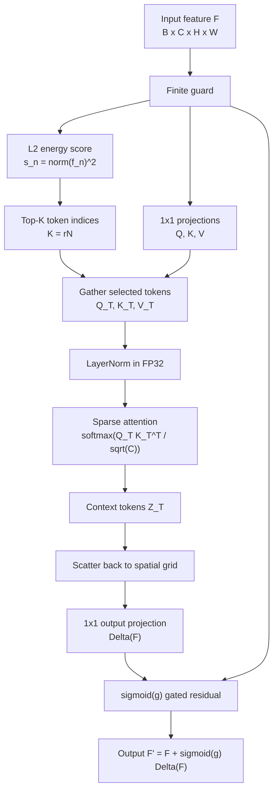
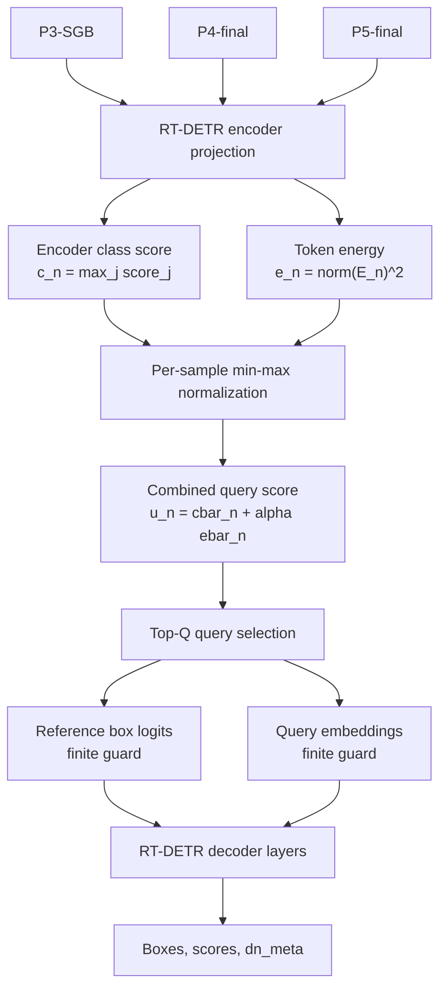

# HSG-DETR: Sparse-Global Hybrid Detection Transformer with Saliency-Guided Query Selection

> Authors: [Author Names]
> Supplementary: [TODO: repository / project page]

---

*Abstract* - Modern object detectors face a persistent trade-off between local efficiency and global scene reasoning. Convolutional detectors provide strong throughput and stable dense feature extraction, but their local receptive-field bias limits reasoning under occlusion and dense object interaction. Transformer detectors provide global set prediction, but full token interaction remains expensive when applied broadly across high-resolution feature maps. We propose **HSG-DETR**, a Sparse-Global hybrid detection transformer built around a simple principle: global reasoning should be concentrated on salient visual tokens rather than applied uniformly to every spatial location. HSG-DETR introduces three architecture components. First, an **SGStem** and **SGDown** backbone replace ordinary stride transitions with clue-preserving sparse-global downsampling. Second, a hybrid FPN/PAN neck inserts **SGTokenBlock** modules at P5, P4, and P3, where tokens are selected by L2 activation energy, refined by sparse self-attention, and scattered back into the feature map through a gated residual path. Third, a custom **RTDETRDecoderSGB** head modifies RT-DETR query initialization by combining class evidence with token energy, biasing object queries toward regions already identified as salient by the sparse-global encoder. We present the architecture, derive its sparse-attention complexity, and formalize the expected entropy reduction from conditioning predictions on salient global context. This draft focuses on design and theory; empirical performance claims are intentionally left as an evaluation protocol until benchmark results are finalized.

**Index Terms** - Object detection, sparse attention, RT-DETR, hybrid CNN-Transformer, saliency-guided query selection, conditional entropy, numerical stability.

---

## I. Introduction

Object detection requires two complementary capabilities. A detector must preserve fine local evidence for boundaries, textures, and small objects, while also reasoning over larger spatial relationships such as occlusion, co-occurrence, and repeated structures. CNN-based detectors are efficient because they build local features with shared convolutional kernels, but this locality can leave ambiguous detections unresolved when objects overlap or when the relevant context lies outside the immediate neighborhood. Transformer-based detectors address this limitation by allowing tokens or object queries to interact globally, but the cost of dense attention grows quadratically with the number of spatial tokens.

HSG-DETR is designed around the observation that global reasoning is valuable, but it does not need to be uniform. In dense detection scenes, only a subset of feature-map positions carry strong object evidence at a given stage of the network. Edges, corners, object centers, occlusion boundaries, and high-response semantic regions tend to concentrate activation energy. If these positions are selected as a sparse token set, the model can exchange global context among the most informative spatial locations while leaving the rest of the feature map on a cheaper convolutional path.

The proposed architecture is therefore not a CNN detector with an attention add-on, nor a full Transformer detector with an expensive encoder. It is an **SGB-centric hybrid CNN-DETR detector**. Sparse-global processing appears in the backbone transitions, the hybrid neck, and the query-selection logic of the RT-DETR-style decoder:

1. **Backbone**: `SGStem` performs two-stage early downsampling with a depthwise detail-preserving intermediate path, while `SGDown` aligns channels before spatial downsampling to preserve saliency cues across pyramid levels.
2. **Hybrid Neck**: `SGTokenBlock` modules refine P5, P4, and P3 features using top-K sparse global attention followed by scatter-back and gated residual fusion.
3. **Detection Head**: `RTDETRDecoderSGB` consumes the refined P3/P4/P5 feature maps and performs saliency-guided query selection by combining encoder class evidence with token energy.

This draft develops HSG-DETR as an architecture and theory paper. It avoids unverified performance claims and instead specifies the intended experimental protocol for future validation. The central technical claims are architectural and mathematical: sparse-global attention has lower complexity than dense feature attention when \(K \ll N\), and conditioning object prediction on salient global tokens can reduce conditional detection entropy under object interaction.

---

## II. Related Work

### A. CNN-Based Real-Time Detection

The YOLO family and related one-stage detectors show that convolutional pyramids can produce efficient dense predictions across multiple spatial scales [1], [6]. These systems benefit from strong inductive bias, simple deployment, and stable optimization. Their weakness is not a lack of local feature extraction, but the limited ability of each local prediction pathway to resolve dependencies among spatially separated or overlapping objects.

### B. DETR and Real-Time Detection Transformers

DETR formulates detection as set prediction and removes the need for hand-designed non-maximum suppression through object queries and bipartite matching [2]. Deformable DETR reduces global attention cost by sampling sparse reference locations [4]. RT-DETR improves real-time performance with efficient hybrid encoding and decoder query initialization [8]. HSG-DETR builds on the RT-DETR detection head idea but changes how query initialization is formed: instead of relying only on encoder class evidence, it injects sparse-global token saliency into the query-selection score.

### C. Sparse Attention and Token Selection

Sparse attention reduces the cost of all-to-all token interaction by selecting or routing a subset of tokens [9], [11]. In vision, sparse token selection is especially attractive because spatial feature maps are highly redundant: many positions correspond to background or low-information regions. HSG-DETR uses a parameter-free L2 energy criterion to identify salient tokens and performs self-attention only within this sparse subset. Unlike sparse encoders that replace the full feature backbone, HSG-DETR keeps the convolutional pyramid intact and treats sparse global attention as a residual refinement.

### D. Numerical Stability in Hybrid Detectors

Hybrid CNN-Transformer models can be sensitive to non-finite activations, mixed-precision arithmetic, and unstable box logits during early training. HSG-DETR includes an explicit finite numerical contract in its custom modules: feature inputs, attention logits, decoder embeddings, box logits, and normalized box outputs are sanitized or clamped at module boundaries. This is not a training schedule adjustment; it is an architectural robustness property ensuring that the model does not propagate invalid tensors into the detection loss.

---

## III. HSG-DETR Architecture

### A. Overview

Let an input image be \(X \in \mathbb{R}^{B \times 3 \times H \times W}\). HSG-DETR produces three feature levels:

$$
F_3 \in \mathbb{R}^{B \times C_3 \times H_3 \times W_3}, \quad
F_4 \in \mathbb{R}^{B \times C_4 \times H_4 \times W_4}, \quad
F_5 \in \mathbb{R}^{B \times C_5 \times H_5 \times W_5}.
$$

The network follows the implementation topology below:

$$
\text{SGStem} \rightarrow \text{C2f} \rightarrow
\text{SGDown}_{P3} \rightarrow \text{C2f} \rightarrow
\text{SGDown}_{P4} \rightarrow \text{C2f} \rightarrow
\text{SGDown}_{P5} \rightarrow \text{C2f} \rightarrow \text{SPPF}.
$$

The neck then performs sparse-global refinement and bidirectional fusion:

$$
\text{P5-SGB} \rightarrow \text{FPN}(P5 \rightarrow P4) \rightarrow
\text{P4-SGB} \rightarrow \text{FPN}(P4 \rightarrow P3) \rightarrow
\text{P3-SGB-light} \rightarrow
\text{PAN}(P3 \rightarrow P4 \rightarrow P5).
$$

Finally, the head consumes the refined multi-scale features:

$$
[F_3^{SGB}, F_4^{final}, F_5^{final}] \rightarrow \text{RTDETRDecoderSGB}.
$$

The scale variants use different decoder widths and query counts:

| Scale | Hidden dim \(d_h\) | Queries \(Q\) | Intended role |
|---|---:|---:|---|
| HSG-DETR-N | 128 | 100 | smallest / fastest |
| HSG-DETR-S | 192 | 150 | small balanced model |
| HSG-DETR-M | 256 | 200 | medium accuracy-capacity |
| HSG-DETR-L | 384 | 300 | largest model |

### B. SGStem: Early Detail-Preserving Downsampling

`SGStem` replaces the first pair of ordinary stride-2 convolutions with a two-stage stem:

$$
\text{Conv}_{3 \times 3, s=2}(3 \rightarrow C/4)
\rightarrow
\text{DWConv}_{3 \times 3}(C/4 \rightarrow C/4)
\rightarrow
\text{Conv}_{1 \times 1}(C/4 \rightarrow C/2)
\rightarrow
\text{Conv}_{3 \times 3, s=2}(C/2 \rightarrow C).
$$

The depthwise middle stage preserves spatial detail before the second downsampling operation. This is important for HSG-DETR because sparse token selection later depends on activation energy. If early downsampling destroys weak object cues, no later top-K selector can recover them.

### C. SGDown: Clue-Preserving Pyramid Transitions

`SGDown` performs channel alignment before spatial reduction:

$$
\text{SGDown}(F) =
\text{Conv}_{3 \times 3, s=2}
\left(
\text{Conv}_{1 \times 1}(F)
\right).
$$

The \(1 \times 1\) stage enriches channel evidence at the original resolution, and the stride-2 stage reduces spatial size only after this alignment. This design is intended to preserve object clues across P3/P4/P5 transitions.

### D. Hybrid Neck with Sparse-Global Refinement

The neck uses conventional upsample, concat, and C2f fusion, but inserts SGB modules at three points:

1. **P5-SGB** after SPPF, with token ratio \(r_5 = 0.25\).
2. **P4-SGB** after top-down P5-to-P4 fusion, with token ratio \(r_4 = 0.12\).
3. **P3-SGB-light** after top-down P4-to-P3 fusion, with token ratio \(r_3 = 0.05\).

This distribution gives deeper features more global interaction while keeping the high-resolution P3 cost small. The PAN path then propagates the refined P3 information back upward to P4 and P5.

**Figure 1. Temporary HSG-DETR model topology.** This Mermaid diagram is a structural placeholder and can be replaced by a rendered figure later.


```mermaid
flowchart LR
    X["Input image"]
    S0["SGStem<br/>P2/4"]
    C1["C2f"]
    D3["SGDown<br/>P3/8"]
    C3["C2f"]
    D4["SGDown<br/>P4/16"]
    C4["C2f"]
    D5["SGDown<br/>P5/32"]
    C5["C2f + SPPF"]

    SGB5["P5 SGTokenBlock<br/>ratio 0.25"]
    UP5["Upsample + Concat(P4) + C2f"]
    SGB4["P4 SGTokenBlock<br/>ratio 0.12"]
    UP4["Upsample + Concat(P3) + C2f"]
    SGB3["P3 SGTokenBlock-light<br/>ratio 0.05"]

    PAN4["PAN downsample + Concat(P4-SGB) + C2f<br/>P4-final"]
    PAN5["PAN downsample + Concat(P5-SGB) + C2f<br/>P5-final"]
    HEAD["RTDETRDecoderSGB<br/>saliency-guided queries"]
    Y["Set predictions"]

    X --> S0 --> C1 --> D3 --> C3 --> D4 --> C4 --> D5 --> C5
    C5 --> SGB5 --> UP5 --> SGB4 --> UP4 --> SGB3
    SGB3 --> PAN4 --> PAN5
    SGB3 --> HEAD
    PAN4 --> HEAD
    PAN5 --> HEAD
    HEAD --> Y
```

```text
Input
  -> SGStem -> C2f
  -> SGDown(P3) -> C2f
  -> SGDown(P4) -> C2f
  -> SGDown(P5) -> C2f/SPPF
  -> P5-SGB -> FPN to P4 -> P4-SGB -> FPN to P3 -> P3-SGB-light
  -> PAN back to P4/P5
  -> [P3-SGB, P4-final, P5-final] -> RTDETRDecoderSGB -> predictions
```

---

## IV. Sparse Global Token Block

**Figure 2. Temporary SGTokenBlock internal flow.**


```mermaid
flowchart TD
    F["Input feature F<br/>B x C x H x W"]
    SAFE0["Finite guard"]
    SAL["L2 energy score<br/>s_n = norm(f_n)^2"]
    TOPK["Top-K token indices<br/>K = rN"]
    QKV["1x1 projections<br/>Q, K, V"]
    GATHER["Gather selected tokens<br/>Q_T, K_T, V_T"]
    LN["LayerNorm in FP32"]
    ATTN["Sparse attention<br/>softmax(Q_T K_T^T / sqrt(C))"]
    Z["Context tokens Z_T"]
    SCATTER["Scatter back to spatial grid"]
    OUT["1x1 output projection<br/>Delta(F)"]
    GATE["sigmoid(g) gated residual"]
    FP["Output F' = F + sigmoid(g) Delta(F)"]

    F --> SAFE0
    SAFE0 --> SAL --> TOPK --> GATHER
    SAFE0 --> QKV --> GATHER
    GATHER --> LN --> ATTN --> Z --> SCATTER --> OUT --> GATE --> FP
    SAFE0 --> GATE
```

```text
SGTokenBlock(F):
  1. sanitize F
  2. compute L2 energy per token
  3. select Top-K spatial tokens
  4. run attention only on selected tokens
  5. scatter attended tokens back
  6. output F + sigmoid(g) * Delta(F)
```

### A. Token Selection by L2 Energy

Given a feature map \(F \in \mathbb{R}^{B \times C \times H \times W}\), define \(N = HW\) and flatten the spatial axes:

$$
F_b = [f_{b,1}, \ldots, f_{b,N}], \qquad f_{b,n} \in \mathbb{R}^{C}.
$$

HSG-DETR scores token \(n\) by squared L2 activation energy:

$$
s_{b,n} = \|f_{b,n}\|_2^2 = \sum_{c=1}^{C} F_{b,c,n}^2.
$$

The selected sparse token set is

$$
\mathcal{T}_K(b) = \operatorname{TopK}_{n}(s_{b,n}),
\qquad K = \max(1, \lfloor rN \rfloor),
$$

where \(r \in \{0.25, 0.12, 0.05\}\) for P5, P4, and P3 respectively.

The L2 criterion is parameter-free, non-negative, sign-invariant, and biased toward locations where multiple channels respond strongly. In detection features, such locations often correspond to object interiors, boundaries, or occlusion regions.

### B. Sparse Self-Attention

The block computes channel-preserving projections:

$$
Q = W_q F,\qquad K_f = W_k F,\qquad V = W_v F.
$$

Only selected tokens participate in attention:

$$
Q_T = \operatorname{gather}(Q, \mathcal{T}_K), \quad
K_T = \operatorname{gather}(K_f, \mathcal{T}_K), \quad
V_T = \operatorname{gather}(V, \mathcal{T}_K).
$$

The sparse attention matrix is

$$
A_T =
\operatorname{softmax}
\left(
\frac{\operatorname{LN}(Q_T)\operatorname{LN}(K_T)^\top}{\sqrt{C}}
\right),
$$

and the selected contextual values are

$$
Z_T = A_T V_T.
$$

Attention is computed in FP32 for stability. Logits are clamped and shifted before softmax, preventing overflow under mixed-precision training.

### C. Scatter-Back and Gated Residual Fusion

The attended values \(Z_T\) are scattered back into the original \(N\)-token layout. Non-selected positions retain the projected value path:

$$
\tilde{V}_{b,n} =
\begin{cases}
Z_{T,k}, & n = \mathcal{T}_K(b)[k], \\
V_{b,n}, & n \notin \mathcal{T}_K(b).
\end{cases}
$$

The attention delta is then

$$
\Delta(F) = W_o \operatorname{reshape}(\tilde{V}).
$$

The block output is

$$
F' = F + \sigma(g)\Delta(F),
$$

where \(g\) is a learnable scalar initialized to a negative value so that \(\sigma(g)\) is small at initialization. Thus, the original feature path remains dominant early in training while the sparse-global branch gradually contributes when it becomes useful.

### D. Finite Numerical Contract

The current implementation enforces a finite-output contract:

$$
\operatorname{SGB}: \mathbb{R}^{B \times C \times H \times W} \cup \{\pm\infty,\operatorname{NaN}\}
\rightarrow
\mathbb{R}_{finite}^{B \times C \times H \times W}.
$$

Inputs, projections, attention values, local branch outputs, residual outputs, and decoder-facing features are passed through finite guards. This prevents isolated invalid activations from propagating into downstream loss computation. The contract is architectural: it does not require changing learning rate, augmentation, or optimizer settings.

---

## V. SGB-Guided RT-DETR Decoder

**Figure 3. Temporary RTDETRDecoderSGB query-selection flow.**


```mermaid
flowchart TD
    P3["P3-SGB"]
    P4["P4-final"]
    P5["P5-final"]
    ENC["RT-DETR encoder projection"]
    CLS["Encoder class score<br/>c_n = max_j score_j"]
    ENE["Token energy<br/>e_n = norm(E_n)^2"]
    NORM["Per-sample min-max normalization"]
    COMB["Combined query score<br/>u_n = cbar_n + alpha ebar_n"]
    TOPQ["Top-Q query selection"]
    BBOX["Reference box logits<br/>finite guard"]
    EMB["Query embeddings<br/>finite guard"]
    DEC["RT-DETR decoder layers"]
    OUT["Boxes, scores, dn_meta"]

    P3 --> ENC
    P4 --> ENC
    P5 --> ENC
    ENC --> CLS --> NORM
    ENC --> ENE --> NORM
    NORM --> COMB --> TOPQ
    TOPQ --> BBOX --> DEC
    TOPQ --> EMB --> DEC
    DEC --> OUT
```

```text
RTDETRDecoderSGB:
  multi-scale features -> encoder projection
  -> class score + token-energy score
  -> Top-Q saliency-guided queries
  -> RT-DETR decoder set prediction
```

### A. Standard RT-DETR Query Selection

RT-DETR converts encoder features into object queries by scoring spatial tokens and selecting the top query candidates. Let \(E \in \mathbb{R}^{B \times N \times d_h}\) be encoder-projected features. A standard selection score can be written as

$$
c_{b,n} = \max_j \operatorname{ScoreHead}(E_{b,n})_j.
$$

The top \(Q\) positions become initial object queries.

### B. Saliency-Guided Query Score

`RTDETRDecoderSGB` modifies the selection score by incorporating token energy:

$$
e_{b,n} = \|E_{b,n}\|_2^2.
$$

Both class score and energy are normalized per sample:

$$
\bar{c}_{b,n} = \frac{c_{b,n} - \min_n c_{b,n}}
{\max_n c_{b,n} - \min_n c_{b,n} + \epsilon},
$$

$$
\bar{e}_{b,n} = \frac{e_{b,n} - \min_n e_{b,n}}
{\max_n e_{b,n} - \min_n e_{b,n} + \epsilon}.
$$

The final query score is

$$
u_{b,n} = \bar{c}_{b,n} + \alpha \bar{e}_{b,n},
$$

where \(\alpha\) is the SGB decoder saliency weight. The decoder selects

$$
\mathcal{Q}_Q(b) = \operatorname{TopQ}_{n}(u_{b,n}).
$$

This biases query initialization toward locations that are both class-discriminative and globally salient. The decoder remains an RT-DETR-style set predictor, but its initial query set is aligned with the sparse-global representation learned by the neck.

### C. Decoder Finite Guards

The decoder sanitizes:

- encoder features before scoring;
- denoising embeddings and denoising boxes;
- selected query embeddings;
- box logits before sigmoid;
- normalized box outputs before loss computation.

This is necessary because the decoder is the final boundary before the matching and loss system. It ensures that non-finite values from upstream feature maps cannot directly become invalid boxes or classification logits.

---

## VI. Complexity Analysis

### A. Full Attention Cost

For a feature map with \(N = HW\) spatial tokens and channel dimension \(C\), full self-attention has dominant cost

$$
\mathcal{C}_{full} = \mathcal{O}(N^2 C).
$$

This becomes expensive at high-resolution pyramid levels because \(N\) grows quadratically with spatial resolution.

### B. Sparse Global Token Cost

SGB selects \(K = rN\) tokens and computes attention only among them:

$$
\mathcal{C}_{SGB} = \mathcal{O}(K^2 C) = \mathcal{O}(r^2N^2C).
$$

The reduction factor relative to full attention is

$$
\rho = \frac{\mathcal{C}_{SGB}}{\mathcal{C}_{full}} = \left(\frac{K}{N}\right)^2 = r^2.
$$

Thus the theoretical attention cost fractions are:

| Level | Ratio \(r\) | Attention cost fraction \(r^2\) | Reduction vs full attention |
|---|---:|---:|---:|
| P5 | 0.25 | 0.0625 | 16x |
| P4 | 0.12 | 0.0144 | 69.4x |
| P3 | 0.05 | 0.0025 | 400x |

The high-resolution P3 branch receives only light sparse-global refinement because its token count is largest. This keeps the complexity bounded while still exposing small-object features to limited global context.

### C. End-to-End Complexity Interpretation

The full model cost is the sum of convolutional pyramid computation, sparse-global refinement, and decoder query processing:

$$
\mathcal{C}_{HSG-DETR}
=
\mathcal{C}_{CNN}
+
\sum_{l \in \{3,4,5\}}\mathcal{O}(K_l^2 C_l)
+
\mathcal{C}_{RTDETRDecoderSGB}.
$$

The architecture therefore preserves the linear spatial scaling of CNN feature extraction for most computation while adding a controlled sparse quadratic term only over selected tokens.

---

## VII. Entropy and Stability Theory

### A. Detection as Conditional Entropy Reduction

Let \(Y\) be the structured detection output and \(X\) the image. A purely local CNN branch estimates

$$
p_{\theta_c}(Y \mid X),
$$

with local feature conditioning. HSG-DETR augments this with a selected sparse-global token set \(Q_K\), yielding

$$
p_{\theta}(Y \mid X, Q_K).
$$

The goal of sparse-global reasoning is to reduce uncertainty in object identity and localization by conditioning on salient object-interaction evidence.

### B. Sparse Context Entropy Bound

**Proposition 1 (Sparse Context Entropy Bound).** Let \(Q_K\) be the sparse token set selected deterministically from intermediate features of \(X\). Then

$$
H(Y \mid X, Q_K) \leq H(Y \mid X).
$$

Moreover, if \(Q_K\) contains information about object interactions not recoverable from the local prediction state alone, then

$$
H(Y \mid X, Q_K) < H(Y \mid X).
$$

**Proof.** By the definition of conditional mutual information,

$$
I(Y; Q_K \mid X) = H(Y \mid X) - H(Y \mid X, Q_K).
$$

Since mutual information is non-negative,

$$
H(Y \mid X, Q_K) = H(Y \mid X) - I(Y; Q_K \mid X) \leq H(Y \mid X).
$$

The inequality is strict whenever \(I(Y;Q_K \mid X) > 0\). In dense or occluded scenes, salient tokens can encode object boundaries, overlap regions, and co-occurring structures. If this information changes the posterior over \(Y\), then the mutual information term is positive. \(\square\)

### C. Complexity Bound

**Proposition 2 (Sparse Complexity Bound).** For any feature level with \(K = rN\) and \(0 < r < 1\), SGB attention has strictly lower asymptotic constant cost than full feature attention:

$$
\mathcal{O}(K^2C) = \mathcal{O}(r^2N^2C), \qquad r^2 < 1.
$$

Therefore, for fixed \(r\), the sparse branch remains sub-cost relative to dense full attention at the same feature level.

### D. Gated Stability Proposition

**Proposition 3 (Gated Residual Stability).** Let

$$
F' = F + \sigma(g)\Delta(F),
$$

where \(0 < \sigma(g) < 1\). The gradient with respect to the input feature is

$$
\frac{\partial \mathcal{L}}{\partial F}
=
\frac{\partial \mathcal{L}}{\partial F'}
\left(
I + \sigma(g)\frac{\partial \Delta}{\partial F}
\Delta(F)\frac{\partial \sigma(g)}{\partial F}
\right).
$$

Since \(g\) is a scalar parameter independent of \(F\), the final term is zero, giving

$$
\frac{\partial \mathcal{L}}{\partial F}
=
\frac{\partial \mathcal{L}}{\partial F'}
\left(
I + \sigma(g)\frac{\partial \Delta}{\partial F}
\right).
$$

When \(\sigma(g)\) is initialized small, the dominant gradient path is the identity path. This preserves stable CNN feature learning while allowing the sparse-global correction to grow through training.

### E. Numerical Contract Proposition

**Proposition 4 (Finite Module Contract).** Suppose each module boundary applies finite projection

$$
\phi_M(z)=\operatorname{clip}(\operatorname{nan\_to\_num}(z), -M, M).
$$

Then every guarded module output is finite for any finite or non-finite input tensor representable by the runtime.

**Proof.** `nan_to_num` maps NaN and infinities to finite constants, and clipping maps all remaining finite values into a bounded interval \([-M,M]\). Composition with convolution, attention, scatter, and decoder heads is followed by another finite projection at the boundary. Therefore the exported boundary output is finite. \(\square\)

This proposition does not claim that finite guards alone guarantee convergence. It states a narrower architectural property: invalid tensor values are prevented from crossing guarded module boundaries into the loss.

---

## VIII. Experimental Protocol

This section is intentionally specified as a protocol rather than a results section.

### A. Datasets

Planned datasets:

- COCO128 for smoke testing and fast convergence diagnostics.
- COCO detection for general object detection validation.
- IDD or another unstructured driving dataset for occlusion-heavy evaluation [15].

### B. Baselines

Planned baselines:

- YOLO-family CNN detector with comparable scale.
- RT-DETR with comparable query count / model scale.
- HSG-DET or earlier sparse-global CNN variant, if available.
- HSG-DETR ablations removing individual SGB components.

### C. Metrics

Planned metrics:

- mAP@0.5 and mAP@0.5:0.95.
- Latency and throughput on GPU and target edge hardware.
- Peak GPU memory during training and inference.
- Parameter count and GFLOPs.
- Stability metrics: NaN/Inf event count, failed checkpoint count, and successful epoch completion rate.

### D. Ablations

Planned ablations:

| Ablation | Purpose |
|---|---|
| Remove P3-SGB-light | Test whether small-object global refinement matters |
| Remove P4-SGB | Test mid-level sparse context contribution |
| Remove P5-SGB | Test high-level semantic context contribution |
| Replace L2 energy with random top-K | Test saliency criterion |
| Disable saliency term in RTDETRDecoderSGB | Test query-selection contribution |
| Disable finite guards | Test numerical contract contribution |

---

## IX. Discussion

### A. Why Sparse-Global Everywhere, But Lightly

HSG-DETR places sparse-global reasoning in the backbone, neck, and head, but each insertion is limited. The backbone uses sparse-global downsampling concepts without self-attention. The neck uses self-attention only over selected tokens. The head uses saliency only to guide query initialization, not to replace the full decoder. This makes sparse-global reasoning a repeated design bias rather than a single expensive module.

### B. Why L2 Energy is a Reasonable Selector

L2 energy is simple, deterministic, and parameter-free. It avoids adding a learned selector that could itself become unstable during early training. Its main limitation is that high activation energy is not guaranteed to mean object relevance. Texture-rich backgrounds can also produce large responses. For this reason, future versions may compare L2 energy against learned saliency or task-aligned token scoring.

### C. Current Limitations

This draft does not report final accuracy, latency, or memory improvements. It also does not prove that the selected token set is optimal; it only proves that conditioning on informative selected tokens can reduce entropy and that the sparse computation is cheaper than dense feature attention. Empirical validation remains necessary.

### D. Deployment Considerations

The implementation uses common tensor operations such as convolution, top-K, gather, batched matrix multiplication, scatter, sigmoid, and clipping. Export behavior should be validated separately for ONNX and TensorRT because top-K and scatter support can depend on opset and backend. Deployment compatibility is therefore a planned engineering validation item, not a claimed result in this draft.

---

## X. Conclusion

HSG-DETR is a sparse-global hybrid detection transformer that integrates saliency-aware global reasoning into the backbone, neck, and detection head. `SGStem` and `SGDown` preserve object clues during downsampling. `SGTokenBlock` selects high-energy feature tokens, performs sparse self-attention, scatters context back into the feature map, and fuses it through a gated residual path. `RTDETRDecoderSGB` uses both class evidence and token energy to initialize object queries for an RT-DETR-style decoder.

The resulting design targets the gap between efficient local CNN detectors and globally expressive Transformer detectors. Its main theoretical advantage is that it conditions prediction on a sparse selected context \(Q_K\), which cannot increase conditional entropy and can strictly reduce it when selected tokens contain object-interaction information. Its main computational advantage is that sparse attention scales as \(\mathcal{O}(K^2C)\) rather than \(\mathcal{O}(N^2C)\), with implementation ratios of 0.25, 0.12, and 0.05 at P5, P4, and P3. Its main engineering advantage is a finite numerical contract that prevents invalid tensors from propagating into the RT-DETR loss.

Future work will complete benchmark evaluation, verify deployment export paths, and study learned saliency alternatives to the current L2 energy selector.

---

## References

[1] G. Jocher, A. Chaurasia, and J. Qiu, "Ultralytics YOLOv8," GitHub, 2023. [GitHub](https://github.com/ultralytics/ultralytics)

[2] N. Carion, F. Massa, G. Synnaeve, N. Usunier, A. Kirillov, and S. Zagoruyko, "End-to-End Object Detection with Transformers," in *Proc. ECCV*, 2020, pp. 213-229. [arXiv](https://arxiv.org/abs/2005.12872)

[3] R. Zhao et al., "RF-DETR: Real-time Fully End-to-End Object Detection Transformer," arXiv:2502.11849, 2024. [TODO: verify citation/date before publication use]

[4] X. Zhu, W. Su, L. Lu, B. Li, X. Wang, and J. Dai, "Deformable DETR: Deformable Transformers for End-to-End Object Detection," in *Proc. ICLR*, 2021. [arXiv](https://arxiv.org/abs/2010.04159)

[5] P. Sun et al., "Sparse R-CNN: End-to-End Object Detection with Learnable Proposals," in *Proc. CVPR*, 2021, pp. 14454-14463. [arXiv](https://arxiv.org/abs/2011.12450)

[6] G. Jocher, "YOLOv8 Architecture," Ultralytics Docs, 2023. [TODO: replace with stable official citation if needed]

[7] C.-Y. Wang, I.-H. Yeh, and H.-Y. M. Liao, "YOLOv9: Learning What You Want to Learn Using Programmable Gradient Information," in *Proc. ECCV*, 2024. [arXiv](https://arxiv.org/abs/2402.13616)

[8] Y. Zhao et al., "DETRs Beat YOLOs on Real-time Object Detection," in *Proc. CVPR*, 2024, pp. 16965-16974. [arXiv](https://arxiv.org/abs/2304.08069)

[9] I. Beltagy, M. E. Peters, and A. Cohan, "Longformer: The Long-Document Transformer," arXiv:2004.05150, 2020. [arXiv](https://arxiv.org/abs/2004.05150)

[10] M. Chen et al., "Generative Pretraining from Pixels," in *Proc. ICML*, 2020, pp. 1691-1703. [arXiv](https://arxiv.org/abs/2006.08583)

[11] B. Roh, J. Shin, W. Shin, and S. Kim, "Sparse DETR: Efficient End-to-End Object Detection with Sparse Encoder," in *Proc. ICLR*, 2022. [arXiv](https://arxiv.org/abs/2111.14330)

[12] [TODO: Edge deployment reference]

[13] [TODO: Embedded perception / Jetson reference]

[14] [TODO: Unstructured autonomous driving perception reference]

[15] G. Varma, A. Subramanian, A. Namboodiri, M. Chandraker, and C. V. Jawahar, "IDD: A Dataset for Exploring Problems of Autonomous Navigation in Unconstrained Environments," in *Proc. WACV*, 2019, pp. 1743-1751. [arXiv](https://arxiv.org/abs/1811.10200)
