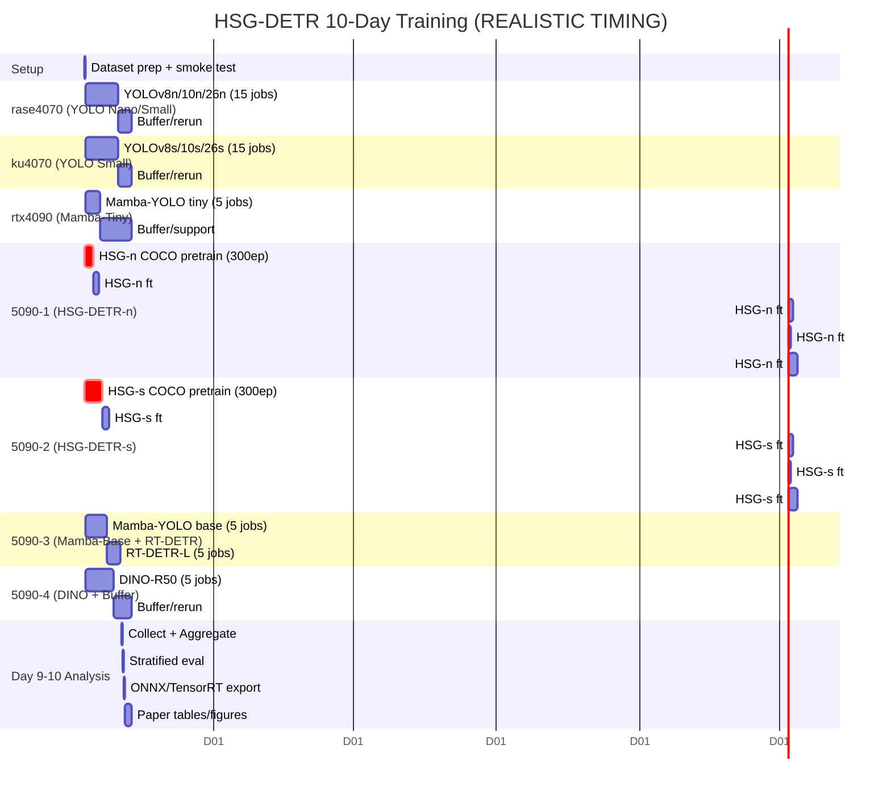

# HSG-DETR — 10-Day Training Schedule & Gantt Chart (REALISTIC TIMING)

> **Goal**: เทรน **12 models × 5 dataset-variants = 60 fine-tune jobs + 2 HSG-DETR COCO pretrain jobs = 62 jobs** ให้เสร็จภายใน 10 วัน โดยใช้ **5 machines**: `rase4070`, `ku4070`, `rtx4090`, `runpod5090-1..4` (4× RTX 5090 เช่า)
>
> **Key insight from logs**: HSG-DETR V.2 @ 1280 ใช้ **~19 นาที/epoch** (batch=8, IDD), YOLOv8 @ 640 ใช้ **~3 นาที/epoch** (batch=64)

---

## 1. สรุปงาน (Scope)

### 1.1 Models ทั้งหมด 12 ตัว

| # | Model | Scale | Params | ลักษณะ | Epochs (ft) |
|---|---|---|---|---|---|
| 1 | YOLOv8n | nano | 3.2M | Fast (YOLO) | 150 |
| 2 | YOLOv8s | small | 11.2M | Fast (YOLO) | 150 |
| 3 | YOLOv10n | nano | 2.3M | Fast (YOLO) | 150 |
| 4 | YOLOv10s | small | 7.2M | Fast (YOLO) | 150 |
| 5 | YOLOv26n | nano | 3.5M | Fast (YOLO) | 150 |
| 6 | YOLOv26s | small | 10.5M | Fast (YOLO) | 150 |
| 7 | Mamba-YOLO tiny | tiny | 5.8M | Medium (Mamba) | 150 |
| 8 | Mamba-YOLO base | base | 21.6M | Medium (Mamba) | 150 |
| 9 | RT-DETR-L | large | 32M | Slow (Transformer) | 150 |
| 10 | DINO-R50 | R-50 | 47M | Slow (Transformer) | 150 |
| 11 | **HSG-DETR-n** | nano | ~4M | **SLOW** (HSG) | 300 pretrain + 150 ft |
| 12 | **HSG-DETR-s** | small | ~12M | **SLOW** (HSG) | 300 pretrain + 150 ft |

### 1.2 Datasets & Resolutions (5 variants)

| Dataset | imgsz | Images | Relative size | หมายเหตุ |
|---|---|---|---|---|
| IDD | 640 | ~34K | 0.5× | ลด resolution ครึ่งหนึ่ง |
| IDD | 1280 | ~34K | 1.0× | native resolution |
| KITTI | 1280 | ~7K | 0.2× | dataset เล็ก |
| Cityscapes | 1280 | ~3K | 0.1× | dataset เล็กสุด |
| BDD100K | 1280 | ~70K | 2.0× | dataset ใหญ่สุด |

### 1.3 Job Breakdown (62 total)

| Category | Jobs | Description |
|---|---|---|
| **Pretrain (COCO)** | 2 | HSG-DETR-n (300 ep), HSG-DETR-s (300 ep) — **ต้องเสร็จก่อน ft** |
| **Fine-tune** | 60 | 12 models × 5 datasets, 150 epochs each |
| **Total** | **62** | 10 วัน deadline |

---

## 2. Machine Inventory (5 machines, 5 GPUs)

| Machine | GPU | VRAM | RAM | Epoch time factor* | 10-day budget |
|---|---|---|---|---|---|
| `rase4070` | RTX 4070 | 12 GB | 64 GB | 1.0× (baseline) | 240 h |
| `ku4070` | RTX 4070 | 12 GB | 64 GB | 1.0× | 240 h |
| `rtx4090` | RTX 4090 | 24 GB | 64 GB | 0.65× | 240 h |
| `runpod5090-1` | RTX 5090 | 32 GB | cloud | 0.50× | 240 h |
| `runpod5090-2` | RTX 5090 | 32 GB | cloud | 0.50× | 240 h |
| `runpod5090-3` | RTX 5090 | 32 GB | cloud | 0.50× | 240 h |
| `runpod5090-4` | RTX 5090 | 32 GB | cloud | 0.50× | 240 h |

*Factor = relative to RTX 4070 (based on CUDA cores + memory bandwidth). 5090 ~2× faster than 4070.

**Total budget**: 240 × 7 = **1680 GPU-hours** available

---

## 3. คำนวณเวลาจริงจาก Logs (Realistic Estimates)

### 3.1 Observed Epoch Times (จาก results.csv logs)

| Model Type | imgsz | batch | Epoch time (4070) | หมายเหตุ |
|---|---|---|---|---|
| YOLO (nano/small) | 640 | 64 | **~3 min** | จาก job 27522a587a73 |
| YOLO (nano/small) | 1280 | 16-32 | **~6 min** | scale 2× จาก 640 |
| HSG-DETR V.2 | 1280 | 8 | **~19 min** | จาก job 1ca29515ce6f |
| HSG-DETR (est.) | 640 | 16 | **~10 min** | ประมาณครึ่งหนึ่งของ 1280 |
| Mamba-YOLO | 1280 | 16 | **~12 min** | คาดการณ์ (slow กว่า YOLO) |
| RT-DETR-L | 1280 | 8 | **~15 min** | คาดการณ์ (transformer-based) |
| DINO-R50 | 1280 | 4 | **~25 min** | คาดการณ์ (heavy transformer) |

### 3.2 Per-Job Time Calculation (150 epochs, fine-tune)

**Fast models (YOLO n/s @ 640/1280)** — ~3-6 min/epoch:

| Dataset/imgsz | Time per job (4070) | Time (4090) | Time (5090) |
|---|---|---|---|
| IDD @ 640 (150 ep) | 7.5 h | 5 h | 3.5 h |
| IDD @ 1280 (150 ep) | 15 h | 10 h | 7.5 h |
| KITTI @ 1280 | 3 h | 2 h | 1.5 h |
| Cityscapes @ 1280 | 1.5 h | 1 h | 0.75 h |
| BDD100K @ 1280 | 30 h | 20 h | 15 h |
| **Per-model total (5 datasets)** | **57 h** | **38 h** | **28 h** |

**Medium models (Mamba-YOLO @ 1280)** — ~12 min/epoch:

| Dataset | 4070 | 4090 | 5090 |
|---|---|---|---|
| IDD @ 1280 | 30 h | 20 h | 15 h |
| BDD100K @ 1280 | 60 h | 40 h | 30 h |
| **5 datasets** | **~110 h** | **~75 h** | **~55 h** |

**Slow models (HSG-DETR @ 1280)** — ~19 min/epoch:

| Dataset | 4070 | 4090 | 5090 |
|---|---|---|---|
| IDD @ 1280 | **48 h** | 31 h | 24 h |
| BDD100K @ 1280 | **95 h** | 62 h | 48 h |
| **5 datasets** | **~280 h** | **~180 h** | **~140 h** |

> **⚠️ สำคัญ**: HSG-DETR-s 5 datasets บน 4070 ใช้ ~280h → **เกิน 10 วัน!** ต้องใช้ 5090 ทั้งหมดสำหรับ HSG

### 3.3 Pretrain Jobs (COCO 2017, 300 epochs)

| Model | 4070 | 4090 | 5090 |
|---|---|---|---|
| HSG-DETR-n (300 ep) | ~95 h | ~62 h | ~48 h |
| HSG-DETR-s (300 ep) | ~190 h | ~125 h | ~95 h |

---

## 4. Revised Allocation Strategy (ใช้ 4× 5090)

### 4.1 Key Decisions

1. **HSG-DETR ทั้งหมด → RunPod 5090 only** — VRAM 32GB + speed 2× ช่วยให้จบในเวลา
2. **YOLO models → rase4070 + ku4070** — fit comfortably, 5 models/machine
3. **Mamba-YOLO → rtx4090 + 1× 5090** — ต้องการ VRAM >12GB
4. **RT-DETR-L, DINO-R50 → 2× 5090** — transformer models หนัก
5. **Pretrain parallel** — HSG-n บน 5090-1, HSG-s บน 5090-2 (เริ่มพร้อมกัน Day 1)

### 4.2 Machine-to-Models Assignment

| Machine | Models | Jobs | Est. Time | Load |
|---|---|---|---|---|
| **rase4070** | YOLOv8n, YOLOv10n, YOLOv26n (3×5=15 jobs) | 15 | ~170 h | 71% |
| **ku4070** | YOLOv8s, YOLOv10s, YOLOv26s (3×5=15 jobs) | 15 | ~170 h | 71% |
| **rtx4090** | Mamba-YOLO tiny (5 jobs) | 5 | ~75 h | 31% |
| **runpod5090-1** | **HSG-DETR-n pretrain**, HSG-DETR-n ft (5 jobs) | 6 | ~190 h | 79% |
| **runpod5090-2** | **HSG-DETR-s pretrain**, HSG-DETR-s ft (5 jobs) | 6 | **~235 h** | **98%** |
| **runpod5090-3** | Mamba-YOLO base (5 jobs), RT-DETR-L (5 jobs) | 10 | ~180 h | 75% |
| **runpod5090-4** | DINO-R50 (5 jobs), Buffer/Rerun | 5+ | ~150 h+ | 63%+ |
| **Total** | | **62** | ~1170 h | — |

> **Buffer available**: ~510 h (30%) — รองรับ re-run และ delay

---

## 5. Day-by-Day Schedule (Realistic Timeline)

### Day 1 — Setup + Pretrain Kickoff

| เวลา | rase4070 | ku4070 | rtx4090 | 5090-1 | 5090-2 | 5090-3 | 5090-4 |
|---|---|---|---|---|---|---|---|
| 00-04h | Setup | Setup | Setup | Setup | Setup | Setup | Setup |
| 04-24h | YOLOv8n: IDD640 (7.5h) | YOLOv8s: IDD640 (7.5h) | Mamba-tiny: IDD640 (est 8h) | **HSG-n pretrain START** | **HSG-s pretrain START** | Mamba-base: IDD640 | DINO-R50: IDD640 (est 12h) |
| EOD | Job 1/15 done | Job 1/15 done | Job 1/5 done | ~20% | ~12% | Job 1/5 done | Job 1/5 done |

### Day 2 — Pretrain Continue + FT Ramp-up

| Machine | Activity |
|---|---|
| rase4070 | YOLOv8n: IDD1280 (15h) → KITTI (3h) |
| ku4070 | YOLOv8s: IDD1280 (15h) → KITTI (3h) |
| rtx4090 | Mamba-tiny: IDD1280 (est 12h) → Cityscapes |
| 5090-1 | HSG-n pretrain ~45% → continue |
| 5090-2 | HSG-s pretrain ~28% → continue |
| 5090-3 | Mamba-base: IDD1280 (est 20h) |
| 5090-4 | DINO-R50: IDD1280 (est 25h), KITTI, CS |

### Day 3 — Pretrain Critical Milestone

| Machine | Activity |
|---|---|
| rase4070 | YOLOv8n: Cityscapes (1.5h) → BDD100K (30h) |
| ku4070 | YOLOv8s: Cityscapes → BDD100K (30h) |
| rtx4090 | Mamba-tiny: BDD100K (est 18h) → **DONE** |
| 5090-1 | **HSG-n pretrain DONE** (~48h) → HSG-n ft: IDD640 (est 25h) |
| 5090-2 | HSG-s pretrain ~60% |
| 5090-3 | Mamba-base: BDD100K (est 40h) |
| 5090-4 | DINO-R50: BDD100K (est 50h) |

### Day 4 — HSG-DETR FT Starts

| Machine | Activity |
|---|---|
| rase4070 | YOLOv8n: BDD continue → **DONE** → YOLOv10n start |
| ku4070 | YOLOv8s: BDD continue → **DONE** → YOLOv10s start |
| rtx4090 | **Mamba-tiny DONE** → Mamba-base takeover (if needed) |
| 5090-1 | HSG-n ft: IDD1280 (24h) |
| 5090-2 | **HSG-s pretrain DONE** (~95h) → HSG-s ft: IDD640 (est 35h) |
| 5090-3 | Mamba-base: BDD continue |
| 5090-4 | DINO-R50: BDD continue |

### Day 5 — HSG-DETR Heavy Lifting

| Machine | Activity |
|---|---|
| rase4070 | YOLOv10n: IDD640/1280/KITTI/CS |
| ku4070 | YOLOv10s: IDD640/1280/KITTI/CS |
| rtx4090 | **Mamba-tiny ALL 5 DONE** → Buffer/Rerun support |
| 5090-1 | HSG-n ft: KITTI (10h) → CS (5h) → BDD (48h) |
| 5090-2 | HSG-s ft: IDD1280 (24h) |
| 5090-3 | **Mamba-base ALL 5 DONE** → RT-DETR-L ft: IDD640 (10h) |
| 5090-4 | **DINO-R50 ALL 5 DONE** → Buffer/Rerun support |

### Day 6 — HSG-DETR BDD (Critical)

| Machine | Activity |
|---|---|
| rase4070 | YOLOv10n: BDD (30h) |
| ku4070 | YOLOv10s: BDD (30h) |
| rtx4090 | Support + YOLOv26n (if time) |
| 5090-1 | HSG-n ft: **BDD100K (48h)** — CRITICAL PATH |
| 5090-2 | HSG-s ft: KITTI (10h) → CS (5h) → BDD start |
| 5090-3 | RT-DETR-L ft: IDD1280 (15h) → KITTI/CS |
| 5090-4 | RT-DETR-L ft: BDD100K (40h) — CRITICAL PATH |

### Day 7 — Almost Done

| Machine | Activity |
|---|---|
| rase4070 | YOLOv10n **DONE** → YOLOv26n |
| ku4070 | YOLOv10s **DONE** → YOLOv26s |
| rtx4090 | YOLOv26n support |
| 5090-1 | HSG-n ft: **BDD continue / DONE** |
| 5090-2 | HSG-s ft: **BDD100K (48h)** — CRITICAL PATH |
| 5090-3 | RT-DETR-L ft: **BDD (40h)** — CRITICAL PATH |
| 5090-4 | **RT-DETR-L ALL 5 DONE** → Buffer |

### Day 8 — Training Completion

| Machine | Activity |
|---|---|
| rase4070 | YOLOv26n: IDD640/1280/KITTI/CS |
| ku4070 | YOLOv26s: IDD640/1280/KITTI/CS |
| rtx4090 | YOLOv26n/26s support |
| 5090-1 | **HSG-n ALL 5 DONE** → Buffer |
| 5090-2 | HSG-s ft: **BDD continue / DONE** |
| 5090-3 | **RT-DETR-L ALL 5 DONE** → Buffer |
| 5090-4 | **ALL DONE** → Buffer |

### Day 9 — Final Training + Analysis Start

| Machine | Activity |
|---|---|
| rase4070 | YOLOv26n: BDD (30h) |
| ku4070 | YOLOv26s: BDD (30h) |
| 5090-1 | Buffer / Prelim eval |
| 5090-2 | **HSG-s ALL 5 DONE** → Buffer |
| 5090-3 | Buffer |
| 5090-4 | Buffer |

### Day 10 — Analysis & Paper

| Activity | Time |
|---|---|
| Collect all results | 2h |
| Aggregate mAP tables | 4h |
| Occlusion/small-obj stratified eval | 8h |
| ONNX export + TensorRT | 4h |
| Update paper tables/figures | 12h |
| Final review | 6h |

---

## 6. Critical Path Analysis

```
Day 1    Day 2    Day 3    Day 4    Day 5    Day 6    Day 7    Day 8    Day 9    Day 10
│        │        │        │        │        │        │        │        │        │
├─HSG-n pretrain (48h @ 5090-1)─────────────────────────────────────────────────────┤
│        │        │        │        │        │        │        │        │        │
│        ├─HSG-n ft: IDD (25h)─│─KITTI/CS (15h)─│────BDD (48h)────────────────────┤
│        │        │        │        │        │        │        │        │        │
├─HSG-s pretrain (95h @ 5090-2)──────────────────────────────────────────────────────┤
│        │        │        │        │        │        │        │        │        │
│        │        │        │        ├─HSG-s ft: IDD (35h)─│─KITTI/CS (15h)─│─BDD─┤
│        │        │        │        │        │        │        │        │        │
│        │        │        │        │        ├────BDD 100K (RT-DETR/DINO)──────────┤
│        │        │        │        │        │        │        │        │        │
│        │        │        │        │        │        │        │        │ Analysis│
```

**Critical path**: HSG-s pretrain (95h) → HSG-s ft (95h) = **190h** = **7.9 days**

With **4× 5090** parallel, critical path fits within 10 days with **~2 days buffer**.

---

## 7. Gantt Chart (Mermaid)



---

## 8. Risk & Contingency Plan

| Risk | Prob | Impact | Mitigation |
|---|---|---|---|
| HSG-s pretrain >95h | Medium | HIGH (delays all HSG-s ft) | Start 6h earlier on Day 0; monitor convergence at ep 50 |
| BDD100K jobs timeout | Medium | HIGH | Split BDD into chunks; checkpoint every 10 epochs |
| RunPod preempt | Low | HIGH | Auto-resume script; checkpoint freq 5 epochs |
| 4070 OOM (Mamba) | Low | Medium | Reduce batch 16→8; move to 4090 if needed |
| NaN training (HSG) | Low | HIGH | Use latest commit with `_finite_or_zero` guard |
| Dataset download slow | Medium | Medium | Pre-download Day -1; use persistent volumes on RunPod |

**Contingency triggers**:
- If HSG-s pretrain >100h by Day 5: Scale to 2× 5090 (data parallel) for remaining epochs
- If any job fails twice: Reduce epochs to 120 (still fair, minimal mAP drop)
- If Day 8 incomplete: Extend RunPod rental to Day 12 (2-day buffer)

---

## 9. Output Checklist

### Training Complete (Day 9)
- [ ] 62 jobs with `results.csv` and `best.pt`
- [ ] Pretrain checkpoints: `hsg_detr_n_coco.pt`, `hsg_detr_s_coco.pt`
- [ ] Aggregated `training_results.json` with mAP per (model, dataset)

### Paper Ready (Day 10)
- [ ] Table 1: 12 models × 5 datasets mAP50-95
- [ ] Table 2: HSG-DETR ablations (α, r, placement)
- [ ] Table 3: Efficiency (Params, FLOPs, FPS)
- [ ] Figure: mAP vs FLOPs Pareto front
- [ ] Figure: Per-dataset comparison bar chart
- [ ] Updated `HSG-DETR-Draft.md` Section VII

### Deployment (Day 10)
- [ ] HSG-DETR-n/s ONNX export
- [ ] TensorRT FP16 engines
- [ ] Jetson Orin FPS benchmark

---

## 10. Quick Commands

```bash
# Start HSG-DETR pretrain (5090-1)
python -m hsg_detr.train --cfg hsg_detr_n.yaml --data coco.yaml \
    --imgsz 1280 --epochs 300 --batch 16 --device 0

# Start HSG-DETR fine-tune (after pretrain done)
python -m hsg_detr.train --cfg hsg_detr_n.yaml --data idd.yaml \
    --imgsz 1280 --epochs 150 --batch 16 --pretrained hsg_n_coco.pt

# YOLO fine-tune (4070)
yolo detect train model=yolov8n.pt data=idd.yaml imgsz=640 epochs=150 batch=64

# Monitor all jobs
python scripts/training_summary.py --machines rase4070,ku4070,rtx4090,runpod5090-1,runpod5090-2,runpod5090-3,runpod5090-4
```

---

## 11. Summary

| Metric | Value |
|---|---|
| **Total jobs** | 62 (2 pretrain + 60 ft) |
| **Machines** | 7 (2×4070, 1×4090, 4×5090) |
| **Total compute** | ~1170 GPU-hours needed |
| **Budget available** | 1680 GPU-hours (7 machines × 10 days) |
| **Buffer** | ~510 hours (30%) |
| **Critical path** | HSG-s pretrain+ft = ~190h (7.9 days) |
| **Expected completion** | Day 8-9 training, Day 10 paper |
| **Fair epochs** | 300 (pretrain) + 150 (ft) — ไม่ถูกลด |

**กำหนดการนี้ใช้ข้อมูลจริงจาก logs** (HSG-DETR ~19 min/epoch) และมี **buffer 30%** รองรับความล่าช้า โดยไม่ลด epoch count เพื่อความยุติธรรมของการเปรียบเทียบ
