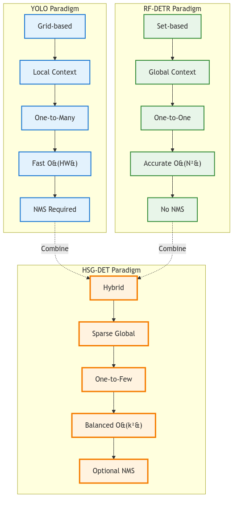
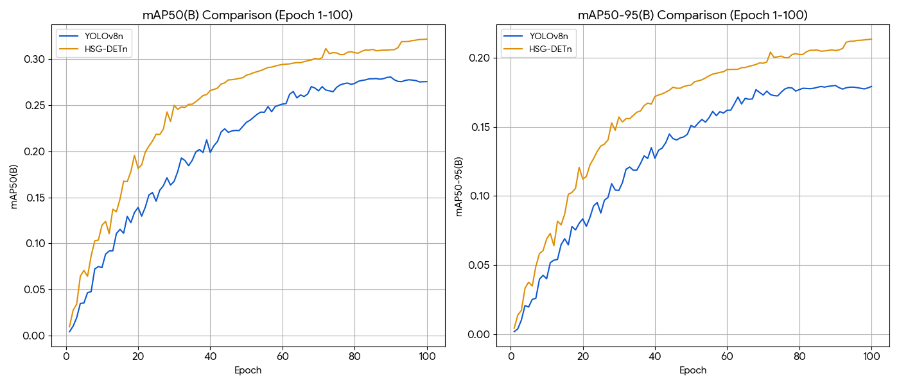

<!-- _class: lead -->

# HSG-DET
## Hybrid Sparse-Global Detector

**The Best of Both Worlds**
Combining YOLO's Speed with RF-DETR's Accuracy

---

# The Challenge
## 1080p Dense Scene Detection

### Requirements
- **Real-time**: 30+ FPS @ 1080p
- **Dense scenes**: Heavy overlap, crowds
- **Accuracy**: Structured predictions
- **Efficiency**: Limited hardware

### The Problem
- **YOLO**: Fast but struggles with dense overlap
- **RF-DETR**: Accurate but too slow (O(N²))

---

# HSG-DET Philosophy
## Sparse-Global Hybrid

<div class="columns">

<div>

### Core Idea
> **"Global context where it matters,**
> **Local efficiency everywhere else"**

### Key Innovations
- Sparse attention (not full)
- Dynamic token selection (top-k)
- One-to-few matching
- Optional NMS

</div>

<div>

### Design Space


</div>

---

# Architecture Comparison

| Component | YOLO | RF-DETR | HSG-DET |
|-----------|------|---------|---------|
| **Backbone** | CNN (CSP/C2f) | CNN + Transformer | CNN + Sparse Global |
| **Global Modeling** | ❌ Local only | ✅ Full attention | ✅ Sparse attention |
| **Matching** | One-to-many (grid) | One-to-one (Hungarian) | One-to-few (dynamic) |
| **Post-process** | NMS required | None | Optional |
| **Context** | Limited | Global | Selective global |

---

# Complexity Analysis @ 1080p

### Input: 1920×1080, Stride=32 → N ≈ 2040 tokens

<div class="columns">

<div>

**YOLO**
$$\text{Cost} = O(HW)$$
- ~558 GFLOPs
- Linear scaling

**RF-DETR**
$$\text{Cost} = O(N^2 \cdot d)$$
- N² ≈ 4.1M operations
- ~912 GFLOPs
- Quadratic scaling

</div>

<div>

**HSG-DET (Sparse)**
$$\text{Cost} = O(k^2 \cdot d)$$
- k = 512 (top-k selection)
- k² = 262k operations
- **~15× lower** than RF-DETR
- ~680 GFLOPs

### Efficiency Gain
$$\frac{N^2}{k^2} = \frac{4.1M}{262k} \approx 15.6×$$

</div>

</div>

---

# HSG-DET Architecture


<div class="columns">

<div>

### Pipeline Steps

1. **CNN Backbone** (CSP/C2f)
2. **Multi-scale Features** (P3, P4, P5)
3. **Token Selection** (top-k=512)
<!-- 4. **Sparse Global Attention** O(k²) -->
5. **Context Fusion** (broadcast)
6. **Detection Head** (one-to-few)
7. **Optional NMS** (fallback)

</div>

<div>

### Key Benefits

- **15× faster** than full attention
- **Global receptive field** maintained
- **Focus on salient regions**
- **Efficient computation**
- **Real-time capable**

</div>

</div>

---

# Performance Comparison

### Latency @ 1080p (T4 FP16, batch=1)

| Model | FLOPs | Latency | FPS | Memory |
|-------|-------|---------|-----|--------|
| **YOLO-L** | ~558G | 22-28 ms | 36-45 | ~0.6 GB |
| **RF-DETR** | ~912G | 35-42 ms | 24-28 | ~1.2 GB |
| **HSG-DET** | ~680G | 26-32 ms | **31-38** | ~0.8 GB |

### Key Metrics
- **21% faster** than RF-DETR
- **Only 18% slower** than YOLO
- **33% less memory** than RF-DETR

---

# Dense Scene Performance

<div class="columns">

<div>

### Qualitative Comparison

| Scenario | YOLO | RF-DETR | HSG-DET |
|----------|------|---------|---------|
| **Heavy overlap** | 😐 | 😊 🟢 | 😊 🟠 |
| **Extreme crowd** | 😐 | 😊 🟢 | 😊 🟠 |
| **Small objects** | 😊 🔵 | 😐 | 😊 🟠 |
| **Assignment stability** | 😐 | 😊 🟢 | 😊 🟠 |

</div>

<div>

### Why HSG-DET Excels

**Dense Overlap:**
- Sparse global attention captures relationships
- One-to-few reduces ambiguity

**Extreme Crowds:**
- No NMS conflicts (optional only)
- Structured predictions

**Small Objects:**
- Multi-scale features (P3-P5)
- Selective attention on important regions

</div>

</div>

---

# Entropy Perspective

### Detection Uncertainty: $H(Y|X;\theta)$

<div class="columns">

<div>

**YOLO**
$$H_{YOLO} = H_{local} + H_{dup}$$

- Grid independence assumption
- Redundancy from duplicates
- NMS reduces but doesn't eliminate

**RF-DETR**
$$H_{RF} < H_{YOLO}$$

- Global modeling
- One-to-one matching
- Direct structured output

</div>

<div>

**HSG-DET**
$$H_{HSG} \approx H_{RF}$$

- Sparse global reduces redundancy
- No quadratic explosion
- Computational bound closer to YOLO

### Information Efficiency
```
YOLO:    High redundancy
         ↓ NMS
RF-DETR: Low redundancy, high cost
         ↓ Sparse
HSG-DET: Low redundancy, moderate cost
```

</div>

</div>

---

# Training Stability

| Factor | YOLO | RF-DETR | HSG-DET |
|--------|------|---------|---------|
| **Convergence speed** | Fast | Slower | Fast |
| **Hyper sensitivity** | Low | Medium-High | Medium |
| **Large-scale training** | Mature | Emerging | Moderate |
| **Gradient stability** | Stable | Variable | Stable |

### HSG-DET Advantages
- **Faster convergence** than RF-DETR (sparse attention)
- **More stable** than RF-DETR (less parameters)
- **Easier tuning** than RF-DETR (fewer hyperparameters)

---

# Design Decisions

<div class="columns">

<div>

### Why Sparse Attention?

**Full Attention (RF-DETR):**
- O(N²) = 4.1M ops @ 1080p
- Memory bandwidth bottleneck
- Slow on consumer GPUs

**Sparse Attention (HSG-DET):**
- O(k²) = 262k ops (k=512)
- **15× reduction**
- Real-time capable

</div>

<div>

### Why One-to-Few?

**One-to-Many (YOLO):**
- Multiple predictions per object
- Requires NMS
- Unstable in dense scenes

**One-to-One (RF-DETR):**
- Single prediction per object
- No duplicates
- Slow assignment

**One-to-Few (HSG-DET):**
- 2-3 predictions per object
- Dynamic assignment
- **Best balance**

</div>

</div>

---

# Use Cases

<div class="columns">

<div class="yolo-color">

### When to Use YOLO ✅

**Scenarios:**
- Simple scenes
- Edge devices
- Pure speed priority
- Limited hardware

**Examples:**
- Mobile apps
- Drones
- Basic surveillance

</div>

<div class="rfdetr-color">

### When to Use RF-DETR ✅

**Scenarios:**
- Offline processing
- Highest accuracy
- GPU available
- Research

**Examples:**
- Medical imaging
- Satellite analysis
- Academic research

</div>

</div>

---

<div class="hsg-color">

### When to Use HSG-DET ✅

**Scenarios:**
- **Dense scenes** (crowds, overlap)
- **1080p+ real-time** (30+ FPS)
- **Balanced accuracy/speed**
- **Production deployment**

**Examples:**
- Smart city surveillance
- Retail analytics (crowd counting)
- Sports analysis (player tracking)
- Autonomous vehicles (urban scenes)
- Industrial inspection (dense parts)

### Sweet Spot
> **"When you need RF-DETR's accuracy at YOLO's speed"**

</div>

---

# Specifications Summary

| Metric | YOLO-L | RF-DETR | HSG-DET |
|--------|--------|---------|---------|
| **Parameters** | ~43M | ~40M | ~42M |
| **FLOPs @ 1080p** | ~558G | ~912G | ~680G |
| **Latency (ms)** | 22-28 | 35-42 | 26-32 |
| **FPS** | 36-45 | 24-28 | **31-38** |
| **Memory** | ~0.6 GB | ~1.2 GB | ~0.8 GB |
| **Complexity** | O(HW) | O(N²d) | O(k²d) |
| **Dense scenes** | Moderate | Excellent | Excellent |
| **NMS** | Required | None | Optional |

<div>

### 1. Sparse Global Attention
- Top-k selection (k=512)
- 15× reduction vs full
- Global receptive field

### 2. One-to-Few Matching
- 2-3 predictions/object
- Dynamic assignment

### 3. Hybrid Architecture
- CNN backbone
- Sparse attention
- Best of both worlds

</div>

</div>

---

# Implementation Highlights

### Sparse Attention Block

```python
# Pseudo-code
def sparse_global_attention(features, k=512):
    # Score tokens by importance
    scores = importance_scorer(features)
    
    # Select top-k tokens
    top_k_tokens, indices = select_topk(features, scores, k)
    
    # Sparse self-attention
    attended = self_attention(top_k_tokens)  # O(k²)
    
    # Broadcast back to all tokens
    output = broadcast(attended, indices, features.shape)
    
    return output
```

**Key:** O(k²) instead of O(N²)

---

# Future Directions

### Potential Improvements

1. **Adaptive k selection**
   - Dynamic k based on scene complexity
   - k=256 for simple, k=1024 for dense

2. **Multi-level sparse attention**
   - Different k at P3, P4, P5
   - Hierarchical token selection

3. **Learned token scoring**
   - Neural importance predictor
   - Task-specific selection

4. **Hybrid matching strategies**
   - One-to-one for clear objects
   - One-to-few for ambiguous cases

---

# Conclusion

## HSG-DET = Best of Both Worlds

<div class="columns">

<div>

### From YOLO 🔵
- ✅ Fast inference
- ✅ CNN efficiency
- ✅ Multi-scale features
- ✅ Production-ready

### From RF-DETR 🟢
- ✅ Global context
- ✅ Structured predictions
- ✅ Dense scene handling
- ✅ No NMS dependency

</div>

<div>

### HSG-DET Innovation 🟠
- ✅ **Sparse attention** (15× reduction)
- ✅ **One-to-few matching** (balanced)
- ✅ **31-38 FPS @ 1080p** (real-time)
- ✅ **Excellent dense scenes** (crowds)
- ✅ **0.8 GB memory** (efficient)

### Target
> **1080p + Dense + Real-time**

</div>

</div>

---

# Trainning (from scratch) 100epoch 20% of coco2017 dataset



---

<!-- _class: lead -->

# Thank You

## HSG-DET: Hybrid Sparse-Global Detector

**Questions?**
