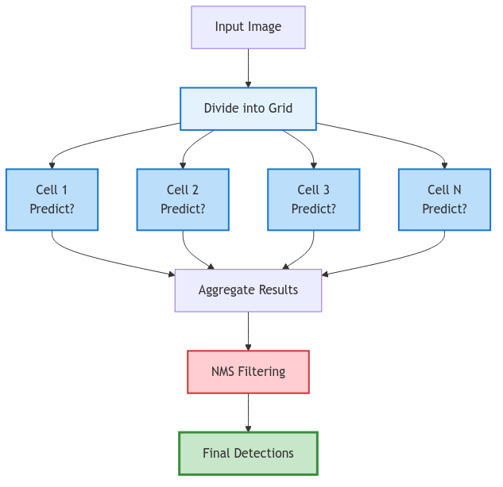
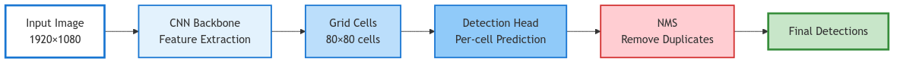
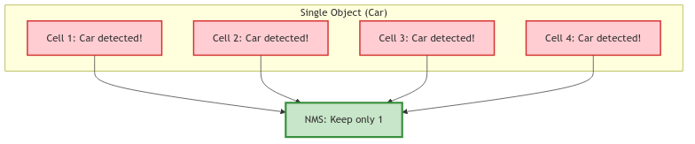
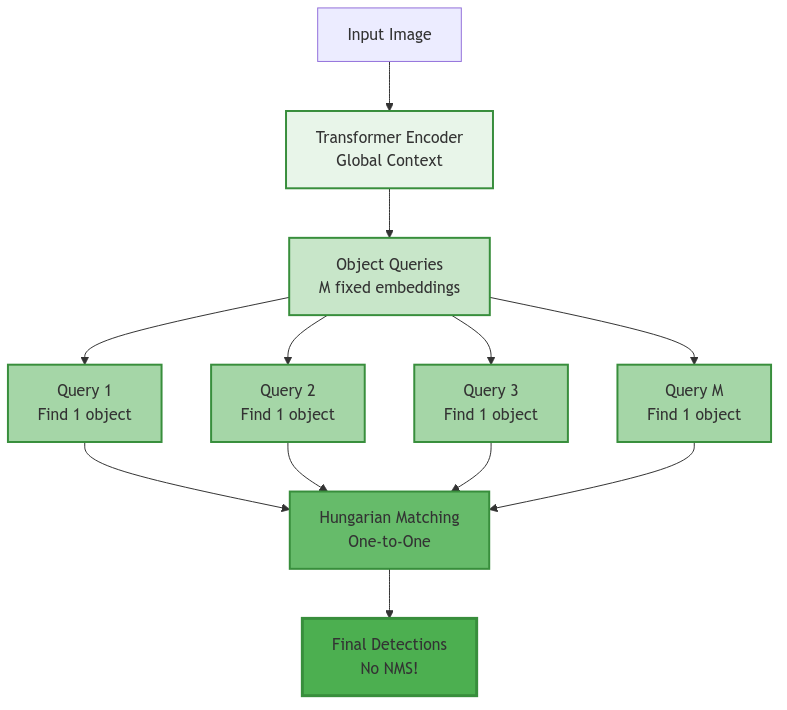
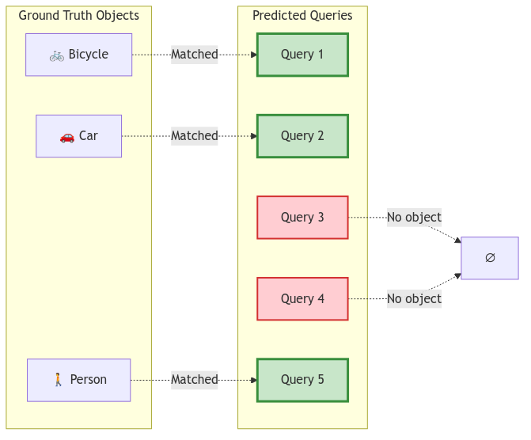
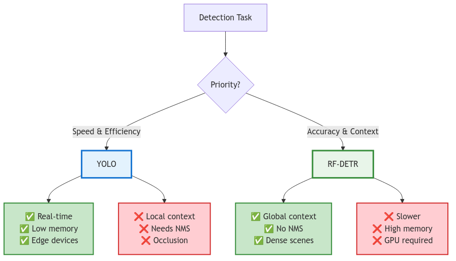
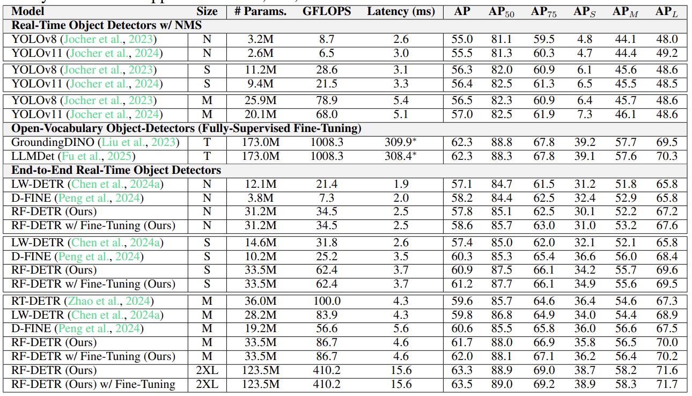

<!-- _class: lead -->

# YOLO vs RF-DETR
## Architecture Comparison

**Two Paradigms:**
- Grid-based (YOLO)
- Set-based (RF-DETR)

---

<!-- _class: lead -->

# The Problem
## Object Detection

### Goal
> **"What & where?"**

### Formulation
$$Y = \{(b_k, c_k)\}_{k=1}^{N}$$

$b_k$ = box, $c_k$ = class, $N$ = count

### Objective
$$p(Y \mid X; \theta)$$

---

# YOLO Philosophy
## Grid-based Predictions

### Concept
- Grid cells (p3: 80×80, p4: 40x40, p5: 20x20)
- Independent predictions

### Formula
$$p(Y \mid X) = \prod_{i,j} p(y_{ij} \mid F_{ij})$$

Grid factorization, Local $F_{ij}$

### Result
Multiple detections → **NMS needed**

---

# YOLO Architecture Pipeline

| Step | Component | Function |
|------|-----------|----------|
| 1 | **Backbone** | CNN features |
| 2 | **Grid** | 80×80 cells |
| 3 | **Head** | Box + Class |
| 4 | **NMS** | Remove duplicates |

---

# YOLO Characteristics

### Strengths ✅
- **Speed**: 30-60 FPS
- **Efficiency**: O(HW)
- **Memory**: Low VRAM
- **Params**: ~43M (YOLOv8l)
- **FLOPs**: ~165G @ 640×1080

### Math
$$\text{Cost} = O(HW)$$

### Limitations ❌
- Multiple predictions
- NMS required
- Limited receptive field
- Dense scenes struggle

### Duplication

---

# RF-DETR Philosophy
## Set-based Prediction

### Concept
- Fixed queries (M=100)
- See entire image

### Formula
$$p(Y \mid X) = \prod_{k=1}^{M} p(y_k \mid X)$$

Set prediction, Global attention

### Result
One-to-one → **No NMS**

---

# RF-DETR Architecture Pipeline

| Step | Component | Function |
|------|-----------|----------|
| 1 | **Backbone** | CNN features |
| 2 | **Encoder** | Self-attention |
| 3 | **Queries** | M embeddings |
| 4 | **Decoder** | Cross-attention |
| 5 | **Heads** | Box + Class |
| 6 | **Hungarian** | 1-to-1 match |

---

# Hungarian Matching
## One-to-One Assignment

### Algorithm
$$\min_{\sigma} \sum_{i} \mathcal{L}(\hat{y}_{\sigma(i)}, y_i)$$

$\sigma$ = assignment, $\mathcal{L}$ = cost

### Properties
✅ No duplicates ✅ No NMS ✅ End-to-end

---

# RF-DETR Characteristics

### Strengths ✅
- Global attention
- No NMS
- Dense scenes OK
- Set prediction
- **Params**: ~40M (DETR-R50)
- **FLOPs**: ~86G @ 640×1080

### Math
$$\mathcal{R}(y_k) = X$$
$$\text{Attn}(Q,K,V) = \text{softmax}\left(\frac{QK^T}{\sqrt{d}}\right)V$$

### Limitations ❌
- 15-30 FPS
- O((HW)²)
- High VRAM
- GPU required

### Cost
$$\text{Cost} = O(N^2 \cdot d)$$

---

# Architecture Comparison

| Dimension | YOLO | RF-DETR |
|-----------|------|---------|
| **Paradigm** | Grid-based | Set-based |
| **Context** | Local (CNN) | Global (Transformer) |
| **Assignment** | Many-to-one | One-to-one |
| **NMS** | Required | Not needed |
| **Complexity** | O(HW) | O((HW)²) |
| **Speed** | 30-60 FPS | 15-30 FPS |
| **Memory** | ~0.6 GB | ~1.2 GB |
| **Field** | Limited | Global |

---

# Trade-offs Analysis

### Performance

| Scenario | YOLO | RF-DETR |
|----------|------|---------|
| **Complex scenes** | 😐 | 😊 🟢 |
| **Speed** | 😊 🔵 | 😐 |
| **Low hardware** | 😊 🔵 | 😐 |
| **Accuracy** | 😐 | 😊 🟢 |

### Computational Trade-off

---

## Specifications Comparison

| Metric | YOLO (YOLOv8l) | RF-DETR (DETR-R50) |
|--------|----------------|---------------------|
| **Parameters** | ~43M | ~40M |
| **FLOPs @ 640×1080** | ~165G | ~86G |
| **Speed** | 30-60 FPS | 15-30 FPS |
| **Memory** | ~0.6 GB | ~1.2 GB |
| **Complexity** | O(HW) | O((HW)²) |

---
## Benchmark Results

**COCO Segmentation Results**
- YOLO: Fast, efficient
- RF-DETR: Higher accuracy

---
# Use Cases

### YOLO ✅

**When:**
Real-time, Edge devices, Limited hardware

**Apps:**
Vehicles, Surveillance, Mobile, Drones

### RF-DETR ✅

**When:**
Accuracy priority, Complex scenes, GPU

**Apps:**
Medical, Satellite, Crowds, Research

---

<!-- _class: lead -->

# Thank You

## YOLO vs RF-DETR: Architecture Comparison

**Key Insight:**  
Both paradigms solve object detection differently - choose based on your constraints and priorities.

**Further Reading:**
- YOLO: Grid-based detection with local context
- RF-DETR: Set-based detection with global attention
- Trade-off: Speed ↔ Accuracy

